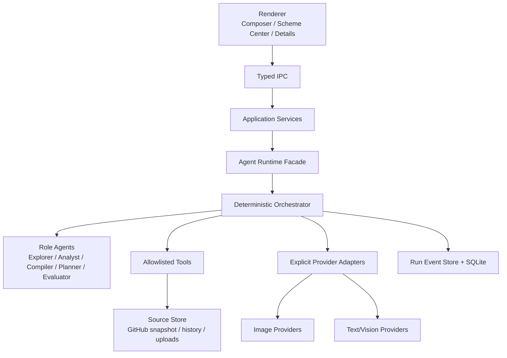

# Musefold / 未像 v0.3.2 Agent Runtime 开发规范

> 文档状态：开发规范已确认，待实现
> 版本：`v0.3.2`
> 目标：把来源仓库、历史内容、用户需求和图片输入编译为可审计、可恢复、可复现的设计方案运行
> 关联文档：[设计方案规范](V03.2-DESIGN-SCHEME-SPEC.md) · [方案 UI 与交互规范](V03.2-SCHEME-UI-INTERACTION-SPEC.md)

## 1. 技术决策摘要

### 1.1 Runtime 是产品边界，不是一个聊天 API

Agent Runtime 负责规划和执行设计方案，但不直接把自然语言交给 Provider。所有运行都必须先得到结构化的 `DesignSchemeRevision` 和 `RunPlan`，再由确定性编排器调用白名单节点。

`DesignScheme` 是当前代码文档中的领域类型名；它表达一个可调用 Skill 的方案视图，不代表“方案包住 Skills”。后续实现可以在不改变契约语义的前提下将内部包名收敛为 `skill-domain`。中文 UI 始终称“方案”。

```text
用户意图/来源
    -> Agent 分析与编译
    -> DesignScheme 草稿
    -> 用户试运行
    -> RunPlan
    -> 确定性 Orchestrator
    -> Provider Adapter
    -> 评估、有限修复、保存
```

### 1.2 推荐的 Agent 组合

采用一个 Musefold 专属 Runtime，内部拆为角色化 Agent，外面由一个确定性 Orchestrator 管理：

| 角色 | 职责 | 是否可写入应用数据 |
|---|---|---|
| Explorer | 用户显式搜索市场，整理候选仓库 | 只能写候选缓存 |
| Repository Analyst | 读取固定来源，分类文件、提取规则、识别能力 | 只能写分析结果 |
| Scheme Compiler | 把分析结果编译为结构化 Skill/方案草稿 | 写草稿版本，不可转为正式 |
| Runtime Planner | 将方案、用户输入和优先级快照编译为 RunPlan | 写运行计划 |
| Visual Evaluator | 对输出执行质量门并给出修复建议 | 写评估，不直接改方案 |

Agent 角色不是互相自由调用的聊天机器人。每个角色只能接收声明好的输入、返回 JSON Schema 结果，并由 Orchestrator 决定下一步。

### 1.3 Agent 框架和 Provider 的隔离

推荐以 Mastra 作为可替换的 Agent/Workflow 内核适配层，封装在 `agent-runtime/kernel-adapters/mastra`；应用业务代码、IPC、数据库和 Provider 适配器不得直接依赖其 API。这样可以使用成熟的 Agent 生命周期、工作流和观测能力，同时保留替换空间。

本项目不把 Vercel AI SDK 的 `generateText`、`streamText`、`@ai-sdk/openai-compatible` 或任何“通用 OpenAI 兼容 Provider”作为业务抽象。Provider 通过 Musefold 自己的显式接口接入，每个 Provider 维护自己的请求格式、图片数量、错误码和能力矩阵。

实现开始前需要做一个依赖审计：如果选定的 Mastra 版本带来 `@ai-sdk/*` 的传递依赖，这些依赖必须只存在于隔离的 `mastra-bridge` 包，不能出现在 renderer、domain 或 provider 包。如果发布策略要求依赖树完全没有 `@ai-sdk/*`，则启用同一套 Runtime 接口下的 `native-graph` 内核；业务代码无需改动。

### 1.4 运行环境

- Electron renderer：只负责交互和事件展示，不持有 Token，不运行 Agent。
- Electron main：负责 IPC、权限、受管文件、数据库和进程生命周期。
- Agent Worker：独立 Node Worker/child process，执行分析、编译、规划和评估；可取消、可重启、可设置超时。
- Provider Adapter：在 main 的受控边界内发起外部请求；Agent Worker 不直接管理密钥。

## 2. 分层架构



### 2.1 包边界

建议的新代码边界如下；旧 `recipe` 领域不迁入这些包：

```text
packages/
  design-scheme-domain/       # 纯类型、校验、版本化文档、策略解析
  source-ingestion/           # URL 解析、固定 commit、文件和资产快照
  agent-runtime/              # Orchestrator、角色、RunPlan、事件
  agent-runtime-kernel/       # Mastra bridge / native-graph bridge
  provider-adapters/          # 显式文本、视觉、生图 Provider
  design-scheme-share/        # .musefold.design 导入导出
  design-scheme-evaluation/   # 确定性质量门和视觉评估
electron/
  main/                       # IPC、密钥、文件和数据库
renderer/
  features/design-schemes/    # 方案中心、详情、Composer 附件、草稿区域
```

依赖方向只能从 UI/Application 指向 Domain/Runtime 接口；Domain 不得依赖 Electron、React、具体 Provider 或网络客户端。

## 3. Agent 输入和输出契约

### 3.1 统一上下文

```ts
interface AgentContext {
  runId: string;
  taskId: string;
  sourceSnapshotIds: string[];
  schemeRevisionId?: string;
  userBrief?: string;
  inputRefs: InputReference[];
  policy: RunPolicySnapshot;
  capabilitySnapshot: ProviderCapabilitySnapshot;
  tokenBudget: number;
  deadlineAt: number;
}
```

Agent 只接收 `InputReference`，不接收任意本地路径：

```ts
interface InputReference {
  id: string;
  kind: 'text' | 'image' | 'article';
  storeKey: string;
  sha256: string;
  role?: string;
  ordinal?: number;
}
```

### 3.2 结构化返回

每个角色的返回都必须经过 JSON Schema 校验，校验失败只能重试一次，仍失败则进入可解释错误态。禁止让自然语言直接驱动工具调用。

```ts
interface AgentEnvelope<T> {
  schemaVersion: 1;
  role: 'explorer' | 'analyst' | 'compiler' | 'planner' | 'evaluator';
  status: 'ok' | 'needs-input' | 'blocked' | 'failed';
  result?: T;
  evidence: EvidenceRef[];
  warnings: RuntimeWarning[];
  model: ModelSnapshot;
}

interface EvidenceRef {
  sourceSnapshotId: string;
  filePath?: string;
  lineStart?: number;
  contentHash?: string;
  claim: string;
}
```

`evidence` 是还原度和可维护性的核心。没有来源证据的规则只能进入 `adapted`，不能标成 `verified`。

## 4. 确定性编排

### 4.1 状态机

```text
created
  -> source_resolving
  -> awaiting_install_confirmation (仅新远程来源)
  -> source_snapshotting
  -> analyzing
  -> compiling_scheme
  -> draft_ready
  -> awaiting_user_trial
  -> planning_run
  -> executing
  -> evaluating
  -> repairing (0..N 次，受预算限制)
  -> trial_completed | completed | blocked | failed | cancelled

trial_completed
  -> awaiting_user_formalization
  -> formalized | draft_retained
```

`awaiting_install_confirmation` 是用户必须确认的安装边界。普通规则不一致永远不会回到这个状态。

`trial_completed` 只说明本机试运行成功，不得自动修改方案状态。只有封面和最低字段齐全、用户明确执行“设为正式”后，Runtime 才写入 `formalized`。正式方案被修改或更新时，现有正式 revision 继续服务普通运行，新 revision 独立处于草稿状态。

### 4.2 Orchestrator 伪代码

```ts
async function runDesignScheme(command: RunCommand): Promise<RunResult> {
  const snapshot = await sourceStore.freeze(command.sources);
  const policy = policyService.snapshot(command.priorityMode, command.schemeRevisionId);
  const capabilities = await providerRegistry.snapshot(command.providerId);

  const plan = await planner.create({
    scheme: await schemeStore.readRevision(command.schemeRevisionId),
    userInput: command.userInput,
    sources: snapshot,
    policy,
    capabilities,
  });

  planValidator.assertAllowlisted(plan);
  capabilityMatcher.assertCompatible(plan, capabilities);
  await eventStore.append('run.planned', { plan, policy });

  const outputs = await executor.execute(plan, {
    onEvent: eventStore.append,
    signal: command.abortSignal,
  });

  const evaluation = await evaluator.evaluate(outputs, plan.evaluation);
  if (evaluation.repairable && plan.repairBudget.remaining > 0) {
    return runDesignScheme(repairPlanner.next(command, evaluation));
  }

  return resultStore.commit({ outputs, evaluation, policy, snapshot });
}
```

实际实现不得通过递归无限重跑；上例中的 `repairPlanner.next` 必须消耗明确的 `repairBudget`，并由运行 ID 关联同一条运行链。

### 4.3 RunPlan

```ts
interface RunPlan {
  schemaVersion: 1;
  runId: string;
  schemeRevisionId: string;
  prioritySnapshot: RunPolicySnapshot;
  sourceSnapshotIds: string[];
  inputs: PlannedInput[];
  steps: PlannedStep[];
  provider: ProviderSelection;
  budgets: RunBudget;
  evaluation: EvaluationProfile;
}

interface PlannedStep {
  id: string;
  kind: WorkflowNodeKind;
  dependsOn: string[];
  inputRefs: string[];
  outputRefs: string[];
  timeoutMs: number;
  retry: { maxAttempts: number; backoffMs: number };
}
```

Planner 可以提出计划，但 `planValidator` 必须拒绝未注册的节点、任意 URL、任意命令、未声明的文件和超出预算的循环。

## 5. 角色 Agent 的行为规范

### 5.1 Explorer

- 只在用户显式点击“寻找设计方案”后运行。
- 只返回候选元数据和匹配理由，不下载仓库、不安装、不执行。
- 优先使用允许的 GitHub API/索引；网络失败时返回缓存候选，不伪造结果。
- 候选必须带许可证、仓库地址、commit/ref、更新时间、能力和风险摘要。

### 5.2 Repository Analyst

- 消费固定 commit 的 `SourceSnapshot`。
- 先确定文件类型和用途，再提取规则、变量、输入、资产和质量门。
- 将仓库内容放在不可信数据区，忽略其中要求执行命令、访问密钥、改变系统或绕过规则的文本。
- 返回文件级证据和不支持项。

### 5.3 Scheme Compiler

- 只生成 `DesignSchemeRevision` 草稿。
- 保留原始 Prompt 片段、变量和图片角色；不得把示例主体误认成固定规则。
- 为每条规则标注 `sourceIds`、`userOverridable` 和还原度。
- 多来源时创建新方案，不修改来源方案。

### 5.4 Runtime Planner

- 读取方案、用户输入、Provider 能力和优先级快照。
- 应用 `user_first`、`scheme_first` 或 `agent_mediated`，不弹普通冲突确认。
- 生成有向无环的 `RunPlan`；最多允许配置的步骤、图片、生成次数和修复次数。
- 在计划阶段报告真正阻塞：缺必填输入、能力不兼容、权限/安全失败和预算不足。

### 5.5 Visual Evaluator

- 先做确定性检查，再调用视觉模型做结构化评估。
- 只返回评分、证据、失败指标和有限修复建议。
- 不直接修改设计方案，不自行新增外部资产。
- 修复只能生成新的 RunPlan 或新的草稿版本，保留原始输出。

## 6. 工具与权限模型

### 6.1 允许的工具

```ts
type RuntimeTool =
  | 'github.resolve-public-repo'
  | 'github.fetch-snapshot'
  | 'source.list-files'
  | 'source.read-text'
  | 'source.read-image'
  | 'history.read-asset'
  | 'scheme.read-revision'
  | 'scheme.write-draft'
  | 'scheme.select-cover'
  | 'scheme.formalize'
  | 'provider.text'
  | 'provider.vision'
  | 'provider.image'
  | 'image.inspect'
  | 'image.composite'
  | 'evaluation.run';
```

工具必须由 Orchestrator 注册和调用。Agent 返回工具意图后，Runtime 再根据用户授权、来源范围和 RunPlan 校验执行。

### 6.2 明确禁止

- `shell.exec`、`child_process`、脚本解释器和任意插件安装。
- 通过来源文本构造 URL、读取来源目录之外的文件或访问本地网络。
- 读取 Token、环境变量、浏览器 Cookie、SSH 密钥和应用数据库之外的路径。
- 将来源仓库整个上传给 Provider；只发送当前计划声明的文本和图片。

未来如需支持代码型 Skill，必须新增原生适配器或经过审计的沙箱，并使用独立权限、资源配额和用户确认；不属于 v0.3.2 MVP。

## 7. Source Snapshot 与安全边界

### 7.1 固定来源

所有远程来源必须先解析到固定 commit，再创建不可变快照：

```ts
interface SourceSnapshot {
  id: string;
  repositoryUrl: string;
  ref: string;
  commit: string;
  files: SourceFile[];
  totalBytes: number;
  createdAt: number;
  license?: string;
  scan: ScanReport;
}
```

运行只引用 `snapshotId`，不在执行过程中追踪 `main` 或 `latest`。

### 7.2 扫描预算

建议初始预算：目录项 500 个、文本文件 100 个、单文本 1 MiB、文本总量 8 MiB、解包总量 64 MiB、下载归档 32 MiB、缓存总量 512 MiB。所有上限都应配置化，并写入扫描报告。

扫描器必须拒绝路径穿越、符号链接、异常 Unicode 路径、伪造 MIME、超大压缩比和未允许的重定向。

## 8. Provider Adapter 契约

Provider 不使用一个“兼容所有服务”的接口来掩盖差异。每个 Provider 实现明确适配器，并向 Runtime 提供能力快照。

```ts
interface TextModelAdapter {
  readonly providerId: string;
  capabilities(): Promise<TextCapability>;
  complete(request: TextRequest, ctx: ProviderContext): Promise<TextResponse>;
}

interface VisionModelAdapter {
  readonly providerId: string;
  capabilities(): Promise<VisionCapability>;
  inspect(request: VisionRequest, ctx: ProviderContext): Promise<VisionResponse>;
}

interface ImageGenerationAdapter {
  readonly providerId: string;
  capabilities(): Promise<ImageCapability>;
  generate(request: ImageRequest, ctx: ProviderContext): Promise<ImageResponse>;
}
```

适配器负责自己的：HTTP 请求格式、multipart 字段、图片顺序、尺寸映射、错误码、重试条件、成本估算、响应落盘和敏感字段脱敏。建议首批实现：

- 一个文本 Provider 适配器，用于分析和编译。
- 一个视觉 Provider 适配器，用于图片检查和质量评估。
- TvT image2 适配器，用于多图生成/编辑。
- 后续按能力矩阵增加 OpenAI、Anthropic、Google 或本地 Provider 的原生适配器。

多图契约必须保留 `ordinal` 和 `role`：用户编辑目标、主体参考、风格参考、布局参考不能因 Provider 组装而重排。Provider 不支持某种图片角色时，在计划阶段阻塞。

## 9. 优先级策略实现

策略服务只输出编译后的决策，不创建用户弹窗：

```ts
interface PolicyResolution {
  mode: 'user_first' | 'scheme_first' | 'agent_mediated';
  appliedConstraints: string[];
  adjustedInputs: string[];
  omittedInputs: string[];
  summary: string;
}
```

- `user_first`：用户明确本次输入覆盖可覆盖规则；不可执行的安全/能力条件仍阻塞。
- `scheme_first`：`required` 方案规则保留，用户输入绑定到可编辑参数；不兼容部分生成 `adjustedInputs`。
- `agent_mediated`：Agent 根据来源证据和用户目标选择方案规则或用户输入，结果写入摘要。

这三个策略不能改变安全扫描、许可证、能力矩阵和资源预算的阻塞逻辑。

## 10. 新数据域与持久化

不迁移旧数据库。创建新 schema，并在启动时校验 schema 版本，不识别旧 `recipe` 数据。

建议表：

| 表 | 关键字段 | 作用 |
|---|---|---|
| `design_schemes` | `id`, `name`, `status`, `current_revision_id`, `working_draft_revision_id`, `cover_asset_id`, `fidelity` | 草稿/正式索引、当前正式版本和待验证版本 |
| `design_scheme_revisions` | `revision_id`, `scheme_id`, `schema_version`, `document_json`, `created_by` | 不可变版本文档 |
| `design_scheme_source_bindings` | `revision_id`, `source_snapshot_id`, `role` | 版本和来源关系 |
| `source_packages` | `id`, `kind`, `repository_url`, `license` | 来源包索引 |
| `source_snapshots` | `id`, `commit`, `scan_json`, `content_hash` | 固定来源快照 |
| `source_files` | `snapshot_id`, `path`, `kind`, `content_hash`, `store_key` | 受管文件 |
| `design_scheme_assets` | `revision_id`, `store_key`, `role`, `origin`, `license` | 仓库示例、本机结果和封面资产 |
| `design_scheme_runs` | `run_id`, `revision_id`, `policy_json`, `status`, `provider_json` | 运行主记录 |
| `design_scheme_run_steps` | `run_id`, `step_id`, `status`, `input_json`, `output_json` | 步骤和恢复点 |
| `design_scheme_evaluations` | `run_id`, `metrics_json`, `evidence_json` | 质量门证据 |
| `market_candidates` | `query`, `repository_url`, `metadata_json`, `expires_at` | 市场候选缓存 |
| `share_packages` | `package_id`, `scheme_id`, `manifest_json`, `path` | 分享包索引 |

`document_json`、`policy_json`、`scan_json` 等 JSON 必须通过 Domain Schema 校验；不允许把未经校验的 Agent 输出直接写入数据库。

## 11. IPC 与事件流

### 11.1 命令

```ts
type RuntimeCommand =
  | { type: 'source.resolve'; url: string }
  | { type: 'source.confirm-install'; sourcePackageId: string; scope: InstallScope }
  | { type: 'scheme.compile'; request: SchemeCompileRequest }
  | { type: 'scheme.save-draft'; revision: DesignSchemeRevision }
  | { type: 'scheme.trial'; schemeRevisionId: string; input: RunInput; priorityMode: PriorityMode }
  | { type: 'scheme.select-cover'; schemeId: string; assetId: string }
  | { type: 'scheme.formalize'; schemeId: string; draftRevisionId: string; coverAssetId: string }
  | { type: 'market.search'; request: MarketSearchRequest }
  | { type: 'share.export'; schemeId: string; revisionId?: string }
  | { type: 'share.import'; packagePath: string };
```

### 11.2 事件

```ts
type RuntimeEvent =
  | { type: 'run.created'; runId: string }
  | { type: 'source.detecting'; sourcePackageId: string }
  | { type: 'source.confirmation-required'; sourcePackageId: string }
  | { type: 'source.snapshot-ready'; snapshotId: string }
  | { type: 'agent.started'; runId: string; role: string }
  | { type: 'agent.progress'; runId: string; role: string; message: string }
  | { type: 'scheme.draft-ready'; revisionId: string }
  | { type: 'scheme.trial-completed'; revisionId: string; outputRefs: string[] }
  | { type: 'scheme.formalization-required'; schemeId: string; revisionId: string }
  | { type: 'scheme.formalized'; schemeId: string; revisionId: string; coverAssetId: string }
  | { type: 'run.planned'; runId: string; plan: RunPlan }
  | { type: 'step.started'; runId: string; stepId: string }
  | { type: 'step.completed'; runId: string; stepId: string; outputRefs: string[] }
  | { type: 'evaluation.completed'; runId: string; evaluationId: string }
  | { type: 'run.blocked'; runId: string; blocker: RuntimeBlocker }
  | { type: 'run.completed'; runId: string; outputRefs: string[] }
  | { type: 'run.cancelled'; runId: string };
```

事件是 UI 展示和恢复的事实源。事件中不写 Token、绝对路径、原始私密 Prompt 或未脱敏 HTTP 响应。

## 12. 错误、取消与恢复

### 12.1 错误分类

```ts
type RuntimeBlockerCode =
  | 'SECURITY_SCAN_FAILED'
  | 'LICENSE_OR_PERMISSION_REQUIRED'
  | 'PROVIDER_CAPABILITY_MISMATCH'
  | 'REQUIRED_INPUT_MISSING'
  | 'RESOURCE_BUDGET_EXCEEDED';

type RuntimeFailureCode =
  | 'SOURCE_UNAVAILABLE'
  | 'MODEL_TIMEOUT'
  | 'MODEL_INVALID_OUTPUT'
  | 'PROVIDER_RATE_LIMITED'
  | 'STORAGE_FAILED'
  | 'SCHEMA_INVALID';
```

`RuntimeBlocker` 会暂停并等待用户或系统条件改变；`RuntimeFailure` 根据重试策略自动重试有限次数，失败后保留上下文和恢复入口。

### 12.2 取消和重启

- 每个运行有 `AbortSignal` 和数据库状态。
- 取消后停止新 Provider 请求，已落盘的中间结果保留为不可见临时资产，定期清理。
- Worker 崩溃后，main 根据最后一个 `step.completed` 事件恢复；已完成步骤不重复计费。
- 重试使用幂等键：`runId + stepId + attempt`。
- 方案文档和来源快照不可变；修复只能产生新 revision 或新的 run。

## 13. 安全、隐私和许可证

1. Token 只在 main 的 Provider Secret Store 中读取；Agent Worker 通过短生命周期请求句柄调用 Provider。
2. GitHub 来源限定 HTTPS、允许域名和固定 commit；禁止静默跟随到不受信任域名。
3. 仓库内容视为不可信 Prompt；所有 Agent 系统指令与来源文本分离，来源不能改变工具权限。
4. 读取目录、文本、解压、图片和缓存均有资源上限。
5. 不执行脚本，不使用来源提供的路径、命令、环境变量或安装步骤。
6. 每个资产记录 hash、来源、许可证和是否得到用户选择；分享包只打包用户选中的资产。
7. 日志只记录稳定 ID、hash、状态和脱敏摘要；生产日志禁止原样输出用户图片 Prompt。

## 14. 可观测性

每次运行至少记录：

- `runId`、`schemeRevisionId`、`sourceSnapshotIds`。
- 优先级快照、Runtime/Agent/Provider 版本。
- 每步耗时、重试次数、输入输出引用、Token/图片请求估算和错误码。
- 质量门结果、视觉评估证据和修复链。

指标建议：方案编译成功率、安装确认转化率、运行阻塞率、Provider 能力失败率、平均重试次数、质量门通过率、从草稿到正式的比例。

## 15. 测试策略

### 15.1 Domain 与编译器

- 设计方案 schema 正向/反向校验。
- `draft` 不能被普通 Composer 调用；`formal` 必须存在成功本机试运行、有效封面和明确用户确认。
- 正式 revision 存在时，修改和上游更新只写 `working_draft_revision_id`，不影响当前正式运行。
- `scheme.formalize` 缺少成功试运行、最低字段或有效封面时必须拒绝。
- `required/preferred/avoid` 规则到三档优先级的确定性测试。
- 多来源合并不会修改原方案，且所有规则都有来源证据。
- 示例主体不会被错误编译为固定内容；未还原能力正确标记 `adapted/unsupported`。

### 15.2 Source 安全

- 路径穿越、符号链接、恶意压缩包、伪造 MIME、超预算文件、重定向和脚本文件。
- Prompt 注入样例不能获得工具权限或秘密。
- 同一 URL 不同 ref 的 commit/hash 固定和缓存隔离。

### 15.3 Provider 契约

- 单图、多图、编辑、纯生成、尺寸和透明度能力矩阵。
- 图片 `ordinal`/`role` 在 Composer、RunPlan、multipart 和历史记录中一致。
- Provider 超时、429、无效 JSON 和部分结果的重试/恢复。

### 15.4 Runtime 与 IPC

- 事件顺序、重复事件、Worker 崩溃恢复、取消、幂等和数据库事务。
- IPC 输入大小、来源范围、权限和 schema 校验。
- renderer 关闭/重启后可重新订阅运行状态。

### 15.5 端到端样例集

至少固定以下样例作为回归夹具：

- `LiamGvchi/gc-minimal-zine-poster`：一张风景照生成留白竖版纸张海报。
- `Hchen1218/heytea-style`：儿童简笔画海报。
- `ZzzLc0405/photo-abstract-editorial`：摄影与抽象记忆面板。
- `helloianneo/ian-xiaohei-illustrations`：文章配图。

每个样例都记录来源 commit、输入图 hash、编译出的方案 revision、Provider 能力、输出比例和质量门结果；不把远程仓库当作不可变测试依赖。

## 16. 实施顺序

### P0：新 Runtime 骨架

- 新 package 边界、Domain schema、SQLite 新表和事件表。
- `RuntimeFacade`、`RunPlan`、Orchestrator、取消/恢复和三档策略。
- 一个假的 Provider Adapter 和完整单元测试。

### P1：来源与方案编译

- GitHub URL 解析、固定 commit、扫描和安装确认。
- 历史图片/对话来源选择。
- Repository Analyst、Scheme Compiler 和 Composer 单一草稿流。

### P2：图片生成闭环

- 文本/视觉/生图显式 Provider Adapter。
- 多图角色和顺序契约、计划前能力匹配、结果落盘和质量门。
- Composer 调用正式方案、草稿试运行、运行事件和结果落盘。

### P3：市场与合并

- 用户主动搜索、候选卡片、许可证和还原度展示。
- 多来源合并成新方案，原方案不可变。

### P4：私有分享与校准

- `.musefold.design` 导入导出、离线检查和重放。
- 样例集质量门、视觉评估校准和有限修复链。

## 17. Definition of Done

v0.3.2 Runtime 只有同时满足以下条件才算完成：

- renderer 没有 Provider Key，也不直接依赖 Agent 框架或 Provider SDK。
- 所有运行都有可校验的 `RunPlan`、优先级快照、来源快照、事件和最终评估。
- 未经确认的远程 Skill 不会安装；来源脚本从未执行。
- 方案草稿不会自动转为正式；只有成功本机试运行、有效封面和用户明确确认后才能正式使用。
- Provider 差异通过显式适配器和能力矩阵表达，不存在通用 OpenAI-compatible 业务接口。
- Worker 崩溃、取消、超时和重试后不会丢失方案版本或产生重复不可解释结果。
- 四个端到端样例均能生成可解释的方案；无法还原的能力被准确标记。
- 新数据域从空数据库启动，旧 recipe 表、旧 IPC 和旧数据不参与运行。
