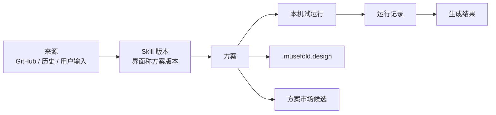

# Musefold / 未像 v0.3.2 设计方案规范

> 文档状态：设计冻结，待实现
> 版本：`v0.3.2`
> 负责人边界：产品交互、领域模型、分享格式、验收标准
> 关联文档：[方案 UI 与交互规范](V03.2-SCHEME-UI-INTERACTION-SPEC.md) · [Agent Runtime 开发规范](V03.2-AGENT-RUNTIME-DEVELOPMENT.md)

## 1. 定义与范围

### 1.1 产品定义

Musefold 不再以“提示词输入框 + 图片生成接口”为产品中心，而以可复用的视觉创作能力为中心。数据、运行时和分享边界统一为 Skill，中文产品界面统一称为“方案”。方案是一个可版本化、可试运行、可分享、可追溯的视觉生产 Skill，包含：

- 视觉规则：构图、留白、色彩、材质、字体、主体保真和禁用项。
- 输入契约：用户文字、用户图片、历史图片、参考图、文章和可选参数。
- Prompt 程序：固定规则、变量、条件和来源片段的结构化组合。
- 执行流程：分析、选图、编译、生成、评估、修复和保存。
- 质量门：输出尺寸、比例、主体保真、文字密度、风格一致性等可验证指标。
- 来源绑定：GitHub 仓库、commit、文件、许可证、历史对话和用户输入。

方案不是静态 Prompt，也不是一个额外包住 Skills 的容器。GitHub Skill、由历史内容生成的本地 Skill、由提示词或想法生成的本地 Skill 都使用同一个领域模型。多个来源组合时编译为一个新的组合 Skill；用户始终只调用一个方案。

`Skill` 是系统理解和交换它的方式，`方案` 是创作者理解和使用它的方式。普通界面不建立独立 Skills 页面，也不要求用户管理内部文件和工作流。

### 1.2 目标

1. 从历史记录或对话中的某张图片提取提示词、Skill、用户需求，生成可编辑的设计方案。
2. 从 GitHub 添加 Skill，确认后直接形成方案草稿，并绑定仓库地址、版本和来源文件。
3. 由 Agent 根据用户明确提出的要求搜索 GitHub 设计方案市场，用户选择候选项后安装并生成设计方案。
4. 从 GitHub 提示词仓库、README、示例图或工作流配置中提取可执行的设计方案。
5. 让绝大多数仓库都能被转换为“可用但诚实标注还原度”的设计方案，而不是假装所有仓库都能一比一执行。
6. 允许用户在 Composer 直接使用正式方案，也允许粘贴 Skill 地址进行本机试运行，或直接告诉 Agent 想法并生成方案草稿。
7. 通过自包含私有文件格式分享设计方案，并支持离线查看、试运行和审计。

### 1.3 不在本版本承诺的能力

- 不执行第三方仓库中的任意脚本、Shell、浏览器自动化或安装命令。
- 不承诺还原依赖私有模型、私有字体、私有 API、定制节点或外部数据库的仓库。
- 不在用户未明确发起搜索时自动联网扫描 GitHub。
- 不在一次运行里未经编译地堆叠多个独立 Skill。
- 不把设计方案自动发布到公开市场；分享默认是私有文件。

## 2. 核心对象与生命周期

### 2.1 对象关系



### 2.2 生命周期

| 状态 | 含义 | 普通 Composer 可引用 | 用户可做的事 |
|---|---|---:|---|
| `draft` 草稿 | 尚未完成本机验证，或正式方案存在待验证的新版本 | 否 | 编辑、查看仓库示例、试运行、删除 |
| `formal` 正式 | 至少一次本机试运行成功，并由用户确认封面和转正 | 是 | 使用、修改、导出、检查更新、移除 |

`试运行` 是运行模式，不是第三种方案状态；`发布` 保留给未来的公开市场。Agent 的输出永远首先是 `draft`，不得静默转为 `formal`。

正式方案被修改或上游 Skill 更新时，当前正式 revision 继续可用，新内容进入独立草稿 revision；只有新草稿再次完成本机试运行并由用户确认后，才替换当前正式 revision。

### 2.3 还原度

```ts
type Fidelity =
  | 'verified'    // 有校准样例和质量门证据
  | 'faithful'    // 规则和输入路径完整，未逐项校准
  | 'adapted'     // 已转换为 Musefold 可执行规则，存在不可还原项
  | 'unsupported' // 只能保存来源和说明，不能安全执行
```

还原度是事实声明，不是排序装饰。`unsupported` 方案可以保存和分享，但运行按钮必须禁用并给出缺失能力。

## 3. 入口与交互流程

本节只冻结产品边界；组件尺寸、状态、文案和键盘行为以 [方案 UI 与交互规范](V03.2-SCHEME-UI-INTERACTION-SPEC.md) 为唯一事实源。

### 3.1 方案中心与详情

- 方案中心只有“我的方案/发现”，没有独立 Skills 顶级页面。
- 我的方案按“草稿/正式”组织；发现页展示可以添加的远程 Skill 方案。
- 列表采用带真实作品缩略图的紧凑双列布局，不使用市场式大卡片瀑布流。
- 方案详情负责展示用途、输入要求、折叠相册、来源与技术详情；结构化规则不作为默认编辑界面。

### 3.2 Composer 是唯一创建和调用入口

Composer 在上方附件栏承载一个主方案和具名图片输入，在正文承载结构化 `@变量` 和自由补充要求。一次对话只允许一个主方案；多个 Skill 必须先编译为一个新的组合 Skill/方案。

Composer 有三个明确模式：

1. **使用正式方案**：用户输入只影响本次生成。
2. **试运行草稿**：本次输入验证方案，不修改方案本身。
3. **修改方案**：用户输入修改草稿，不直接触发生图。

模式不得根据模糊自然语言静默切换。草稿不出现在普通方案选择器中。

### 3.3 GitHub Skill

- 单独粘贴 GitHub Skill 地址时转换为来源附件并显示识别状态；嵌入普通段落时只建议识别。
- 新 Skill 必须由用户确认后才能添加为草稿。
- 第一次成功生成可以作为本机试运行，但成功后仍需用户选择封面并确认“设为正式”。
- 添加后未经本机试运行的 Skill 始终是草稿，不能在普通 Composer 调用。
- 远程更新创建新的草稿 revision，不直接覆盖正式版本。

### 3.4 历史、提示词与用户想法

- 从历史创建时，由用户选择具体图片、消息、提示词和上下文范围；不得默认读取整段对话。
- Composer 显示可编辑的提取说明，默认建议保留视觉风格、构图、色彩和材质，排除具体人物、品牌和原始文案。
- 快捷建议只能更新可见说明，不得在后台静默增加规则。
- 提示词仓库不要求存在 `SKILL.md`；分析器可以把它作为来源编译为本地 Skill 草稿，但必须诚实标记无法还原项。

### 3.5 Agent 创建和编辑

- Agent 对话是编辑入口，结构化 Skill 文档是事实源。
- 创建过程持续更新同一份方案草稿，不连续生成重复卡片，也不使用三栏结构化工作台。
- Agent 能合理推断时直接形成草稿，只在真正阻塞运行时提问。
- 修改和试运行每轮自动保存草稿；正式方案在新草稿验证期间继续可用。
- 第一版暂不把方案创建过程接入普通聊天历史，草稿通过“我的方案 > 草稿”恢复。

## 4. 优先级设置与冲突行为

### 4.1 三个用户可理解的级别

| 设置名 | 内部值 | 默认 | 行为 |
|---|---|---|---|
| **用户主导** | `user_first` | 否 | 用户本次输入优先；方案核心规则只作为参考，允许改变构图、色彩、主体和比例 |
| **方案主导** | `scheme_first` | **是** | 方案核心规则优先；用户输入填充方案声明的变量，不兼容的部分自动弱化、改写或忽略 |
| **智能协调** | `agent_mediated` | 否 | Agent 根据目标、方案证据和输入意图自动取舍，并在结果摘要中说明采用了什么 |

### 4.2 不再向用户暴露冲突分类

产品层不显示“硬冲突/软冲突/安全冲突”三类冲突，也不弹出优先级冲突确认框。用户一旦选择优先级，本次运行按该策略自动处理，不能因普通规则不一致而打断。

只有以下真实执行阻塞可以暂停，并且必须给出明确原因和恢复路径：

| 阻塞 | 例子 | 处理 |
|---|---|---|
| 安全 | 仓库含恶意路径、越权文件、未审计脚本 | 停止，不能被优先级绕过 |
| 权限/许可证 | 私有仓库未授权、许可证要求无法满足 | 停止，等待授权或更换来源 |
| 能力 | 当前 Provider 不支持多图、尺寸或编辑模式 | 停止，选择兼容 Provider 或修改输入 |
| 必需输入 | 方案声明的必填图片/文字缺失 | 停止，补充输入 |
| 资源 | 超出大小、步骤、成本或时间上限 | 停止或允许用户重新设置上限 |

这些是系统无法执行的条件，不是优先级冲突。

### 4.3 每次运行的优先级快照

```ts
interface RunPolicySnapshot {
  priorityMode: 'user_first' | 'scheme_first' | 'agent_mediated';
  schemeRevisionId: string;
  policyVersion: string;
  appliedAt: number;
}
```

运行完成后可在“运行详情”显示非阻塞摘要，例如“保留方案的 3:5 比例，采用用户输入的蓝色锚点”。摘要用于审计和复现，不用于再次询问用户。

## 5. 设计方案领域模型

### 5.1 顶层对象

```ts
interface DesignScheme {
  id: string;
  name: string;
  summary: string;
  status: 'draft' | 'formal';
  sourcePresentation: 'skill' | 'musefold-created';
  currentRevisionId: string;
  workingDraftRevisionId?: string;
  coverAssetId?: string;
  fidelity: 'verified' | 'faithful' | 'adapted' | 'unsupported';
  createdAt: number;
  updatedAt: number;
}

interface DesignSchemeRevision {
  schemaVersion: 1;
  revisionId: string;
  schemeId: string;
  sources: SourceBinding[];
  inputs: InputSlot[];
  parameters: ParameterDefinition[];
  constraints: DesignConstraint[];
  assets: AssetBinding[];
  promptProgram: PromptModule[];
  workflow: WorkflowGraph;
  evaluation: EvaluationProfile;
  compatibility: ProviderProfile[];
  policy: ExecutionPolicy;
  compilation: CompilationRecord;
}
```

### 5.2 来源绑定

```ts
type SourceKind =
  | 'github-skill'
  | 'github-prompt-repo'
  | 'github-readme'
  | 'history-image'
  | 'conversation-turn'
  | 'user-brief'
  | 'reference-image';

interface SourceBinding {
  id: string;
  kind: SourceKind;
  uri?: string;
  ref?: string;
  commit?: string;
  filePath?: string;
  contentHash?: string;
  license?: string;
  role: 'normative' | 'reference' | 'example' | 'context';
}
```

`normative` 规则可以影响编译；`reference` 只用于视觉参考；`example` 只能帮助抽取变量；`context` 只提供背景。来源角色必须在工作台可见。

### 5.3 输入槽位与参数

```ts
type InputKind = 'text' | 'image' | 'image-set' | 'article' | 'choice';
type ImageRole =
  | 'edit-target'
  | 'subject-reference'
  | 'style-reference'
  | 'layout-reference'
  | 'content-reference';

interface InputSlot {
  id: string;
  label: string;
  kind: InputKind;
  required: boolean;
  minItems?: number;
  maxItems?: number;
  imageRole?: ImageRole;
  preserve?: 'high' | 'medium' | 'low';
  description?: string;
}

interface ParameterDefinition {
  id: string;
  label: string;
  type: 'text' | 'select' | 'multi-select' | 'boolean' | 'color' | 'ratio' | 'number';
  defaultValue?: unknown;
  options?: string[];
  userEditable: boolean;
}
```

### 5.4 规则、Prompt 程序和流程

规则需要区分固定约束和可变变量，但不使用面向用户的冲突等级：

```ts
interface DesignConstraint {
  id: string;
  domain: 'composition' | 'color' | 'typography' | 'texture' | 'subject' | 'output' | 'safety';
  statement: string;
  mode: 'required' | 'preferred' | 'avoid';
  sourceIds: string[];
  userOverridable: boolean;
}

interface PromptModule {
  id: string;
  order: number;
  kind: 'system-rule' | 'input-template' | 'style-rule' | 'negative-rule' | 'quality-rule';
  template: string;
  variables: string[];
  sourceIds: string[];
}
```

流程只允许注册节点，不允许把任意仓库代码变成工具：

```ts
type WorkflowNodeKind =
  | 'inspect-input'
  | 'extract-content'
  | 'select-assets'
  | 'compile-prompt'
  | 'generate-image'
  | 'evaluate-image'
  | 'repair-image'
  | 'composite-image'
  | 'batch'
  | 'save-output';
```

### 5.5 质量门与兼容性

质量门包含确定性检查和视觉评估：比例、尺寸、文件完整性、主体保真、留白占比、文字密度、色彩锚点、纹理和禁用项。每条检查都要有阈值、证据和失败后的有限修复策略。

兼容性记录 Provider 能力：文本/视觉/生图、单图/多图、编辑/生成、可用尺寸、最大输入数、透明度和输出格式。运行前先做能力匹配，不能在生成中途才发现不支持。

## 6. 来源到设计方案的编译规则

### 6.1 仓库分类

Agent 先分类再编译：

| 仓库类型 | 可抽取内容 | 默认还原度 |
|---|---|---|
| Agent Skill | `SKILL.md`、references、示例图、路由 | `faithful` |
| Prompt 仓库 | Prompt 文本、变量、负面词、示例 | `faithful` 或 `adapted` |
| README + 示例图 | 说明、步骤、输入输出和视觉目标 | `adapted` |
| 工作流配置 | 节点、参数、顺序、质量门 | `faithful`，需能力映射 |
| 代码依赖型仓库 | 代码说明、配置和样例 | `adapted` 或 `unsupported` |
| 仅资产仓库 | 参考图、字体和素材说明 | `adapted` |

编译结果必须写明“采用了哪些内容、舍弃了哪些内容、为什么不能还原”。

### 6.2 文件读取白名单

默认读取 `SKILL.md`、README、文档、Prompt、JSON/YAML/TOML 配置和当前路由引用的图片。脚本、二进制、隐藏目录、符号链接和超出资源预算的文件不读取。绝对路径、环境变量、密钥和任意网络指令一律当作不可信文本。

### 6.3 多来源合并

多个来源合并时先建立新的设计方案草稿：

1. 提取每个来源的规则、变量、资产和流程。
2. 生成规则重叠和不可兼容项的内部报告。
3. Agent 按当前优先级自动取舍，保留来源证据。
4. 输出一个新的 `schemeId`，不改变任何原方案。

## 7. 私有分享格式

文件扩展名：`.musefold.design`

它是 ZIP 容器，包含：

```text
manifest.json           # 格式版本、方案名称、来源、许可证、hash
scheme.json             # 完整 DesignSchemeRevision
sources/                # 选中的文本来源和脱敏摘要
assets/                 # 用户明确选择的参考图/示例图
previews/               # 可选预览图
evaluations/            # 可选质量门证据
```

分享默认包含来源快照和资产，保证离线查看和尽可能的重放；不包含 API Key、GitHub Token、绝对路径、用户身份信息和未选择的仓库文件。外部 GitHub URL 只作为可选更新线索，导入后不自动联网、不自动更新。导入一个分享文件生成新的方案 ID 和版本，不覆盖现有方案。

导入前必须校验格式版本、大小、路径穿越、hash、许可证和资产 MIME；不执行包内脚本。

## 8. 验收标准

### 产品验收

- 用户能从历史图片、原始 Prompt、Skill 和补充需求生成草稿，并看到每条规则的来源。
- GitHub 安装在读取前有明确确认；取消不会丢失 Composer 文本和用户图片。
- 用户能在 Composer 直接调用正式方案，或把 Skill 地址添加为草稿后完成本机试运行。
- 草稿不能在普通 Composer 调用；成功试运行不会自动转为正式。
- 方案中心、详情和 Composer 只显示“草稿/正式”两个方案状态，试运行作为独立运行模式表达。
- 方案中心没有独立 Skills 页面，也没有“方案包含 Skills”的第二层管理界面。
- 折叠相册区分临时查看与永久封面，仓库示例和本机生成有明确来源。
- Composer 支持一个主方案、具名图片槽位、结构化 `@变量` 和自由补充输入。
- 市场搜索只在用户发起后联网；候选安装仍需确认。
- 三个优先级设置可独立切换，默认“方案主导”；普通规则不一致不弹冲突框。
- 每次运行详情都有优先级快照、方案 revision、来源 commit、Provider 和 Agent 版本。
- 方案能导出和导入 `.musefold.design`，离线可浏览，且不泄露密钥和绝对路径。

### 质量验收

- `verified` 方案有可重复的样例、质量门和评估证据。
- `adapted`/`unsupported` 方案明确显示不可还原项，不能伪装成高还原。
- 多图输入在方案中声明图片角色、数量、编号和 Provider 能力。
- 方案运行只能经过白名单节点，第三方脚本从未执行。

## 9. 交付阶段

| 阶段 | 交付 |
|---|---|
| P0 领域重建 | 新数据库、新 TypeScript 类型、方案中心/详情/Composer 草稿骨架、三档优先级设置 |
| P1 来源编译 | GitHub/历史/Prompt 仓库读取、安装确认、来源绑定、草稿生成 |
| P2 Runtime MVP | 确定性编排、Provider 适配、多图输入、运行事件和历史 |
| P3 市场探索 | 用户主动搜索、候选评估、安装确认、合并编译 |
| P4 分享与复现 | `.musefold.design` 导入导出、离线预览、重放测试 |
| P5 校准与扩展 | 样例集、视觉评估、修复策略、更多 Provider 和原生转换器 |

## 10. 冻结决策

本版本的“冲突”只作为内部编译和运行日志，不作为用户流程。设置优先级后，正常运行不再要求用户逐项确认；只有安全、权限、能力、必需输入和资源预算等真实阻塞可以中断。任何实现如果重新引入普通规则冲突弹窗，都视为违反 v0.3.2 交互契约。
