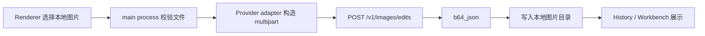

# v0.3 图片编辑 multipart 上传开发说明

> 版本目标：`v0.3`
> 文档状态：实测后收敛方案
> 适用场景：参考图编辑、图生图、`gpt-image-2` 图片编辑

## 1. 结论

v0.3 的 TvT image2 图片编辑主链路使用 **multipart 直接上传图片**，不再依赖图床、对象存储或公网图片 URL。

```text
本地图片
  → 主进程读取和校验
  → multipart/form-data 提交给 /v1/images/edits
  → 返回 b64_json
  → 写入本地生成历史
```

这个结论来自 2026-08-08 的真实联调：

- `images[].image_url` 方式会进入远端下载阶段，但返回 `Unable to download content from the provided URL before the timeout`。
- 换成公开 HTTPS 图片 URL 后仍然出现同类远端下载失败。
- 标准 `/v1/files` 上传接口在该中转站返回 `404`。
- `multipart/form-data` 直接向 `/v1/images/edits` 上传图片成功，返回 `HTTP 200` 和 `b64_json`。

因此，Musefold 接入该中转站 image2 时，应优先走 multipart；公网 URL 方案不作为 v0.3 图片编辑主设计。

## 2. 架构



Renderer 不持有 Provider API Key；图片文件读取、请求构造、错误归一化和结果落盘都在主进程完成。

## 3. Provider 请求

接口：

```http
POST https://ai.tvt.wiki/v1/images/edits
Authorization: Bearer <provider-api-key>
Content-Type: multipart/form-data
```

字段：

| 字段 | 类型 | 必填 | 说明 |
|---|---|---|---|
| `model` | string | 是 | `gpt-image-2` |
| `prompt` | string | 是 | 编辑指令 |
| `image[]` | file[] | 是 | 按 `referenceImages` 顺序重复提交；支持多张本地图片 |
| `size` | string | 否 | 例如 `1024x1024`，按 Provider 实测能力决定 |
| `n` | number | 否 | 默认 `1` |

示例：

```bash
curl "https://ai.tvt.wiki/v1/images/edits" \
  -H "Authorization: Bearer $TVT_API_KEY" \
  -F model=gpt-image-2 \
  -F "prompt=只修改背景，保持主体不变" \
  -F size=1024x1024 \
  -F n=1 \
  -F "image[]=@/absolute/path/input-1.png" \
  -F "image[]=@/absolute/path/input-2.png"
```

返回处理：

- 优先读取 `data[0].b64_json`。
- 解码后写入 Musefold 图片目录。
- 若未来 Provider 返回 `url`，再下载落盘；当前实测成功路径为 `b64_json`。

## 4. 主进程流程

1. Renderer 只提交本地文件路径或文件选择结果，不接触 API Key。
2. 主进程校验文件存在、大小和类型。
3. 主进程用 multipart 直接提交给 Provider。
4. Provider 返回后，主进程把图片写入本地历史目录。
5. History / Workbench 使用本地 `imagePath` 或现有 `media://` 机制展示结果。

伪代码：

```ts
const form = new FormData();
form.append('model', 'gpt-image-2');
form.append('prompt', prompt);
form.append('size', '1024x1024');
form.append('n', '1');
for (const image of referenceImages) {
  const { bytes } = await readLocalImage(image);
  form.append('image[]', new Blob([bytes], { type: image.mimeType }), image.name);
}

const response = await fetch(`${baseUrl}/images/edits`, {
  method: 'POST',
  headers: {
    Authorization: `Bearer ${apiKey}`,
  },
  body: form,
});

const payload = await response.json();
const b64 = payload.data?.[0]?.b64_json;
if (!b64) throw new Error('响应中没有图像数据');

await writeFile(outputPath, Buffer.from(b64, 'base64'));
```

Node / Electron 具体实现应优先复用项目现有 Provider 抽象和错误归一化逻辑，不在 renderer 新增网络直连。

## 5. 校验与限制

上传前至少校验：

- 文件类型：`image/png`、`image/jpeg`、`image/webp`。
- 文件大小：默认不超过 `20 MiB`，可按 Provider 实测限制下调。
- 图片存在且可读。
- 路径必须来自系统文件选择或应用内部已知历史图片，不接受任意远端 URL 当作本地路径。

错误处理：

| 场景 | UI 提示 |
|---|---|
| 文件不存在或不可读 | 图片读取失败，请重新选择 |
| 文件类型不支持 | 请选择 PNG、JPG 或 WebP 图片 |
| Provider 返回 400 下载 URL 失败 | 当前 Provider 不支持该 URL 输入，请改用本地图片上传 |
| Provider 返回 401 / 403 | API Key 无效或权限不足 |
| Provider 返回 402 / 余额类错误 | 余额不足或账户不可用 |
| Provider 返回 5xx | 图像服务暂时不可用，请稍后重试 |

## 6. 不再需要线上云存储的范围

对于当前 v0.3 的 **TvT image2 图片编辑**，不需要线上云存储：

- 不需要先上传到图床。
- 不需要生成 24h 公网 URL。
- 不需要 MinIO 参与图片编辑请求。
- 不需要域名、HTTPS 反代或对象存储签名链路作为前置条件。

云存储以后仍可能用于这些独立场景，但不属于本功能主链路：

- 多设备同步历史图片。
- 团队共享素材库。
- 需要把生成结果长期分享给外部用户。
- 某些 Provider 未来只接受公网 URL 且不支持 multipart。

## 7. 测试清单

- [ ] PNG / JPG / WebP 本地图片可成功提交 multipart。
- [x] `gpt-image-2` 两张图片按 `image[]` 顺序提交并生成组合图。
- [ ] 成功响应中的 `b64_json` 可解码为有效 PNG。
- [ ] 输出图写入本地历史目录并可展示。
- [ ] renderer 包和日志中不存在 Provider API Key。
- [ ] `images[].image_url` 失败时提示改用本地上传，不阻塞 multipart 主链路。
- [ ] 取消、超时、余额不足、鉴权失败和 5xx 错误都有清晰状态。
- [ ] 真实 API 验收只使用临时 Key，验收后轮换。

## 8. 当前完成度

已完成：

- 本地图片 multipart 提交到 TvT `/v1/images/edits` 实测成功。
- 返回 `b64_json` 解码落盘实测成功。
- 已确认 `images[].image_url` 和 `/v1/files` 不作为当前主链路。

已补充：

- 多图顺序与 `图 1 / 图 2` 指代契约见 `MULTI-IMAGE-INPUT-AND-REFINEMENT.md`。
- Provider 仍在主进程构造 multipart，renderer 不接触 Key。

## 9. 禁止事项

- 不要把 Provider API Key 暴露给 renderer。
- 不要把 API Key、服务器密码或对象存储密钥写入文档、日志或测试快照。
- 不要为了兼容失败的 `image_url` 路径重新引入图床作为必选依赖。
- 不要让用户手工输入任意本地路径后直接读取；路径来源必须可控。
