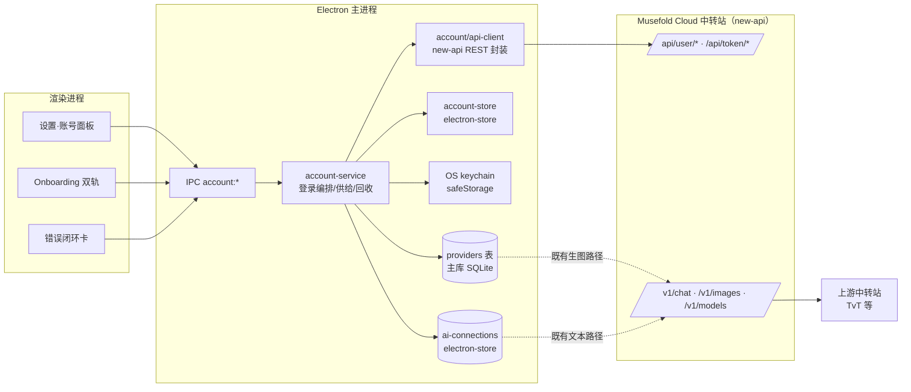

# V05 · 技术架构（开发文档）

> **状态**：设计规格（待评审）
> **日期**：2026-08-13
> **上游**：V05-REQUIREMENTS.md（FR/NFR/OQ）、README §5（D1–D12）
> **原则**：账号层是**既有双栈之上的自动配置器**——生图与文本的请求路径、密钥加载、激活语义一概不动；改动收敛在「新增账号模块 + 两处存储加字段 + UI」。

---

## 1. 总览



关键不变量：

1. **生图/文本调用代码零改动**——托管记录就是一条普通的 `openai-compatible` Provider / gateway 连接，密钥从各自 keychain 按记录 id 加载（既有机制）。
2. **凭据只在主进程**——渲染进程经 `window.api.account` 只能拿到状态摘要（`hasKey`/`suffix` 级别），与既有 `provider:*`、`aiConnection:*` 约定一致。
3. **账号服务器就是一个 new-api 实例**——不依赖私有扩展，自建站可平替（D11/NFR-COMP-03）。

---

## 2. 模块设计：`electron/account/`

```text
electron/account/
├── api-client.ts      # new-api REST 封装（纯网络层，无副作用）
├── account-service.ts # 登录编排、令牌供给、双栈托管、回收（唯一副作用协调者）
├── account-store.ts   # electron-store：非敏感账号状态
└── __tests__/
```

### 2.1 `api-client.ts`

纯函数式客户端：输入 `serverUrl` + 凭据，输出解析后的领域对象；不触碰 keychain / store。便于单测与未来替换（D3 的抽象位）。

> 接口已按 2026-08-13 生产实测（new-api v1.0.0-rc.24）修订：管理面凭据 = **短期 JWT（约 30 分钟）+ 30 天期 refresh 凭据**，双凭据均由登录一次性下发，此后 30 天内可静默续期，**无需存储密码、无多设备互踢**。

```ts
export interface RelayAuthSession {
  jwt: string;             // data.access_token（JWT，约 30 分钟）
  jwtExpiresAt: number;    // data.access_expires_at（epoch 秒）
  refreshToken: string;    // Set-Cookie: new_api_refresh=<值>（约 30 天，HttpOnly，Path=/api/user/auth）
  user: RelayUser;         // data.user（含 id、username、quota）
}

export interface NewApiClient {
  register(input: { username: string; password: string }): Promise<void>;          // POST /api/user/register
  login(input: { username: string; password: string }): Promise<RelayAuthSession>; // POST /api/user/login（响应体 + Set-Cookie 双通道）
  /** 静默续期：POST /api/user/auth/refresh，携带 Cookie: new_api_refresh=<值>；
      返回新 JWT，且响应会轮换 refresh 值（必须回存）。已实测无 Origin 头可用。 */
  refresh(refreshToken: string): Promise<RelayAuthSession>;
  getSelf(jwt: string): Promise<RelayUser>;                       // GET /api/user/self（quota/500000 = 美元）
  listUserModels(jwt: string): Promise<string[]>;                 // GET /api/user/models（管理面模型列表，无需 sk-）
  createToken(jwt: string, input: { name: string }): Promise<void>;   // POST /api/token/（响应刻意不含 key）
  listTokens(jwt: string): Promise<RelayApiToken[]>;              // GET /api/token/?p=0&page_size=20（key 为掩码）
  fetchTokenKey(jwt: string, tokenId: number): Promise<string>;   // POST /api/token/{id}/key → 完整明文（服务端限流）
  /** POST /api/user/topup。成功：data = 到账 quota（管理面余额即时更新，/v1 调用面另有缓存延迟）；
      失败：HTTP 200 + success:false，服务器对已用/无效/空码统一模糊响应（防枚举）→ ACCOUNT/REDEEM_INVALID。
      golden：tests/fixtures/newapi/redemption-golden.json */
  redeem(jwt: string, code: string): Promise<{ quotaAdded: number }>;
  /** GET /api/pricing —— 公开接口（无鉴权），返回全模型定价 + pricing_version 指纹 + group_ratio */
  getPricing(): Promise<RelayPricing>;
}

export interface RelayModelPricing {
  modelName: string;
  quotaType: 0 | 1;          // 0 = 按量（ratio），1 = 按次（price）
  modelRatio: number;        // 按量：quota = tokens × ratio（补全另乘 completionRatio）
  completionRatio: number;
  modelPrice: number;        // 按次：美元/次；quota = price × 500000
  enableGroups: string[];
}

export interface RelayPricing {
  version: string;           // pricing_version 指纹，变化才重新应用
  groupRatio: Record<string, number>;
  models: RelayModelPricing[];
}
```

实现要点：

- 统一处理 new-api 响应信封 `{ success, message, data }`：`success=false` 转 `RelayApiError`（携带 `message` 原文供映射）。
- **JWT 管理请求**：`Authorization: Bearer <JWT>`，无 cookie、无需 `New-Api-User` 头（该头只在使用"系统 access token"时需要——App 不用这种凭据，因为它全账号单值、多设备重铸会互踢；参考 `.claude/skills/newapi` 的用法差异）。
- **refresh 凭据在 Electron 主进程手工管理**：从登录/续期响应的 `Set-Cookie` 头解析 `new_api_refresh` 值（不依赖浏览器 cookie 容器），续期请求手工拼 `Cookie` 头。**每次 refresh 都会轮换该值，必须立即回存 keychain**。
- **设备令牌明文取回（OQ-01 冻结）**：列表/详情只给掩码；完整 key 唯一来源是 `POST /api/token/{id}/key`。幂等供给：按 store 记录的 id 取回，失败则新建。
- **额度不足（OQ-02 冻结）**：`/v1` 返回 HTTP 403 + `error.code = "insufficient_user_quota"` → `ACCOUNT/QUOTA`；充值/兑换后配额有 **~15–60s Redis 缓存延迟**，兑换成功文案与重试时机需容忍（产品文档 §5）。
- 所有请求 10s 超时（NFR-REL-01）、显式 `redirect: 'error'`、仅接受 `serverUrl` 同源。
- 2FA / Passkey 账号：登录响应走 `/api/user/login/2fa` 分支，v0.5 不支持——识别到该分支时报 `ACCOUNT/CREDENTIALS` 变体文案「该账号开启了两步验证，请使用网页控制台」。

### 2.2 `account-store.ts`（electron-store，非敏感）

```ts
interface AccountStoreShape {
  serverUrl: string;            // 缺省 DEFAULT_ACCOUNT_SERVER_URL
  session: {
    username: string;
    userId: number;
    deviceTokenId: number | null;   // new-api 令牌记录 id（FR-ACC-07 幂等复用）
    deviceTokenName: string;        // musefold-<platform>-<4位随机>
    managedProviderId: string | null;    // providers 表托管行 id
    managedConnectionId: string | null;  // ai-connections 托管记录 id
    quotaCache: { value: number; at: number } | null;
    health: 'ok' | 'token-invalid' | 'unreachable' | 'unknown';
  } | null;                     // null = 未登录
}
```

敏感值（refresh 凭据、JWT、设备令牌 sk-）**不进本 store**，见 §4；JWT 甚至不落盘。

### 2.3 `account-service.ts`

单例（同 `getAiConnectionStore` 模式），持有 api-client、account-store、双栈 store 句柄与两个 keychain。对外暴露的方法与 IPC 一一对应（§7）。

---

## 3. new-api 契约摘录（2026-08-13 生产实测冻结，v1.0.0-rc.24）

> 每行均已在 Musefold Cloud 生产实例实测；golden 快照由冒烟脚本产出（V05-ACC-01 直接复用）。补充参考：`.claude/skills/newapi/docs/`（官方 skill 附带的接口文档）。

| 用途 | 端点 | 鉴权 | 实测要点 |
|---|---|---|---|
| 注册 | `POST /api/user/register` | 公开（限流） | `{username, password}`；用户名 ≤ 12 字符（服务端校验）；成功后仍需调 login 获取凭据 |
| 登录 | `POST /api/user/login` | 公开（限流） | 响应体 `data = {access_token(JWT), access_expires_at, token_type:"Bearer", user}`；**同时 Set-Cookie `new_api_refresh`（约 30 天，Path=/api/user/auth）** |
| 静默续期 | `POST /api/user/auth/refresh` | Cookie `new_api_refresh` | 返回同 login 的 `data`（新 JWT）+ **轮换后的 refresh Cookie**；无 Origin 头可用（Electron 主进程 ✓） |
| 用户信息 / 余额 | `GET /api/user/self` | Bearer JWT | `quota`（÷500000 = 美元）、`used_quota`、`group`、`id` |
| 可用模型（管理面） | `GET /api/user/models` | Bearer JWT | 账号面板展示模型列表用，无需消耗令牌 |
| 创建令牌 | `POST /api/token/` | Bearer JWT | `{name, unlimited_quota:true, expired_time:-1}`；**响应不含 key**（`{"success":true}`） |
| 令牌列表 | `GET /api/token/?p=0&page_size=20` | Bearer JWT | `data.items[]`：`id`,`name`,`status`,`key`（**掩码**，形如 `tP1…LmzM`，18 位） |
| 取完整令牌 key | `POST /api/token/{id}/key` | Bearer JWT（限流） | `data.key` = 完整明文（51 位，含 `sk-` 前缀视版本，需归一化） |
| 兑换充值 | `POST /api/user/topup` | Bearer JWT | `{key: 兑换码}` → `data` = 到账 quota；**到账后 /v1 侧有 ~15–60s 缓存延迟** |
| 模型列表（调用面） | `GET /v1/models` | Bearer sk- | 返回含别名（`musefold-*-default`）的完整列表 |
| 文本 | `POST /v1/chat/completions` | Bearer sk- | 别名重定向在服务端发生；计费按请求模型名（别名） |
| 生图 | `POST /v1/images/generations` / `edits` | Bearer sk- | gpt-image-2 默认返回 `b64_json`；既有生图路径（含 multipart 直传，v0.3 文档）不变 |
| 额度不足错误 | （/v1 各端点） | — | HTTP 403 + `{"error":{"code":"insufficient_user_quota","type":"new_api_error"}}` |
| 模型未定价错误 | （/v1 各端点） | — | HTTP 400 + 中英双语提示"价格尚未由管理员配置"（服务器配置缺陷信号，App 按 `ACCOUNT/SERVER` 处理） |

---

## 4. 凭据模型（NFR-SEC-01，按实测修订）

| 凭据 | 生命周期 | 存放 | keychain 条目 id |
|---|---|---|---|
| 密码 | 单次编排的内存作用域 | 不落盘、不进 store、序列化边界显式剔除（有单测） | — |
| JWT（管理面短期） | 约 30 分钟（`access_expires_at`） | **仅主进程内存**，不落盘——过期即静默续期 | — |
| refresh 凭据（管理面长期） | 约 30 天，**每次续期轮换** | `ElectronAiSecretKeychain`；续期成功后立即覆写 | `account:refresh-token` |
| 设备令牌 sk-（调用面） | 长期（`expired_time: -1`） | 写入**两处**既有 keychain：生图 keychain（key=托管 provider id）与文本 keychain（key=托管 connection id） | 随托管记录 id |

要点：

- **JWT 不落盘**是安全增益：磁盘上只有 30 天期、可服务端吊销、单一用途（`/api/user/auth` 路径）的 refresh 值和长期 sk- 令牌。
- **多设备天然隔离**：每次登录产生独立的 refresh 会话（uuid.secret 结构），设备间互不影响；不使用 new-api 的"系统 access token"（`GET /api/user/token`）——那是全账号单值，重铸互踢（该凭据仅供运维工具使用，如 `.claude/skills/newapi`）。
- 设备令牌双写两处 keychain 是刻意的冗余：两栈的密钥加载代码（`loadApiKey(providerId)` / `secrets.load(connectionId)`）零改动即可工作。
- 登出回收清单（四处）：refresh keychain 条目 + 两条托管记录的 keychain + 内存 JWT 置空。

---

## 5. 登录编排与回收

### 5.1 登录（`account:login`；注册成功后复用同一编排）

```text
0  （注册轨）client.register(username, password)            —— 服务端限流，失败映射 ACCOUNT/CONFLICT 等
1  session = client.login(username, password)               → { jwt, refreshToken, user }
2  keychain.save('account:refresh-token', refreshToken)；jwt 驻留内存
3  self = client.getSelf(jwt)                               → quota（决定 Onboarding 是否进兑换步）
4  确保设备令牌（幂等，FR-ACC-07）：
   a. store.deviceTokenId 存在 → client.fetchTokenKey(jwt, id)：
      成功 → 复用该 sk-key；404/失败 → b
   b. client.createToken({name: deviceTokenName}) → listTokens 按 name 定位新 id
      → client.fetchTokenKey(jwt, id) → sk-key（归一化 sk- 前缀）
5  双栈托管写入（幂等 upsert，见 §6.3）：
   a. providers 表：insert or update 托管行（managed_by='account'）→ setActive
   b. AiConnectionStore：create or update 托管记录（managedBy='account'）→ setActive
   c. 两处 keychain 写入 sk-key
6  store.session = {...}; health='ok'; 广播 account:changed
失败回滚（NFR-REL-02）：按已完成步骤逆序删除（keychain 条目、托管行），
store.session 置 null；错误带阶段标签（'auth' | 'token' | 'provision'）供 UI 展示。
```

### 5.2 管理凭据静默续期（新增，替代"30 分钟后重登"）

`account-service` 内维护单飞（single-flight）的 `ensureJwt()`：

```text
ensureJwt():
  内存 jwt 有效（余量 > 60s）→ 直接返回
  否则 refreshToken = keychain.load('account:refresh-token')
    无值 → 抛 ACCOUNT/AUTH（未登录/已登出）
  session = client.refresh(refreshToken)      —— 并发调用合并为一次
    成功 → 覆写 keychain refresh 值（响应必轮换）+ 更新内存 jwt → 返回
    401/403 → health='token-invalid'，抛 ACCOUNT/AUTH（refresh 过期或被吊销 → 需重新登录）
    网络错误 → health='unreachable'，抛 ACCOUNT/NETWORK（不清凭据）
```

所有管理操作（`refreshQuota` / `redeem` / 令牌供给）先过 `ensureJwt()`。正常使用下用户 30 天内不会再见到登录框；超过 30 天未启动 App 才需要重登。

### 5.3 登出（`account:logout`）

本地操作，服务器不可达也成功：删除两条托管记录（含各自 keychain）→ 删除 `account:refresh-token` → 内存 JWT 置空 → `session=null` → 激活权回落（复用两栈已有的 delete 回落逻辑：`updatedAt` 最新者）→ 广播 `account:changed`。

### 5.4 凭据失效自愈（三层，按面分治）

| 层 | 触发 | 处置 |
|---|---|---|
| JWT 过期（30 分钟） | 管理请求前检查 / 401 | `ensureJwt()` 静默续期，用户无感 |
| refresh 失效（30 天未用 / 服务端吊销 / 改密码） | refresh 返回 401 | `health='token-invalid'` → 账号面板「重新登录」；**不动设备令牌**，AI 调用不受影响 |
| 设备令牌被删（网页端操作） | `/v1` 返回 401 且记录 `managedBy='account'` | `ACCOUNT/AUTH` 错误卡 → 重新登录 → 编排步骤 4 自动新建令牌覆写 |

### 5.5 定价动态同步（FR-GW-09，2026-08-13 实测冻结）

`GET /api/pricing` 为**公开接口**（无鉴权、无消耗），返回全模型定价与 `pricing_version` 指纹。计费公式已用生产扣账逆向验证：

```text
按量（quota_type=0）：quota = (prompt_tokens + completion_tokens × completion_ratio) × model_ratio × group_ratio
按次（quota_type=1）：quota = model_price × 500000 × group_ratio        // 每次调用
美元成本 = quota ÷ 500000
```

同步机制：

1. **拉取时机**：登录编排完成后、账号面板打开时、每次生成完成后的余额刷新顺带；`pricing_version` 未变化则跳过应用（幂等、无写放大）。
2. **托管生图 Provider 自动定价**：按 `IMAGE_MODEL` 的 `model_price` 自动写入既有 `settings:pricing`——**单位为「点」**（`model_price × 500000`，如 $0.04 → 20000 点/张），与账号余额、服务器扣费同单位（FR-COST-03 的记账单位快照配套）；托管记录的定价 UI 只读（「随账号同步」徽标），不触发"未配置单价"警告。
3. **文本成本**：以「生成后余额变动」作为真实成本反馈；逐 token 预估**已拍板不做**（2026-08-13，需求 §8.1）。
4. **运营者改价生效路径**：后台改倍率 → `pricing_version` 变化 → 全端下次拉取自动跟进，**不发版、不重登录**。
5. 自建 new-api 站同样受益（接口是标准能力，D11 兼容）。

---

## 6. 数据模型变更

### 6.1 主库迁移（providers 表 + history 表，同一迁移文件）

新增迁移文件 `packages/core/src/db/migrations/00XX_account_managed.ts`（编号接主库当前 `user_version` 顺延，随 v0.4 的迁移调度机制执行）：

```sql
ALTER TABLE providers ADD COLUMN managed_by TEXT DEFAULT NULL;        -- 'account' | NULL
ALTER TABLE history   ADD COLUMN cost_unit  TEXT NOT NULL DEFAULT 'cny_cent';  -- 'cny_cent' | 'point'
```

`cost_unit` 在生成入账时按 Provider 来源快照（托管 = `'point'`，数值 = 实际扣费点数）；单位随记录冻结，登出删除托管 Provider 后历史仍可正确解释（FR-COST-03）。`HistoryStats` 聚合按单位分组（`totals: Array<{ unit, cost }>`，`byProvider`/`buckets` 行内携带 `unit`），渲染层 `formatCost(cost, unit)` 支持「点」与 ¥ 双格式。

- `rowToProvider`（`packages/core/src/services/providers.ts`）与 `ProviderConfig`（`shared/types/models.ts`）同步透出 `managedBy: 'account' | null`。
- 写路径守卫：`provider:update`（baseUrl/name）、`provider:delete`、`provider:saveKey` 对 `managed_by='account'` 行抛 `ACCOUNT/MANAGED_READONLY`（FR-GW-03）；`provider:update` 仅放行 `model` 字段；`account-service` 内部走专用直写函数绕过守卫。
- 导出：`system:export` 聚合查询追加 `WHERE managed_by IS NULL`（FR-GW-08）；导入端剔除该字段。

### 6.2 文本连接（electron-store，无迁移成本）

- `PersistedAiConnection` / `AiConnectionProfile` 增加 `managedBy: 'account' | null`（缺省 null，旧数据天然兼容，NFR-COMP-01）。
- `AiConnectionPresetId` 联合类型追加 `'account'`；**不**加入 `AI_CONNECTION_PRESETS` 展示列表（托管记录不通过预设对话框创建）。
- `AiConnectionStore.update/delete/saveKey/deleteKey` 对 `managedBy='account'` 记录按 §6.1 同规则守卫，`updateManaged()` 内部方法供 account-service 使用。

### 6.3 托管记录形态

| 字段 | 生图托管行 | 文本托管记录 |
|---|---|---|
| name | `Musefold 账号` | `Musefold 账号` |
| type / presetId | `openai-compatible` | `'account'` |
| baseUrl | `<serverUrl>/v1` | `<serverUrl>/v1` |
| model | `musefold-image-pro` | `musefold-agent` |
| managed_by / managedBy | `'account'` | `'account'` |

幂等 upsert：按 store.session 中记录的 id 更新；id 失效（被外力删除）则重建并回写 id。

### 6.4 共享常量（`shared/constants.ts`）

```ts
export const DEFAULT_ACCOUNT_SERVER_URL = 'https://cloud.musefold.example'; // OQ-05 定稿后替换
export const ACCOUNT_DEFAULT_TEXT_MODEL = 'musefold-agent';
export const ACCOUNT_DEFAULT_IMAGE_MODEL = 'musefold-image-pro';
export const ACCOUNT_FALLBACK_TEXT_MODEL = 'gpt-5.4-mini';    // D6 兜底
export const ACCOUNT_FALLBACK_IMAGE_MODEL = 'gpt-image-2';
```

---

## 7. IPC 契约新增（同步更新 `docs/07-ipc-contracts.md`）

通道常量（`shared/types/ipc.ts`，沿用 `domain:action` 约定）：

```ts
ACCOUNT_STATUS: 'account:status',
ACCOUNT_REGISTER: 'account:register',
ACCOUNT_LOGIN: 'account:login',
ACCOUNT_LOGOUT: 'account:logout',
ACCOUNT_REDEEM: 'account:redeem',
ACCOUNT_REFRESH_QUOTA: 'account:refreshQuota',
ACCOUNT_SET_SERVER_URL: 'account:setServerUrl',
/** 主进程 → 渲染进程：登录/登出/额度/健康度变化 */
ACCOUNT_CHANGED: 'account:changed',
```

`window.api.account` 形态（`shared/types/account.ts` 新文件承载类型）：

```ts
export interface AccountStatus {
  loggedIn: boolean;
  username: string | null;
  serverUrl: string;
  isDefaultServer: boolean;
  quota: { value: number; at: number } | null;   // 缓存值 + 时间戳（单位：点）
  /** 约可生成张数 = quota ÷ 当前生图单价点数（主进程按 FR-GW-09 定价计算；无定价时 null） */
  estImagesRemaining: number | null;
  deviceTokenSuffix: string | null;               // 仅后 4 位
  health: 'ok' | 'token-invalid' | 'unreachable' | 'unknown';
  /** 服务器公告（FR-SET-05；GET /api/notice + /api/status announcements，随余额刷新顺带拉取；已读记忆在渲染层） */
  notices: Array<{ id: string; content: string; publishedAt: number | null }>;
}

account: {
  status: () => Promise<AccountStatus>;
  register: (input: { username: string; password: string }) => Promise<AccountStatus>; // 注册即登录
  login: (input: { username: string; password: string }) => Promise<AccountStatus>;
  logout: () => Promise<AccountStatus>;
  redeem: (code: string) => Promise<{ quotaAdded: number; status: AccountStatus }>;
  refreshQuota: () => Promise<AccountStatus>;
  setServerUrl: (url: string) => Promise<AccountStatus>;  // 要求未登录态，否则 ACCOUNT/MANAGED_READONLY
  onChanged: (cb: (status: AccountStatus) => void) => () => void;
}
```

约束：请求/响应中**永不**出现密码回显、access_token、sk- 明文（NFR-SEC-04）；`register/login` 的密码入参在 handler 入口即进入编排作用域，不入日志（FR-ERR-04 单测覆盖序列化边界）。

---

## 8. 错误映射

账号错误码域 `ACCOUNT/*`（渲染层文案见产品文档 §5）：

| 触发源 | 判定 | 错误码 |
|---|---|---|
| 管理 API `success=false` + 凭据类 message / 登录 401 | 登录/注册表单 | `ACCOUNT/CREDENTIALS` |
| 注册用户名占用 | message 匹配（golden 锁定） | `ACCOUNT/CONFLICT` |
| 兑换失败（已用/无效/空统一） | `POST /api/user/topup` 返回 HTTP 200 + `success:false`（服务器防枚举，不区分原因；golden：`tests/fixtures/newapi/redemption-golden.json`） | `ACCOUNT/REDEEM_INVALID` |
| 管理 API 401（非登录） | access_token 失效 | → `health='token-invalid'`（不弹全局错） |
| `/v1` 调用 401 且记录 `managedBy='account'` | 既有 AUTH 错误 + 托管判定 | `ACCOUNT/AUTH` |
| `/v1` 调用额度不足（状态码/错误体，OQ-02） | 同上 | `ACCOUNT/QUOTA` |
| fetch 超时 / DNS / 连接拒绝 | 所有账号请求 | `ACCOUNT/NETWORK` |
| 5xx | 所有账号请求 | `ACCOUNT/SERVER` |
| 托管记录被禁写 | 存储层守卫 | `ACCOUNT/MANAGED_READONLY` |

实现位置：`/v1` 侧不改 Provider 适配器——在生图/文本两条错误出口处按「记录是否托管」做一次**后置增强映射**（既有 `AUTH/401`、`RATE_LIMIT` 语义对 BYOK 记录保持原样）。

---

## 9. 安全模型

| 红线 | 落实 |
|---|---|
| 明文凭据不出主进程 | `account:*` 响应只含摘要（suffix/布尔）；渲染层无任何凭据读取通道 |
| 密码不落盘 | 内存作用域 + 序列化剔除单测（NFR-SEC-03）；electron-store/日志/诊断快照均验证 |
| 服务器地址可信 | `normalizeAiBaseUrl` 同源校验复用；默认地址 https；自定义 http 地址仅允许私网/回环（开发与自建内网场景），公网 http 拒绝 |
| 自动化面隔离（D12） | 控制面/CLI/MCP 无 `account` 域；provider 列表响应携带 `managedBy` 供只读展示，不提供任何写口 |
| 日志脱敏 | logger 层对 `password`、`access_token`、`sk-` 前缀值全局 redact（既有密钥脱敏机制扩展三条规则） |
| 导出安全 | 托管行不出现在 `ExportEnvelope`（FR-GW-08），杜绝"服务器地址+用户名"组合泄露面 |

---

## 10. 与 v0.4 的协调

1. **迁移次序**：v0.5 主库迁移文件落在 `packages/core/src/db/migrations/`，编号在实现时接当前 head 顺延；与 v0.4 分支合并时只需保持编号单调。
2. **服务面**：V04-CORE-04 的 Provider 读服务透出 `managedBy` 字段即可，无行为变化；GenerationService（V04-CORE-05）对托管 Provider 完全无感知。
3. **控制面契约**：Automation API v1 的 provider 响应加只读字段属「只加不改」，符合 D10（v0.4）的兼容承诺。

---

## 11. 测试基建

开发与联调资产（2026-08-13 起可用）：

- **生产实例**：`https://45.207.211.136`（v1.0.0-rc.24，双 TvT 渠道 + 别名已配置）；测试账号 `smoke01`（凭据在服务器 `/opt/musefold/.smoke-credentials`，余额约 $4.94）可直接用于 App 联调。
- **golden 快照来源**：`/opt/musefold/configure-stage*.py` 冒烟脚本的输出即 V05-ACC-01 契约测试的种子数据（登录/refresh/令牌/兑换/额度错误全覆盖）。
- **`.claude/skills/newapi`**（项目级 skill）：开发期通过对话管理中转站（查模型/余额/令牌、安全注入 Key），使用"系统 access token + `New-Api-User` 头"的运维凭据模式——注意与 App 的 JWT+refresh 用户凭据模式是**两套体系**，勿混用。

| 层 | 手段 |
|---|---|
| api-client 单测 | vitest + mock fetch；golden 响应快照取自真实 new-api（生产实例采集 + 本地 docker `calciumion/new-api:v1.0.0-rc.24` 复核），含成功/失败/超时矩阵 |
| account-service 单测 | 注入 mock client + 内存 store/keychain（既有 `AiConnectionStoreOptions` 注入模式复用）；覆盖编排回滚、幂等供给、登出回收、守卫 |
| 迁移测试 | 既有迁移测试模式：旧库快照 → 迁移 → 断言列存在且旧行 `managed_by IS NULL` |
| E2E | Python fixture 起本地 mock relay（http.server 级别，golden 驱动）；用例：账号轨注册→兑换→首图、401 闭环、登出回收、高级轨回归 |
| 真实冒烟 | P1/P3 各一轮：对生产服务器跑注册→登录→兑换→双端点脚本（V05-SERVER-SPEC §7），证据进入包外发布系统 |
