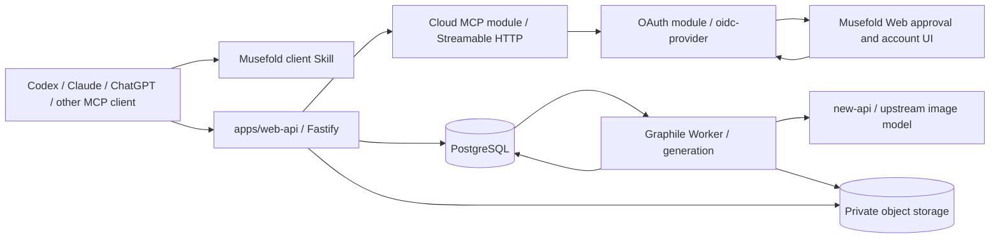

# Musefold v1.1 云端 MCP 与 Skills 设计

> **状态**：v1.1 P0 设计基线
>
> **日期**：2026-08-17
>
> **目标**：用户用 Musefold/new-api 个人账号授权 AI 客户端，在不安装桌面 App 的情况下通过远程 MCP 和 Skill 调用云端生图

## 0. 核心结论

可以把 MCP 部署到服务器，但必须新增 Cloud MCP，不能把当前本地 Automation Server 改成 `0.0.0.0` 后直接暴露公网。

v1.1 冻结为：

1. Cloud MCP 使用 MCP Streamable HTTP；当前本地 MCP 继续使用 stdio。
2. Cloud MCP 是 `apps/web-api` 内的隔离 Fastify 模块，只做协议、OAuth scope 和工具映射，不复制账号、扣费、任务、历史或对象存储逻辑。
3. Web 和 MCP 共用同一 Cloud Generation API、PostgreSQL 任务表、worker 和对象资产。
4. AI 客户端通过 Musefold OAuth 授权；Musefold 登录页再复用现有 new-api 账号。
5. 默认生成需要 Web 审批；用户可为已连接 AI 配置单次和每日自动预算。
6. Skills 是 AI 使用工具的指导与版本化知识，不携带 token，不执行仓库脚本。
7. 本地和云端 MCP 共用工具 schema/结果映射，通过 backend adapter 区分能力。

## 1. 为什么不能直接部署现有 MCP

当前链路：

```text
AI client -> local stdio MCP -> 127.0.0.1 Automation API -> Electron/core -> local Provider/files
```

现有实现的安全前提是：

- MCP 和 Automation 都在用户机器上。
- Automation token 来自本机发现文件。
- 返回值可以包含本地 `file://` 路径。
- 生图可依赖桌面确认卡、本地 Provider、keychain 和系统文件。
- GitHub Skill 可以在桌面沙箱内处理本地输入。

公网服务不具备这些前提。Cloud MCP 必须返回 HTTPS/ResourceLink，使用账户级授权、预算和审计，并只调用 cloud-safe application services。

## 2. 用户流程

### 2.1 首次连接

```text
1. 用户在 AI 客户端添加 Musefold Cloud MCP URL
2. MCP 返回 OAuth authorization challenge
3. 浏览器打开 Musefold 授权页
4. 用户用现有 Musefold/new-api 账号登录
5. 用户确认客户端名称、scope 和花费策略
6. Musefold 发回 authorization code，客户端用 PKCE 换 token
7. AI 调用 get_account_status 验证账号和生图能力
```

授权页不能把 new-api JWT、refresh 或设备令牌交给 MCP 客户端。Musefold 自己签发面向 MCP resource 的 access token。

### 2.2 通过通用 Skill 生图

```text
1. AI 读取 Musefold SKILL.md
2. 调用 get_account_status
3. 可选调用 search_prompts / get_prompt / get_skill
4. 调用 estimate_generation
5. 调用 generate_image，携带 idempotencyKey + maxPoints
6. 自动预算通过 -> queued；否则 -> pending_approval + approvalUrl
7. AI 调用 wait_for_generation 做有界长轮询
8. 返回 ResourceLink 和短期签名 HTTPS URL
9. AI 把结果图片展示给用户
```

### 2.3 使用官方视觉 Skill

```text
1. list_skills 查找经过审核的官方 Skill
2. get_skill(id, version) 获取 Markdown 指令、输入 schema 和内容哈希
3. AI 按 Skill 收集必要输入并形成最终 prompt
4. generate_image 携带 skillRef + skillInputs + 最终 prompt
5. generation run 保存 Skill 版本、哈希、输入和最终 prompt 快照
```

P0 不在服务器执行 Skill 中的 shell、JavaScript、Python、网络抓取或任意代码。

## 3. 目标拓扑



推荐公网入口：

```text
https://zhaozhaoyue.top/api/musefold/mcp
https://zhaozhaoyue.top/api/musefold/v1/oauth/*
https://zhaozhaoyue.top/Musefold/app/connections
https://zhaozhaoyue.top/Musefold/app/approvals/:id
```

## 4. 代码复用架构

### 4.1 目标目录

```text
packages/
  mcp-tools/                    # MCP 工具定义、schema、结果格式、Skill prompt
  mcp/                          # 本地 stdio transport + LocalAutomationBackend
  cloud-client/                 # Cloud API typed client

apps/
  web-api/
    src/modules/mcp/            # Streamable HTTP transport + CloudBackend + OAuth middleware
    src/modules/oauth/          # oidc-provider adapter、consent 和 connected apps
    src/modules/                # account/policy/generation/history/assets
  generation-worker/
```

`packages/mcp-tools` 不导入 Electron、文件系统、Automation client 或 Fastify。

### 4.2 Backend 端口

```ts
interface MusefoldToolBackend {
  readonly surface: 'local' | 'cloud';
  capabilities(): Promise<McpCapabilitySet>;
  accountStatus(): Promise<McpAccountStatus>;
  listModels(): Promise<McpModel[]>;
  searchPrompts(input: PromptSearchInput): Promise<PromptSearchResult>;
  getPrompt(id: string): Promise<McpPrompt>;
  savePrompt(input: SavePromptInput): Promise<McpPrompt>;
  listSkills(input: SkillListInput): Promise<SkillSummary[]>;
  getSkill(input: SkillRef): Promise<PublishedSkill>;
  estimateGeneration(input: EstimateInput): Promise<GenerationEstimate>;
  generate(input: McpGenerationInput): Promise<McpGeneration>;
  getGeneration(id: string): Promise<McpGeneration>;
  waitGeneration(id: string, timeoutSeconds: number): Promise<McpGeneration>;
  cancelGeneration(id: string): Promise<McpGeneration>;
  listHistory(input: HistoryListInput): Promise<HistoryPage>;
}
```

实现：

```text
LocalAutomationBackend -> 当前 127.0.0.1 Automation API
CloudBackend           -> 同进程 application services，携带已验证的 owner/grant/scopes actor context
```

外部 OAuth access token 的 audience 固定为 Cloud MCP canonical resource URL，只能被 `/api/musefold/mcp` 路由接受。MCP middleware 验证 token、resource、scope 和 grant 后构造只在请求作用域存在的 actor context，直接调用同一 application service；不经过内部 HTTP，也不签发第二种 actor token。普通 REST 路由只接受 Web session Cookie，MCP 路由不接受 Cookie，两套认证不能互换。

同进程是 P0 的部署选择，不是不可拆分的耦合：`packages/mcp-tools`、`MusefoldToolBackend`、actor context 和 application ports 保持独立。当 MCP 流量、安全发布节奏或故障域达到 [技术选型决策](./V11-TECHNOLOGY-DECISIONS.md) 的阈值时，可提取为独立服务并补回服务身份边界。

工具注册层只读取 backend capability，不写 `if (cloud)` 分支。平台特有工具由 capability 决定是否注册：

- Local：本地参考图、BYOK、桌面设计方案、本地 GitHub Skill、setup UI。
- Cloud：账号云额度、官方 Skill、Web 审批、云历史和 HTTPS assets。

## 5. Streamable HTTP

### 5.1 Transport

- 使用 `@modelcontextprotocol/sdk` 的 Streamable HTTP server transport。
- 仓库当前安装 SDK 1.30.0，已包含 Streamable HTTP 和 OAuth 辅助模块；实现时锁定版本并运行协议兼容测试，不依赖未锁定的 latest 行为。
- P0 工具都是异步 job + 有界查询，服务端采用可水平扩展的无状态请求处理。
- 不依赖永久 SSE 连接或进程内 session 保存任务状态。
- `wait_for_generation` 最长阻塞 25 秒；未完成返回 `running`，由 Skill 决定是否再次等待。
- 每次请求限制 body、工具调用并发、连接时长和账号速率。

### 5.2 HTTP 安全

- 只接受 HTTPS；反向代理必须保留并验证 `Host`/`Forwarded`。
- 校验 `Origin`；非浏览器 MCP 客户端没有 Origin 时按 bearer auth 处理，存在 Origin 时必须命中 allowlist。
- MCP endpoint 不启用宽泛 CORS，不支持 Cookie 认证。
- Access token 只从 `Authorization: Bearer` 读取，不接受 query token。
- 返回未授权时包含标准 OAuth protected-resource discovery 信息。
- 错误日志只记录 tool name、request id、grant id hash 和错误码，不记录 tool arguments 全文。

### 5.3 响应恢复

MCP transport 断线不能影响 generation job。`generate_image` 成功创建 job 后，事实已在 PostgreSQL；客户端可用 job id 在新 MCP 会话中继续 `get_generation/wait_for_generation`。

## 6. OAuth 与账号登录

### 6.1 身份边界

```text
new-api account identity
  -> Musefold Web authenticated session
  -> Musefold OAuth consent/grant
  -> MCP-scoped Musefold access token
```

new-api 是身份和额度来源；Musefold 是 MCP resource server 和 authorization server。AI 客户端永远不获得 new-api 管理 JWT、refresh cookie 或生图设备 `sk-`。

### 6.2 授权方式

P0 由 `oidc-provider` 提供协议状态机和 metadata，在 Musefold adapter 中映射 new-api 身份、grant、consent、预算和撤销；不自行手写 OAuth token endpoint。授权使用 Authorization Code + PKCE S256：

- 发布 OAuth authorization-server metadata 和 MCP protected-resource metadata。
- authorization code 单次使用、5 分钟过期并绑定 client、redirect URI、PKCE challenge 和 resource。
- access token 短期有效，建议 30 分钟；audience 固定为 Cloud MCP protected resource，不被 Web API 直接接受。
- refresh token 最长 30 天、每次轮换，数据库只保存 hash 和 token family。
- 支持 token revocation；检测 refresh reuse 时撤销整个 token family。
- 客户端注册优先级为：预登记客户端、Client ID Metadata Documents（CIMD）；仅为旧客户端提供受限 Dynamic Client Registration（DCR）兼容，DCR 已在当前 MCP 授权规范中标记为弃用。
- 无论采用 CIMD 或 DCR，redirect URI、客户端元数据来源和变更都必须严格验证；不接受通配 redirect URI。
- `state`、PKCE、resource/audience、issuer 都必须验证，不接受通配 redirect URI。

### 6.3 Scope

| Scope | 能力 |
|---|---|
| `account:read` | 账号摘要、额度和模型能力 |
| `prompts:read` | 搜索和读取云端提示词 |
| `prompts:write` | 保存提示词 |
| `skills:read` | 读取官方 Skill registry |
| `generations:read` | 查询任务、历史和资产 |
| `generations:write` | 创建、等待和取消生图任务 |

默认授权不包含 `prompts:write`。生图 spend policy 不是 scope 的替代物：即使有 `generations:write`，仍需通过预算/审批。

### 6.4 OAuth 数据

```text
oauth_clients
  id, name, redirect_uris, registration_type, created_at, revoked_at

oauth_grants
  id, owner_id, client_id, scopes, created_at, last_used_at, revoked_at

oauth_authorization_codes
  code_hash, grant_id, redirect_uri, pkce_challenge,
  resource, expires_at, used_at

oauth_token_families
  id, grant_id, refresh_hash, previous_refresh_hash,
  expires_at, rotated_at, revoked_at
```

Access token 可以是短期签名 JWT；refresh token 必须是不透明随机值并只保存 hash。签名 key 使用 `kid` 轮换并发布 JWKS。

## 7. 花费控制与审批

### 7.1 策略

每个 OAuth grant 有独立策略：

```ts
interface McpSpendPolicy {
  mode: 'ask_each_time' | 'auto_with_limits';
  maxPointsPerGeneration: number;
  maxPointsPerDay: number;
  maxImagesPerGeneration: 1;
  allowedModelAliases: string[];
}
```

- 默认 `ask_each_time`。
- 用户只能在 Musefold Web 的连接管理页修改策略，AI 工具不能自行提高额度。
- `maxPoints` 是每次 tool call 的调用方上限，最终允许值取调用上限、grant 策略和账户余额三者最小值。
- 每个 grant 独立累计，用户可随时暂停、撤销或降低预算。

### 7.2 审批状态机

```text
pending_approval -> queued -> running -> succeeded
        |             |          |  -> failed
        -> rejected   -> cancelled -> cancelling -> cancelled
        -> expired
```

生成请求在以下情况进入 `pending_approval`：

- 策略是 ask each time。
- 估算费用超过单次或当日剩余额度。
- Skill/model 不在 grant 允许范围。
- 请求缺少可靠的 maxPoints。

响应返回一次性 approval URL。支持 MCP URL elicitation 的客户端可以直接打开；不支持时 Skill 明确要求用户在浏览器确认。审批链接本身不能批准任务，用户必须有 Musefold Web session 并提交 CSRF 保护的确认请求。

### 7.3 预算预留

```text
mcp_spend_policies
  grant_id, mode, per_generation_limit, daily_limit,
  allowed_models, updated_at

mcp_spend_reservations
  id, owner_id, grant_id, generation_run_id,
  estimated_points, actual_points, status,
  reserved_at, settled_at, released_at
```

批准/自动执行时在数据库事务内锁定 policy 计数并创建 reservation，再把 run 转为 queued。任务终态后按实际费用结算；失败/取消释放预留。new-api 余额仍是最终上游约束，Musefold reservation 用于防止同一 AI 客户端并发超出用户设置。

## 8. P0 工具目录

### 8.1 账号与发现

| Tool | 级别 | 说明 |
|---|---|---|
| `musefold_status` | read | MCP、账号、Cloud API 和 capability 摘要 |
| `get_account_status` | read | 脱敏账号、额度、预算剩余和可生图状态 |
| `list_models` | read | 允许的模型别名和参数能力 |
| `estimate_generation` | read | 当前模型/参数的点数估算，不预留额度 |

### 8.2 提示词与 Skills

| Tool | 级别 | 说明 |
|---|---|---|
| `search_prompts` | read | 搜索用户云端提示词库 |
| `get_prompt` | read | 获取一条完整提示词 |
| `save_prompt` | write | 保存 AI 形成的好提示词，需要 `prompts:write` |
| `list_skills` | read | 列出官方/已审核视觉 Skills |
| `get_skill` | read | 按固定版本返回 Skill 内容、输入 schema 和 hash |

### 8.3 生图与历史

| Tool | 级别 | 说明 |
|---|---|---|
| `generate_image` | spend | 创建任务或返回待审批状态 |
| `get_generation` | read | 获取一次任务当前状态 |
| `wait_for_generation` | read | 最多等待 25 秒后返回当前状态 |
| `cancel_generation` | write | 尽力取消 |
| `list_history` | read | 分页获取该账号的云历史 |

P0 不注册 `select_provider`、`open_provider_setup`、本地路径参数、设计方案和任意 GitHub URL 执行工具。

### 8.4 `generate_image` 输入

```ts
interface McpGenerationInput {
  idempotencyKey: string;
  prompt: string;
  negative?: string;
  size?: 'auto' | '1024x1024' | '1536x1024' | '1024x1536';
  aspectRatio?: '1:1' | '3:4' | '4:3' | '16:9' | '9:16';
  quality?: 'low' | 'medium' | 'high' | 'auto';
  maxPoints: number;
  promptId?: string;
  skillRef?: { id: string; version: string; contentHash: string };
  skillInputs?: Record<string, string | number | boolean>;
}
```

- P0 count 固定为 1。
- `idempotencyKey` 在同一 OAuth grant 下唯一；AI 重试必须复用。
- 服务器重新计算估价，不信任客户端提交的 estimate。
- `skillRef` 必须在 registry 中存在且 hash 匹配，否则拒绝或要求重新读取 Skill。

## 9. 结果与图片资源

工具结果同时提供 `structuredContent` 和简短文本，不要求 AI 解析日志文本：

```json
{
  "jobId": "01...",
  "status": "succeeded",
  "costPoints": 9000,
  "skillRef": {
    "id": "postcard",
    "version": "1.0.0",
    "contentHash": "sha256:..."
  },
  "assets": [
    {
      "id": "01...",
      "resourceUri": "musefold://assets/01...",
      "url": "https://...signed...",
      "expiresAt": "2026-08-17T08:00:00Z",
      "mimeType": "image/png"
    }
  ]
}
```

- Cloud MCP 注册 `musefold://assets/{id}` resource，读取时重新校验 token/owner 并生成新签名 URL。
- 签名 URL 默认 10 分钟，不是永久公开链接。
- MCP 消息中不返回 bucket key、内部 endpoint 或本地路径。
- 客户端不支持 ResourceLink 时仍可使用 HTTPS URL；过期后调用 `get_generation` 获取新 URL。

## 10. Skill 模型

### 10.1 两层 Skill

**客户端 Musefold Skill**：公开 `SKILL.md`，教 AI 选择 Local/Cloud MCP、获取用户意图、估价、生成、等待和展示结果。

**服务端 Skill Registry**：保存经过审核的视觉 Skill 文档和版本：

```text
published_skills
  id, version, name, description, markdown,
  input_schema jsonb, content_hash, publisher,
  status, published_at, retired_at
```

### 10.2 发布规则

- 官方 Skill 在仓库中评审，通过 CI 规范化、hash、签名后发布。
- 版本不可变；更新必须创建新 version。
- generation run 保存 Skill 快照引用，不因 Skill 后续更新改变历史解释。
- retired Skill 不再用于新任务，但历史仍可读取对应 snapshot。
- P0 不允许用户提交 GitHub URL让服务器即时抓取，不允许任意脚本或网络指令。
- Markdown 中的指令对 AI 可见，但服务器仍以 tool schema、scope、budget 和输入验证为安全边界。

### 10.3 `run_skill`

P0 不提供会在服务端“执行 Markdown”的 `run_skill`。AI 通过 `get_skill -> generate_image(skillRef, skillInputs, prompt)` 完成调用。后续如增加 `run_skill`，只允许审核过的声明式模板和 JSON Schema，不得退化为远程代码执行，也不能重新引入已经移除的配方产品面。

## 11. Web 管理 UI

Cloud MCP 必须配套以下用户界面：

```text
/app/connections              已连接 AI 客户端
/app/connections/:grantId     scope、预算、使用量、暂停和撤销
/app/approvals/:requestId     单次生成审批
/app/history                  显示 Web/MCP 来源、Skill 和费用
/app/account/sessions         Web 与 OAuth 会话管理
```

连接详情显示：

- 客户端名称、首次授权、最近使用、scope。
- 单次和每日预算、今日已用/已预留。
- 最近 MCP 生图，不显示 prompt 正文到普通审计列表。
- 暂停、撤销、降低预算；提高预算需要重新验证当前 Web session。

审批页显示最终 prompt 摘要、模型、比例、估算费用、Skill 来源和客户端名称。用户确认前不创建上游调用。

UI 复用策略见 [V11-SHARED-UI-ARCHITECTURE.md](./V11-SHARED-UI-ARCHITECTURE.md)。

## 12. 审计与数据模型扩展

`generation_runs` 增加：

```text
actor_type        web | cloud_mcp
actor_id          Web session id hash 或 OAuth grant id
approval_status   not_required | pending | approved | rejected | expired
approved_at
skill_id
skill_version
skill_content_hash
skill_inputs      jsonb
```

审计事件：

```text
oauth.authorized
oauth.refreshed
oauth.revoked
mcp.tool.called
generation.approval.requested
generation.approved
generation.rejected
generation.queued
generation.settled
```

审计不记录 OAuth token、完整 tool arguments、完整 prompt 或图片签名 URL。

## 13. 威胁与控制

| 风险 | 控制 |
|---|---|
| 直接暴露本地控制面 | Cloud MCP 只挂载 cloud-safe backend，不连接 Electron/loopback token |
| OAuth token 泄漏 | 短期 access、refresh rotation、scope、audience、撤销、hash 存储 |
| Web/MCP 认证混用 | REST 只接受 Web session，MCP 只接受目标 audience 的 bearer token；actor context 由路由 middleware 构造 |
| AI 重试重复扣费 | grant-scoped idempotency key + generation 唯一约束 |
| AI 越权提高预算 | policy 只能在 Web session 中修改，tool 无预算写接口 |
| Prompt injection 要求泄密 | MCP 后端从不提供凭据；Skill 不是安全边界 |
| 任意 GitHub Skill 供应链攻击 | P0 只读审核 registry，不抓任意 URL、不执行代码 |
| SSRF | P0 不接受参考图 URL；后续只使用预签名上传 |
| 资源 URL 转发 | 私有 bucket、短期签名、owner 校验、可撤销 grant |
| 恶意动态 OAuth client | 注册限流、redirect 严格匹配、client 元数据和撤销界面 |
| 长连接耗尽 | 无状态 Streamable HTTP、有界等待、并发/时长/响应大小限制 |

## 14. 测试矩阵

### 14.1 Transport

- initialize、tools/list、tools/call、resources/read 的 Streamable HTTP 合规测试。
- 无 token、错 audience、错 scope、过期 token、撤销 token。
- Origin/Host、body limit、并发 limit 和断线恢复。
- 多实例下任意实例都能继续查询同一 job。

### 14.2 OAuth

- Authorization Code + PKCE 成功路径。
- code 重放、redirect mismatch、state mismatch、PKCE mismatch、resource mismatch 全部拒绝。
- refresh rotation 和 reuse detection 撤销 token family。
- grant 暂停/撤销立即阻止新工具调用。

### 14.3 花费

- ask each time 不会在审批前调用上游。
- 自动预算内直接排队，超单次/日预算进入审批。
- 并发 10 个请求不能超过 daily reservation。
- 同 idempotencyKey 重试只生成一个 run。
- 失败/取消正确释放预留，成功按实际费用结算。

### 14.4 Skills

- Skill 版本/hash 不匹配拒绝。
- retired Skill 历史可读、新任务不可用。
- Markdown 中含恶意指令也不能取得 token、扩大 scope 或跳过预算。
- generation 历史可追溯到固定 Skill 版本和输入快照。

### 14.5 兼容性

- 至少用两个支持远程 MCP OAuth 的客户端完成授权、生图、等待和资源展示。
- 不支持 URL elicitation 的客户端仍能通过 approvalUrl 完成审批。
- 本地 stdio MCP 全量回归，现有 CLI/Automation 行为不变。

## 15. P0 完成定义

- 用户无需安装桌面 App，即可通过账号授权 Cloud MCP。
- AI 能读取 Musefold Skill、估价、创建生图、等待并展示 HTTPS 图片。
- 默认审批和自动预算两种模式均可用，重复请求不重复扣费。
- Cloud MCP 生图出现在同一 Web 工作台历史中，并标明 MCP/Skill 来源。
- 用户可以在 Web 查看连接、修改预算、审批、暂停和撤销。
- 本地/云 MCP 共享工具 schema，工具语义没有两套手写实现。
- 任意凭据、本地路径和未审核脚本均不会进入 MCP 响应或 Skill。
