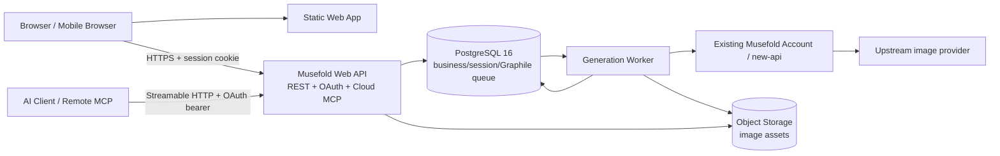

# Musefold v1.1 Web 版架构与开发文档

> **状态**：开发基线，Phase 0 已开始落地
>
> **日期**：2026-08-17
>
> **目标**：在保持桌面端持续演进的同时，新增一个面向个人用户、支持手机浏览器的 Musefold Web 产品面。

## 0. 结论摘要

v1.1 Web 版不是桌面端的简单裁剪，也不直接复用桌面端的 Electron/SQLite 实现。采用以下边界：

1. **Web 开放**：个人账号、账号额度、制作工作台、可恢复工作台会话、生图历史、云端提示词库、提示词搜索/编辑/复制/使用和提示词云同步。
2. **Web 不开放**：Agent、自定义 GitHub Skills 执行、设计方案、桌面 CLI/本地 MCP、本地 Provider、豆包网页桥接、BYOK 和系统文件访问；Cloud MCP 与审核后的官方 Skills 作为独立协议入口开放。
3. **共享内容**：领域类型和校验、纯业务用例、错误码、云端 API 契约、MCP 工具定义、提示词/工作台/历史核心 UI 组件。
4. **平台专属内容**：Electron 主进程、IPC、SQLite、本地文件、系统密钥链、桌面 Provider、Automation API、CLI/MCP。
5. **云端生图路径**：浏览器永远不接触 `sk-` 或上游 Key；浏览器请求 Musefold Web API，由服务端通过现有账号/中转服务完成生图。
6. **云端提示词路径**：Web 以云端为唯一数据源；桌面端继续本地优先，并通过独立 Cloud Repository 逐步接入云端，不把桌面 SQLite 直接暴露给 Web。
7. **API 契约**：新增 Musefold Web API v1，使用 OpenAPI 描述 HTTP 接口；新增账号授权的 Cloud MCP；现有本地 Automation API v1 保持不变。

本文中的“推荐”是建议决策，不代表所有问题已经冻结。文末列出需要产品确认的事项。

## 1. 现状回顾

### 1.1 当前桌面端边界

当前仓库是 Electron + React + Vite 的 npm workspace：

```text
root renderer / src
  └─ React 页面、Zustand store、桌面 IPC 客户端
electron/
  └─ 主进程、IPC、账户、系统密钥链、本地文件、窗口和 Provider 适配
packages/core/
  └─ SQLite 数据访问、提示词库、历史、生图编排、Provider Registry
packages/client/
  └─ 本地控制面发现、typed fetch、SSE
packages/automation-server/
  └─ 127.0.0.1 loopback HTTP/SSE 控制面
packages/cli + packages/mcp/
  └─ CLI/MCP 薄客户端；不直接读 SQLite 或密钥
```

主要事实：

- `packages/core/src/services/library.ts` 的提示词库直接依赖 SQLite repository。
- `packages/core/src/services/generation.ts` 会读取 Provider 行、验证本地参考图路径、调用 Provider、写入本地 history 和图片文件。
- `shared/types/providers.ts` 的生图请求包含 `providerId`、`imagePath`、`referenceImages` 等桌面语义，不能原样作为 Web API 请求。
- `electron/account/api-client.ts` 和 `account-service.ts` 已经冻结了 new-api 账号、JWT、refresh、兑换、设备令牌和额度契约，但其凭据编排运行在 Electron 主进程。
- 当前三类强平台依赖是：SQLite/FTS5、本地图片路径和 OS keychain。它们必须留在桌面适配层。

### 1.2 可复用性判断

| 能力 | 当前实现 | Web 是否直接复用 | 处理方式 |
|---|---|---:|---|
| Prompt/Generation 类型 | `shared/types` | 否 | 抽取为 cloud-safe contracts，保留兼容映射 |
| 提示词校验/归一化 | 分散在 IPC、store、repository | 否 | 集中为纯 TypeScript domain/use case |
| 提示词编辑与卡片 UI | React 组件 | 部分 | 抽成无平台依赖的 `@musefold/ui` |
| 提示词库 repository | SQLite | 否 | 定义 `PromptRepository`，桌面实现 Local，Web 实现 HTTP |
| 生图 Provider | 主进程 + 本地 Keychain | 否 | 保留桌面 Provider；Web 通过服务端 `GenerationGateway` |
| 账号模型 | new-api 契约 | 部分 | 抽取账号领域状态；Web 走 BFF，桌面保留主进程密钥管理 |
| 事件/进度 | Electron EventHub + 本地 SSE | 否 | Web API 使用 job + SSE，并提供轮询兜底 |
| Agent/Skills/方案 | `packages/core` 与 Electron 深耦合 | 否 | Web capability manifest 中明确禁用 |

## 2. 产品范围

### 2.1 v1.1 Web P0

| 模块 | 能力 |
|---|---|
| 账号 | 注册、登录、退出、额度展示、兑换码、登录失效处理 |
| 制作工作台 | 可恢复会话、草稿、提示词引用、尺寸/比例/质量、异步提交、进度、取消、结果展示、下载、重试和继续调整 |
| 生图历史 | 按工作台会话保存请求快照、任务状态、结果资产和错误；刷新或换设备后可继续查看 |
| 提示词云库 | 列表、关键词搜索、详情、创建、编辑、软删除、恢复、收藏、标签/文件夹、分页 |
| 提示词使用 | 复制正文、带入生图编辑器、“使用并生成”、服务端 usage 计数 |
| 提示词云同步 | Web 以云端为主数据源；桌面端登录同一账号后通过增量协议同步本地提示词、文件夹和删除状态 |
| Cloud MCP | AI 客户端通过 OAuth 登录同一账号，使用远程 MCP 调用云端生图、提示词、官方 Skill 和历史 |
| 移动端 | 手机宽度下的单列工作流、底部导航/抽屉、触控目标、图片预览和下载 |
| 个人账户 | 数据按账户隔离；不开放团队、共享、公开发布和管理员能力 |

### 2.2 v1.1 P1

- 参考图/图生图，需要对象存储上传和上传授权流程。
- 生成历史的高级筛选、批量管理和长期归档策略。
- 提示词同步的自动冲突合并；P0 使用显式冲突处理，不做静默覆盖。

P1 不应阻塞 Web P0 上线，但接口和数据模型要预留扩展点。

### 2.3 明确不开放

Agent 自主执行、任意 GitHub Skill 执行、设计方案、桌面 CLI、本地自动化开关、本地文件夹导入、豆包浏览器会话、用户自带 API Key、多人协作、公共提示词市场均不属于 Web v1.1。Web 工作台允许同一会话内重试和继续调整；Cloud MCP 只开放云安全工具与审核后的官方 Skill，不开放桌面本地能力。

## 3. 架构原则

1. **领域先于平台**：共享层不能导入 `electron`、`better-sqlite3`、`fs`、`path`、`window.api` 或 Node-only 包。
2. **接口先于实现**：桌面 Local Repository、Web HTTP Repository 和未来同步引擎实现同一组端口接口。
3. **凭据不进浏览器**：浏览器不接收上游 Key、new-api 设备令牌明文或服务端管理密钥。
4. **服务端是云数据边界**：云端提示词和生图任务都经过账户鉴权、授权和审计；不能让浏览器直连数据库。
5. **显式产品能力**：用 capability manifest 控制路由和功能，不在组件内部到处写 `if (isWeb)`。
6. **桌面端兼容优先**：新增 Web 能力不改变当前桌面 SQLite schema、本地 Automation API v1 和 CLI/MCP 行为。
7. **可替换 Provider**：Web API 不把 new-api 写死在领域层；通过 `AccountGateway`、`ImageGenerationGateway` 端口隔离当前实现。
8. **可观测的异步任务**：生图使用 job 状态机和幂等键，网络重试不能造成重复扣费或重复任务。

## 4. 成熟方案对比

### 4.1 共享工作台 + 平台宿主

VS Code 是最接近本项目的公开成熟案例：产品工作台和扩展契约共享，但 desktop、web、remote 使用不同的 extension host 和运行时。它没有试图让浏览器拥有 Node/文件系统能力，而是根据能力选择宿主。

对 Musefold 的对应关系是：

```text
共享：Prompt/Generation domain、UI 组件、API contracts、错误处理
桌面宿主：Electron main、SQLite、OS keychain、本地 Provider、Automation
Web 宿主：Browser UI、HttpOnly session、Cloud Repository、Web API
```

这是本项目的主方案，因为当前桌面端已经具备清晰的 Electron main/renderer/core 边界，继续沿用比全量重写更稳定。

### 4.2 Electron 壳 + 浏览器壳，共享 React UI

这类方案把业务 UI 组件抽成包，再给 Electron 和 Web 各自注入数据源。它适合 Musefold 的第二阶段：`PromptCard`、`PromptEditor`、`GenerationComposer` 等组件可以复用，但页面级 Shell、导航、登录态和权限不能强行共用。

因此 v1.1 采用“产品组件共享、页面由平台壳组合”的粒度：桌面工作台/提示词库/历史拆入 `packages/product-ui`，Desktop/Web 都从该包装配；Electron IPC 和 Cloud HTTP 留在各自 adapter，避免平台依赖进入共享组件。

### 4.3 浏览器直连数据库或 Provider

这条路径开发初期看起来最快，但不适合 Musefold：

- 云端提示词需要账户隔离、版本冲突和审计，浏览器不应该直接持有数据库权限。
- 生图必须使用服务端管理的上游 Key 或设备令牌，不能交给 JavaScript bundle、IndexedDB 或浏览器网络面板。
- new-api 是现有账号和计费边界，Web 直接拼接其内部管理接口会让桌面、Web 和运营配置产生三套耦合。

因此浏览器只访问 Musefold Web API；Web API 再通过端口连接账号系统、PostgreSQL 和对象存储。P0 的持久任务队列也在 PostgreSQL 中，由 Graphile Worker 消费。

### 4.4 全栈 Web 框架一体化

Next.js 等全栈框架可以同时提供页面和 API，但当前产品没有公开内容 SEO、服务端渲染和桌面端共享服务的刚性需求。选择 Vite Web Shell + 独立 Web API 有三个好处：

1. 与现有 Electron/Vite/React 技术栈一致，UI 组件迁移成本更低。
2. Web API、worker、数据库迁移可独立发布和扩容。
3. API 契约不被某个前端框架绑死，桌面端未来可以复用 Cloud Repository。

## 5. 目标代码组织

采用渐进式迁移，不在第一阶段移动整个桌面端目录：

```text
apps/
  web/                         # Vite + React Web 壳，移动端布局和路由
  web-api/                     # Fastify/Node API，含 REST、OAuth 和 Cloud MCP 模块
  generation-worker/           # Graphile Worker 生图任务消费者

packages/
  contracts/                   # Zod schema、DTO、错误码、OpenAPI 生成输入
  domain/                      # 纯业务对象、校验、用例、能力矩阵
  ui/                          # 无平台依赖的 React 组件和设计 token
  product-ui/                  # Desktop/Web 共用工作台、提示词库和历史页面组件
  cloud-client/                # Web API typed client；桌面云库也使用
  mcp-tools/                   # Local/Cloud MCP 共用工具 schema 和结果映射
  core/                        # 现有桌面本地核心，继续保留 SQLite/Provider 适配
  client/                      # 现有本地控制面客户端，职责不变
  automation-server/           # 现有本地控制面，职责不变
  cli/                         # 现有 CLI，职责不变
  mcp/                         # 现有 MCP，职责不变

electron/
  ...                          # 桌面专属 adapter，不允许被 apps/web 引入
src/                           # v1.1 先保持现状，逐步抽取页面组件到 packages/ui
server/
  ...                          # Web API 若不迁入 apps/web-api，可采用此目录
```

### 5.1 包依赖规则

```text
contracts  <- domain <- ui
contracts  <- cloud-client
contracts  <- core
domain     <- desktop renderer / apps/web / web-api use cases
cloud-client <- apps/web / desktop cloud adapter
core       <- Electron main only
electron   -X- apps/web
better-sqlite3 -X- apps/web / web-api
mcp-tools  <- packages/mcp / apps/web-api MCP module
product-ui <- desktop renderer / apps/web
```

第一阶段允许 `shared/` 作为兼容导出层：原有 `@shared/types/*` 从新包 re-export，避免一次性修改所有桌面文件。新代码禁止继续向 `shared/` 增加平台耦合类型。

## 6. 运行时拓扑



### 6.1 推荐部署

首期沿用现有官网域名和反向代理，避免额外跨域和 Cookie 配置：

```text
https://zhaozhaoyue.top/Musefold/          # 官网静态页
https://zhaozhaoyue.top/Musefold/app/      # Web App 静态资源
https://zhaozhaoyue.top/api/musefold/v1/   # Musefold Web API
https://zhaozhaoyue.top/api/musefold/mcp   # Remote MCP Streamable HTTP
https://zhaozhaoyue.top/api/*              # 既有 new-api 管理/调用面
```

Web API 与 new-api 必须是两个可独立升级的服务。不要修改 new-api 源码来塞入提示词业务；通过反向代理、内部网络和 `AccountGateway` 连接。

## 7. 共享应用层设计

### 7.1 Cloud-safe contracts

从当前桌面类型拆出以下稳定对象：

```ts
interface PromptDocument {
  id: string;
  title: string;
  description: string | null;
  content: string;
  negative: string | null;
  folderId: string | null;
  tags: Array<{ id: string; name: string; group: string | null; color: string | null }>;
  modelId: string | null;
  params: Record<string, unknown> | null;
  rating: number;
  isPinned: boolean;
  pinOrder: number | null;
  usageCount: number;
  lastUsedAt: string | null;
  source: 'manual' | 'import' | 'share' | 'slip' | 'generation';
  sourceUrl: string | null;
  version: number;
  createdAt: string;
  updatedAt: string;
  deletedAt: string | null;
}

interface CloudGenerationRequest {
  prompt: string;
  negative?: string;
  promptId?: string;
  size: 'auto' | '1024x1024' | '1536x1024' | '1024x1536';
  aspectRatio?: string;
  quality: 'low' | 'medium' | 'high' | 'auto';
  count?: 1;
}
```

`CloudGenerationRequest` 不包含 `providerId`、本地路径、Electron job 句柄和密钥。桌面 `GenerateImageRequest` 通过 adapter 映射，Web DTO 通过 API schema 校验。

### 7.2 Repository ports

```ts
interface PromptRepository {
  list(query: PromptListQuery): Promise<PromptPage>;
  get(id: string): Promise<PromptDocument | null>;
  create(input: NewPromptDocument): Promise<PromptDocument>;
  update(id: string, patch: UpdatePromptDocument, expectedVersion?: number): Promise<PromptDocument>;
  remove(id: string, expectedVersion?: number): Promise<void>;
  use(id: string, input: PromptUseInput): Promise<PromptUseResult>;
}
```

- `LocalPromptRepository` 适配当前 `packages/core`/SQLite。
- `CloudPromptRepository` 调用 `packages/cloud-client`。
- `Web` 只注入 `CloudPromptRepository`。
- 桌面端始终由 `LocalPromptRepository` 提供本地读写；用户明确启用云同步后，sync engine 通过 `CloudPromptRepository` 增量 push/pull，不把页面切换成远程直读模式。

### 7.3 Capability manifest

```ts
type MusefoldSurface = 'desktop' | 'web';

interface ProductCapabilities {
  generation: boolean;
  workbench: boolean;
  generationHistory: boolean;
  cloudPrompts: boolean;
  promptSync: boolean;
  cloudMcpConnections: boolean;
  localPrompts: boolean;
  agent: boolean;
  designSchemes: boolean;
  automation: boolean;
  byokProviders: boolean;
  referenceImages: boolean;
}
```

Web manifest：`generation/workbench/generationHistory/cloudPrompts/promptSync/cloudMcpConnections = true`，其余复杂能力为 `false`；桌面继续使用现有完整 manifest。路由、导航、设置项和快捷操作都由 manifest 生成，避免 Web 误显示“不可用”的桌面入口。

## 8. 账号与安全

### 8.1 账号策略

Web 用户登录复用现有 Musefold Cloud/new-api 个人账号，不引入 Supabase Auth 或第二套用户身份表。Web API 对现有账号实现 `AccountGateway`，将来可以替换底层账号系统而不影响提示词领域层。Cloud MCP 的 OAuth 只用于把已登录用户的授权委托给 AI 客户端，不是一套新的用户登录系统。

推荐的 Web 登录流程：

1. 浏览器提交用户名/密码到 `POST /api/musefold/v1/auth/login`。
2. Web API 调用现有账号服务完成登录，并在服务端建立短期会话。
3. 浏览器只收到 `HttpOnly; Secure; SameSite=Lax` 会话 Cookie，不保存 JWT、refresh 或设备令牌到 `localStorage`。
4. Web API 访问 new-api 管理面时使用服务端会话中的凭据，并按账户缓存短期 access token。
5. Web API 按账户懒创建/复用一个 `musefold-web` 设备令牌；完整 `sk-` 只在服务端内存或加密密钥存储中出现。

Cloud MCP 不复用浏览器 Cookie，也不把 new-api 凭据交给 AI 客户端。用户先在 Musefold Web 登录，再通过 Authorization Code + PKCE 授予 Musefold scope；Cloud MCP 只接受面向自身 resource/audience 的短期 bearer token。授权、预算和撤销详见 [V11-CLOUD-MCP-AND-SKILLS.md](./V11-CLOUD-MCP-AND-SKILLS.md)。

### 8.2 安全要求

- 所有提示词表、任务表和资产表都必须有 `owner_id`；repository 方法必须显式接收已认证的 `accountId`。
- 任何按 id 查询都同时带 `owner_id`，禁止“先查 id 再判断归属”。
- 数据库启用 PostgreSQL Row-Level Security 作为第二道防线；应用层仍保留 owner 条件和授权测试。
- 所有改变状态的请求检查 `Origin`，Cookie 会话配合 CSRF token 或同源校验。
- 登录、兑换、创建任务、上传和提示词写入分别限流；错误消息不能暴露账号是否存在、兑换码具体失败原因或上游 Key。
- 生图请求写入审计元数据：账户、任务 id、模型别名、耗时、扣费结果、错误码；不记录完整提示词到普通日志。
- Web API 与 new-api 通过内部网络/固定地址通信；浏览器不允许直连上游 Provider。

## 9. 云端数据模型

云端使用独立 PostgreSQL schema/数据库和迁移目录，不与 new-api 表直接 join。

### 9.1 核心表

```text
prompt_folders
  id, owner_id, name, sort_order, created_at, updated_at, deleted_at

prompt_tags
  id, owner_id, name, created_at, updated_at

prompts
  id (ULID), owner_id, title, description, content, negative,
  folder_id, model_id, params JSONB, is_pinned, pin_order,
  usage_count, version, source, source_url,
  created_at, updated_at, deleted_at

prompt_tag_links
  prompt_id, tag_id, owner_id

prompt_usage_events
  id, owner_id, prompt_id, action, idempotency_key,
  generation_id, created_at

workbench_sessions
  id, owner_id, title, draft_prompt, draft_negative,
  draft_params, version, created_at, updated_at, archived_at, deleted_at

generation_runs
  id, owner_id, session_id, parent_run_id, prompt_id,
  prompt_snapshot JSONB, request JSONB, provider_model,
  actor_type, approval_status, status, idempotency_key,
  error_code, cost_points, created_at, started_at, finished_at

generation_assets
  id, owner_id, generation_id, object_key, mime_type,
  width, height, byte_size, created_at, deleted_at

sync_devices / sync_changes / sync_mutations
  设备、变更序列、删除墓碑和幂等 mutation

oauth_clients / oauth_grants / oauth_token_families
  Cloud MCP OAuth 客户端、scope、授权和 refresh family

mcp_spend_policies / mcp_spend_reservations
  AI 客户端单次/每日预算、审批和费用预留
```

约束：`(owner_id, name)`、`(owner_id, id)`、`(owner_id, idempotency_key)` 建唯一索引；`prompts.version` 每次更新递增；删除使用软删除。成功生成资产 P0 不自动过期，签名 URL 短期过期。完整字段和 RLS 见 [后端实施规格](./V11-WEB-BACKEND-MVP.md)。

### 9.2 搜索与分页

- P0 使用 PostgreSQL `pg_trgm`/规范化文本做标题、正文和标签搜索，游标分页，不把全库一次性下发浏览器。
- 不把 SQLite FTS5 SQL 直接搬到 Web API。
- 搜索响应包含 `nextCursor`，前端用虚拟列表或增量加载；手机端默认 20 条。
- 云端提示词正文可以被用户主动复制/带入生图；不会因为列表查询而写入 usage。

### 9.3 并发更新

更新请求带 `expectedVersion` 或 `If-Match`；版本不一致返回 `409 PROMPT_VERSION_CONFLICT` 和当前服务端版本。Web 端显示“内容已在其他设备修改”，让用户选择覆盖或重新编辑；不默认静默覆盖。

## 10. Web API v1

API 源文件建议放在 `packages/contracts/openapi/musefold-v1.yaml`，服务器和客户端从同一契约生成/校验。

### 10.1 端点

| 方法 | 路径 | 说明 |
|---|---|---|
| `POST` | `/auth/register` | 创建个人账号，复用现有账号服务 |
| `POST` | `/auth/login` | 建立 HttpOnly 会话 |
| `POST` | `/auth/logout` | 撤销 Web 会话 |
| `GET` | `/auth/me` | 账号摘要、额度、模型能力 |
| `POST` | `/auth/redeem` | 兑换码充值 |
| `GET` | `/prompts` | 搜索、筛选、游标分页 |
| `POST` | `/prompts` | 创建提示词 |
| `GET` | `/prompts/:id` | 获取详情 |
| `PATCH` | `/prompts/:id` | 带版本更新 |
| `DELETE` | `/prompts/:id` | 软删除 |
| `POST` | `/prompts/:id/use` | 复制/带入/使用并生成，幂等计数 |
| `GET` | `/folders` / `/tags` | 个人文件夹和标签 |
| `GET/POST` | `/workbench/sessions` | 列出或创建工作台会话 |
| `GET/PATCH` | `/workbench/sessions/:id` | 恢复或保存工作台草稿 |
| `GET` | `/generations` | 个人生成历史分页 |
| `POST` | `/generations` | 创建异步生图任务，需 `Idempotency-Key` |
| `GET` | `/generations/:id` | 获取任务状态和结果 URL |
| `GET` | `/generations/:id/events` | SSE 进度流 |
| `POST` | `/generations/:id/cancel` | 尽力取消 |
| `GET` | `/assets/:id/url` | 获取短期签名图片 URL |
| `GET/POST` | `/sync/*` | bootstrap、pull、push、device 和同步状态 |
| `GET/POST` | `/oauth/*` | Cloud MCP 授权、token、撤销和 metadata |

Cloud MCP 的工具、OAuth、预算和审批契约见 [V11-CLOUD-MCP-AND-SKILLS.md](./V11-CLOUD-MCP-AND-SKILLS.md)。

### 10.2 生图任务状态机

```text
pending_approval -> queued -> running -> succeeded
        └-> rejected    └-> failed
        └-> expired     └-> cancelling -> cancelled
```

规则：

- Web `POST /generations` 直接创建 queued 任务；Cloud MCP 请求先按 grant 策略决定 pending approval 或 queued，不同步等待上游响应。
- `Idempotency-Key` 在同一账户下重复提交返回同一个任务，避免移动网络重试重复扣费。
- Worker 调用现有账号/中转服务的 `musefold-image-pro` 别名；不把 Provider 配置暴露给 Web。
- 结果写入对象存储，API 返回短期签名 URL；任务详情只返回账户拥有的资源。
- SSE 断线后前端先 `GET` 当前状态，再重新订阅；SSE 不作为唯一可靠状态源。
- 取消是尽力而为；上游已经扣费或已经完成时，任务按真实状态落库。

## 11. Web 前端与移动端

### 11.1 页面

```text
/app/generate       生图首页
/app/sessions/:id   可恢复工作台会话
/app/prompts        云端提示词库
/app/prompts/:id    提示词详情/编辑
/app/history        云端生成历史
/app/connections    Cloud MCP 已连接 AI、scope 和预算
/app/approvals/:id  MCP 单次生图审批
/app/account        账号、额度、兑换码、退出
```

Web Shell 只加载 P0 capability 对应页面。Desktop/Web 共用产品页面组件，但平台 shell 和路由表分开，详见 [共享 UI 架构](./V11-SHARED-UI-ARCHITECTURE.md)。

### 11.2 移动端交互约束

- 以单列为默认布局，生成参数使用底部抽屉或分组面板。
- 主要按钮保持稳定尺寸，触控目标不小于 44px；结果图片使用 `aspect-ratio`，不因加载文本改变布局。
- 提示词库采用“列表 + 详情抽屉/页面”，避免手机上同时显示三栏。
- 生图提交后切换到结果状态，不要求用户停留在页面；刷新后通过任务 id 恢复。
- 支持系统分享、下载和复制；不把剪贴板权限作为页面初始化前提。
- PWA 可作为后续增强，但不能把离线能力当作云数据一致性的替代方案。

### 11.3 前端状态分层

- 服务端状态：提示词、账号、任务、签名 URL，由 `cloud-client` 和 query cache 管理。
- 本地 UI 状态：抽屉、编辑草稿、筛选条件、正在查看的任务，由页面 store 管理。
- 不在 Web 端复制一份 SQLite 风格的“全量本地数据库”。
- 编辑草稿可以放 IndexedDB/localStorage，但登录态和 Key 不放 localStorage。

## 12. 桌面端并行维护与同步策略

### 12.1 发布关系

```text
Musefold product 1.1
  ├─ Desktop 1.1：完整能力，Local-first，继续支持 CLI/MCP/Agent/方案
  ├─ Web 1.1：个人账号，Cloud-first，工作台、历史、生图和提示词
  └─ Cloud MCP 1.1：OAuth 账号授权、官方 Skill、云端生图和历史
```

两端共享包独立版本；Web API 使用 `/v1`，后端以后只做向后兼容的新增字段和新端点。桌面本地 Automation API v1 与 Web API v1 不合并，避免把 loopback 安全模型带入公网。

### 12.2 同步分阶段

1. Web P0：云端提示词完整 CRUD 和使用。
2. Desktop P0：用户明确启用后，以 SQLite outbox + 云端 version/change cursor 做双向增量同步。
3. P0：离线队列、删除墓碑、mutation 幂等和显式冲突处理全部上线，不使用 `updatedAt` 做覆盖判断。
4. 后续：再考虑字段级自动合并或 CRDT；P0 不静默覆盖。

完整协议见 [V11-PROMPT-CLOUD-SYNC.md](./V11-PROMPT-CLOUD-SYNC.md)。

## 13. 测试与质量门禁

### 13.1 共享层

- domain 校验：提示词长度、空内容、参数枚举、错误码映射、能力矩阵。
- contracts：请求/响应 schema、破坏性变更检测、OpenAPI 文档校验。
- repository contract tests：Local SQLite 与 Cloud HTTP 都运行同一组 CRUD/use/version 测试。

### 13.2 Web API

- 每个 endpoint 的鉴权、owner 隔离、CSRF/Origin、限流和错误响应测试。
- 生图任务：幂等提交、断线恢复、重复消费、取消竞态、额度不足、模型下线、对象存储失败。
- 数据库迁移：空库、上一版本升级、索引和 RLS 策略检查。
- 使用真实 new-api 测试账号做隔离的 staging smoke test，不把生产账号和兑换码写进测试。

### 13.3 Web UI

- Playwright：桌面宽度、iPhone 宽度、登录、创建提示词、从提示词生成、复制、刷新恢复任务。
- 视觉检查：生成页、提示词列表、编辑页、结果状态、网络错误和额度不足。
- 无障碍：键盘操作、表单标签、焦点恢复、图片 alt、颜色对比。
- 移动网络模拟：慢网络、请求超时、SSE 断开、重复点击。

### 13.4 桌面回归

每次共享包或 contracts 变更都必须运行现有：

```bash
npm run typecheck
npm run test
npm run build
npm run test:e2e
```

此外验证 CLI/MCP、Automation API、Electron 密钥红线和本地 SQLite 不受 Web 依赖影响。

## 14. 分阶段开发计划

### Phase 0：基线和包拆分

- 建立 `docs/v1.1`、`packages/contracts`、`packages/domain` 的初始边界。
- 从 `shared/types` 抽出 cloud-safe 类型，旧路径 re-export。
- 建立 capability manifest 和 Web API 错误码命名空间。
- 不改变桌面行为，完成 typecheck/test/build 门禁。

### Phase 1：服务基座、账号和云端提示词

- 建立 `web-api`、独立 PostgreSQL schema、迁移和 owner/RLS 测试。
- 实现 Web session、登录/注册/退出/额度/兑换。
- 实现 prompts/folders/tags CRUD、搜索、使用计数、版本冲突。
- 生成 OpenAPI 文档和 `cloud-client`。

### Phase 2：提示词同步和共享 UI

- 实现 sync device/bootstrap/pull/push、SQLite outbox、墓碑和冲突处理。
- 抽取 Desktop/Web 共用 token、primitives、提示词库、历史和工作台组件。
- Desktop 保持 Local-first，用户明确启用后自动同步。

### Phase 3：Web 工作台和生图闭环

- 实现 workbench session、generation job、Graphile Worker、new-api gateway、对象存储和 PostgreSQL 可恢复事件流。
- 实现生成页、历史、进度、错误闭环、结果预览、重试和下载。
- 完成手机端布局和 Playwright 测试。

### Phase 4：Cloud MCP 与发布

- 抽离 MCP tool backend，保留 Local stdio，并把 Streamable HTTP Cloud MCP 挂载为 Web API 的隔离模块。
- 实现 Musefold OAuth、connected apps、预算、审批和官方 Skill registry。
- 官网新增 Web App 入口、隐私说明、账号说明和 API 状态页。
- 完成桌面安装包与 Web/API/worker 分开发布；Cloud MCP 随 API 同版本发布。

## 15. 运营与可观测性

- 结构化日志只记录 `requestId/accountIdHash/jobId/errorCode`，提示词正文和凭据不进日志。
- 指标：登录成功率、提示词 CRUD 延迟、任务排队时长、上游耗时、成功率、取消率、额度错误率、对象存储失败率。
- Web API、worker、PostgreSQL、Graphile queue 和对象存储分别有健康检查；API 健康检查不得触发真实生图。
- 任务和资产设置保留策略；过期签名 URL不能成为永久公开链接。
- 数据库每日备份，定期恢复演练；生产 new-api 升级与 Web API 发布分开进行。

## 16. 冻结决策与风险

已冻结决策：

| 编号 | 问题 | 推荐方案 | 影响 |
|---|---|---|---|
| D1 | 桌面端是否在 1.1 就访问云端提示词 | 纳入 P0；用户明确启用后双向增量同步，桌面仍 Local-first | 需要 SQLite outbox、墓碑、冲突 UI |
| D2 | 生图结果保留多久 | P0 成功资产不自动过期，用户删除后 30 天清理；签名 URL 10 分钟 | 后续按存储配额增加归档策略 |
| D3 | Web 是否允许参考图 | P0 先文字生图；参考图作为 P1 | 需要上传授权、病毒/大小检查和图片计费 |
| D4 | Web 登录入口 | Web API BFF + HttpOnly session，复用现有 new-api 账号 | 需要新增会话存储和服务端账号适配 |
| D5 | Web 部署位置 | 官网同源 `/Musefold/app/` + `/api/musefold/v1/` | 最小化 CORS 和 Cookie 问题 |
| D6 | Web API 技术栈 | Node.js 24 + Fastify 5 + Zod/OpenAPI + PostgreSQL 16/Kysely + Graphile Worker + S3 | 与现有 Node/TS workspace 一致；P0 以单一持久层降低运维和一致性成本 |
| D7 | 个人账户含义 | 不开放团队/共享/公开市场；所有记录 owner-only | 后续协作需要独立的 ACL/组织模型，不能临时加字段解决 |
| D8 | Cloud MCP | P0 提供 Streamable HTTP + Musefold OAuth；本地 stdio MCP 保留 | 需要 scope、预算、审批和 connected apps UI |
| D9 | UI 复用 | Desktop/Web 共用 product-ui 源码和 token，平台 adapter/shell 分开 | 需要先拆分现有桌面页面，Web 原型不继续独立演化 |

具体实施顺序以 [Web 后端交付计划](./V11-BACKEND-DELIVERY-PLAN.md) 为准。
技术选择、候选方案评分和拆分阈值见 [技术选型与架构决策](./V11-TECHNOLOGY-DECISIONS.md)。

## 17. Phase 0 落地状态（2026-08-17）

第一批代码已按本文边界建立，且未改变桌面端运行时：

| 路径 | 当前职责 |
|---|---|
| `packages/contracts` | Zod 驱动的账号、提示词、生图、分页和错误码契约；生成请求不含 Provider、密钥或本地路径 |
| `packages/domain` | Web/Desktop capability manifest、提示词归一化、提示词到云端生成请求的映射、Repository 端口 |
| `apps/web` | Vite + React Web 宿主、同源 API gateway、开发态 fixture gateway、桌面/手机响应式工作区 |
| `DESIGN.md` | Desktop/Web 共用的 Graphite / Ember 视觉与可访问性约束 |

当前门禁：

```bash
npm run typecheck:v1.1
npm run test:v1.1
npm run build:web
npm run check:v1.1
```

浏览器验证已覆盖 `1440x900` 和 `390x844`：选择云提示词、切换比例、提交任务、SSE 状态唤醒与快照确认、断线退避、取消能力、结果展示和同一会话多 turn 恢复；两种视口均无水平溢出，手机可见操作目标不小于 44px。开发态结果来自明确标记的 fixture，生产构建通过 `HttpWebGateway` 访问 `/api/musefold/v1`。

当前 `apps/web` UI 已进入共享组件迁移阶段：工作台页面壳、时间线、Composer、用户消息、助手头、结果网格/结果卡/共享助手头像、提示词库、历史核心视图、历史主从工作区、账户摘要、账户页和 Cloud MCP 连接策略页已由 Desktop/Web 共用的 `@musefold/product-ui` 提供，`App.tsx` 对这些页面只负责路由和 contracts 到 view model 的映射。Desktop active/archived/open/rename/archive/restore/delete 已复用同一 session reducer 规则并加入 IPC 请求序列保护；Desktop 设置已通过集中式 `cloud-connections-store` 和 `cloudConnections` IPC 接入共享 Cloud MCP 连接页面；`useWorkbenchGenerationSyncController` 已接入 Web，按跨会话活跃任务维护快照和可恢复 SSE；`npm run test:visual:shared` 已完成 Workbench、成功/失败/取消结果态、提示词库列表/详情、历史详情内容、完整历史工作区、账号摘要和 Cloud MCP 连接页十一项区域的 Desktop/Web 中心裁剪像素比较，指标均低于阈值。仍需完成跨设备后台快照的真实 Cloud 验收、真实 Cloud API 浏览器验收和 staging/production 环境门禁，不能把当前代码标记为 M8 或 production release 完成。

当前 UI 验收修订（2026-08-19）：共享视觉比较已扩展为十三项区域，新增提示词引用卡片和全文悬停预览；共享产品 UI 当前为 `37/37`。真实 Cloud API、跨设备后台生成快照和 staging/production 环境门禁仍未完成。

本轮视觉门禁增量：共享视觉比较已扩展为十三项区域，覆盖成功、失败、取消结果态、`390x844` 手机取消态、提示词引用卡片和全文悬停预览；Web E2E 当前 `11/11`，Desktop 视觉 QA `5/5`，新增五项结果/引用态比较均低于门禁。真实 Cloud API、跨设备后台生成快照和 staging/production 环境门禁仍未完成。

最新 UI 修订（2026-08-19）：共享产品 UI 为 `38/38`；生成结果重试按钮已抽取为 `@musefold/product-ui` 的 `GenerationRetryAction`，Desktop/Web 共享图标、尺寸、忙碌/禁用状态和测试契约。历史详情真实运行时内容区域在两端均为 `285x459`。这只收敛公共 UI，不改变 Desktop 本地文件、Skill、方案和批量操作等 capability slot；真实 Cloud API、跨设备后台生成快照和 staging/production 环境门禁仍未完成。

当前验证基线（2026-08-19）：重新执行本地 v1.1 验证后，共享 Product UI 为 `40/40`，共享视觉门禁为 `16/16`，Web E2E 为 `13/13`，Desktop 视觉 QA 为 `5/5`，本地产物预检通过。本地 Web API `60162` 已连接真实 new-api 账号完成登录、真实生图、MCP SDK 双客户端和兑换码增额核验（`500000` 点）；远程 Cloud API、跨设备后台生成快照和 staging/production 环境门禁仍未完成。
Cloud MCP 全量验收补充：本地真实账号已通过 14 个工具的双客户端调用矩阵、OAuth PKCE/refresh/revoke、审批态生成的幂等/查询/等待/取消和历史签名资源读取；`pending_approval` 取消状态转换已修复。远程 Cloud API、跨设备后台生成快照和 staging/production 环境门禁仍未完成。

## 18. 调研依据

本方案借鉴了以下官方资料中的边界设计：

- [Visual Studio Code Extension Host](https://code.visualstudio.com/api/advanced-topics/extension-host)：同一产品在 desktop、web、remote 环境使用不同运行时和能力宿主，支持按能力选择运行位置。
- [Electron Process Model](https://www.electronjs.org/docs/latest/tutorial/process-model)：main、renderer、preload 的进程边界和原生能力归属。
- [Electron Context Isolation](https://www.electronjs.org/docs/latest/tutorial/context-isolation)：通过 preload/contextBridge 暴露窄 API，不让渲染层直接接触 Node/Electron 能力。
- [PostgreSQL Row-Level Security](https://www.postgresql.org/docs/current/ddl-rowsecurity.html)：以数据库策略作为应用 owner 校验之外的纵深隔离。
- [OpenAPI Specification](https://spec.openapis.org/oas/latest.html)：以语言无关的 HTTP 接口描述作为文档、客户端生成和契约测试的共同输入。
- [MCP Transports 2026-07-28](https://modelcontextprotocol.io/specification/2026-07-28/basic/transports)：Cloud MCP 使用 Streamable HTTP，本地 MCP 保留 stdio。
- [MCP Authorization 2026-07-28](https://modelcontextprotocol.io/specification/2026-07-28/basic/authorization)：远程 MCP 使用 OAuth discovery、PKCE、resource/audience 和 bearer token，不复用 Web Cookie。
- [MCP TypeScript SDK](https://github.com/modelcontextprotocol/typescript-sdk)：当前仓库已使用 SDK 1.30.0，包含 Streamable HTTP transport 与 OAuth 辅助能力。
