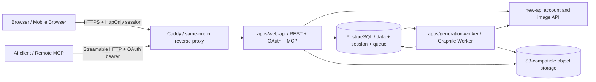

# Musefold v1.1 Web 后端 MVP 实施规格

> **状态**：首版开发基线，核心后端实现与集成验证进行中
>
> **日期**：2026-08-17
>
> **适用范围**：Web 制作工作台、个人账号、生成历史、云端提示词库、提示词云同步和 Cloud MCP

> **实施状态（2026-08-19）**：迁移已推进至 `000013_generation_events_notify`；Fastify、PostgreSQL/RLS、opaque session、提示词/同步、工作台/历史、Graphile Worker、私有对象、OAuth 和 Cloud MCP 已形成可运行基线。真实 PostgreSQL 迁移、owner 隔离、并发 token bucket、Cloud MCP 预算和生成事件通知测试已通过；Web 审批页已接入共享生成快照恢复并显示签名结果。真实 new-api staging、双远程客户端、备份恢复和生产发布仍是上线门禁。

本轮补充了三个显式真实环境验收入口：`scripts/test-v1.1-staging.mjs`（Cookie/CSRF 账号、提示词、工作台、历史、幂等生图、SSE replay 和签名资产）、`scripts/test-v1.1-mcp-staging.mjs`（两个独立 SDK transport 会话）和 `scripts/check-v1.1-openapi.mjs`。它们只在传入 staging 环境变量时运行；当前工作区没有 staging 凭据，因此不能把脚本存在误记为真实环境已通过。

## 0. 冻结结论

首版后端按以下技术栈实施：

| 层        | 选型                                              | 约束                                                             |
| --------- | ------------------------------------------------- | ---------------------------------------------------------------- |
| Runtime   | Node.js 24 LTS + TypeScript                       | API、worker 保持同一 Node 主版本；共享包兼容 Electron 运行时     |
| HTTP API  | Fastify 5                                         | 插件化模块、统一错误处理、Pino 结构化日志                        |
| 契约      | Zod 4 + `fastify-type-provider-zod` + OpenAPI 3.1 | `@musefold/contracts` 是请求和响应的唯一 schema 来源             |
| 数据库    | PostgreSQL 16                                     | 独立 Musefold Cloud 数据库；不和 new-api 表直接 join             |
| 数据访问  | Kysely + `pg`                                     | 类型化查询；RLS、`pg_trgm`、queue function 保持 SQL 可见         |
| 迁移      | SQL-first + `node-pg-migrate`                     | schema、RLS、扩展、函数和索引只有一个迁移入口                    |
| 会话/限流 | PostgreSQL                                        | opaque session、敏感端点 token bucket；P0 不依赖 Redis           |
| 异步任务  | Graphile Worker                                   | 与 generation run 同库事务入队；支持重试、延迟、优先级和 job key |
| 对象存储  | S3-compatible + AWS SDK v3                        | 本地开发使用 MinIO，生产使用配置的 S3 兼容服务                   |
| 测试      | Vitest + Testcontainers + Playwright              | 数据隔离、迁移、队列竞态和移动端主路径必须自动化                 |

代码组织冻结为模块化 Web API 和独立 worker。Cloud MCP 作为隔离的 Fastify 模块挂载在 Web API；不把公网 API 塞入 Electron 或现有 loopback Automation Server。完整取舍见 [技术选型与架构决策](./V11-TECHNOLOGY-DECISIONS.md)。

## 1. 首版目标

首版必须完整交付五条个人用户闭环：

1. 使用现有 new-api 账号注册、登录、查看额度和兑换。
2. 在 Web 制作工作台创建或恢复会话，提交生图任务，刷新页面后继续查看进度和结果。
3. 查看个人生成历史，下载、重试、继续调整，并把有效提示词存入提示词库。
4. 在 Web 与已登录桌面端之间同步提示词、文件夹、标签关系、收藏和删除状态。
5. 用户用同一账号授权 Cloud MCP，让 AI 通过官方 Skill 调用生图，并受 scope、预算和审批控制。

首版不是临时演示后端。数据库迁移、幂等、账户隔离、任务恢复、备份和可观测性都属于上线条件。

## 2. 产品范围

### 2.1 P0 功能

| 数据域         | P0 能力                                                       |
| -------------- | ------------------------------------------------------------- |
| Account        | 注册、登录、续期、退出、账号摘要、额度、兑换码                |
| Workbench      | 会话创建、草稿保存、提示词引用、参数保存、会话恢复、归档      |
| Generation     | 文生图、异步任务、进度、取消、失败重试、继续调整、结果下载    |
| History        | 按会话分页、任务快照、错误状态、资产元数据、删除与恢复        |
| Prompt Library | CRUD、搜索、文件夹、标签、收藏、软删除、恢复、使用计数        |
| Prompt Sync    | 首次引导、增量 pull/push、删除墓碑、幂等 mutation、显式冲突   |
| Cloud MCP      | Streamable HTTP、OAuth、官方 Skill、预算/审批、云端生图和历史 |
| Mobile         | 同一 API 支持手机浏览器；断线、重复点击和页面恢复不重复扣费   |

### 2.2 明确不进入 P0

- Agent 自主执行、GitHub Skills、设计方案、CLI/MCP 和自动化开关。
- BYOK、本地 Provider、豆包浏览器会话和浏览器访问本地文件。
- 参考图、图生图和用户上传素材。数据模型预留输入资产，但 P0 API 不开放上传。
- 团队、ACL、公开分享、提示词市场、评论和协作编辑。
- CRDT 或静默字段级自动合并。首版以乐观并发和显式冲突为准。

## 3. 运行时拓扑



运行规则：

- PostgreSQL 保存提示词、工作台、任务、历史、同步序列和对象元数据，是业务事实来源。
- Web session、限流计数和 Graphile Worker 队列也由 PostgreSQL 持久化；P0 没有第二套必须恢复的数据基础设施。
- generation run 与 `graphile_worker.add_job()` 在同一事务提交，job key 等于 run id，重复请求不得创建第二个上游任务。
- API 和 worker 使用不同数据库角色；两者都不能绕过 owner 隔离。
- 静态 Web 与 API 采用同源路径，默认部署在 `/Musefold/app/` 和 `/api/musefold/v1/`。

## 4. 代码结构与依赖边界

```text
apps/
  web/                         # 已有 Vite/React Web 壳
  web-api/
    src/app.ts                 # Fastify 组合根
    src/config.ts              # 环境变量 schema
    src/plugins/               # db/session/security/openapi/telemetry
    src/modules/account/
    src/modules/prompts/
    src/modules/sync/
    src/modules/workbench/
    src/modules/generations/
    src/modules/oauth/
    src/modules/mcp/           # Streamable HTTP transport + CloudBackend
    src/modules/assets/
    src/modules/health/
    migrations/                # SQL-first/node-pg-migrate migrations
  generation-worker/
    src/worker.ts
    src/gateways/new-api.ts
    src/gateways/object-storage.ts
    src/recovery.ts
packages/
  contracts/                   # Zod DTO、错误码、OpenAPI 输入
  domain/                      # 纯领域规则、端口、状态机
  cloud-client/                # 浏览器和桌面共用 typed HTTP client
  mcp-tools/                   # Local/Cloud MCP 共用工具 schema 与结果映射
  product-ui/                  # Desktop/Web 共用产品页面组件
  ui/                          # 后续抽取的无平台 React 组件
  core/                        # 桌面 SQLite 和本地 Provider，保持独立
```

依赖方向：

```text
contracts <- domain <- web-api application services
contracts <- cloud-client <- apps/web / desktop cloud adapter
domain <- generation-worker
core -X- web-api
electron -X- apps/web
automation-server -X- web-api
mcp-tools <- packages/mcp / apps/web-api MCP module
product-ui <- desktop renderer / apps/web
```

禁止事项：

- route handler 直接拼 SQL、直接调用 new-api 或直接操作 S3。
- `packages/contracts` 导入 Fastify、Kysely、Electron 或 Node-only 模块。
- Web API 复用桌面 `GenerateImageRequest`、本地文件路径或 Provider id。
- 将账号密码、refresh token、设备令牌、完整提示词写入日志。

## 5. 模块边界

### 5.1 Account

职责：

- 适配 new-api 注册、登录、refresh、账号摘要、额度和兑换接口。
- 建立 Musefold Web 服务端会话。
- 为异步生图供给账户级 `musefold-web` 调用令牌。
- 统一映射 new-api 错误到 Musefold API 错误。

端口：

```ts
interface AccountGateway {
  register(input: Credentials): Promise<void>;
  login(input: Credentials): Promise<RelaySession>;
  refresh(refreshToken: string): Promise<RelaySession>;
  getAccount(jwt: string): Promise<AccountSummary>;
  redeem(jwt: string, code: string): Promise<RedeemResult>;
  ensureImageCredential(jwt: string, ownerId: string): Promise<SecretValue>;
}
```

### 5.2 Prompt Library

职责：

- 维护提示词聚合、文件夹、标签关系、使用计数和搜索。
- 每次成功 mutation 同事务写入 `sync_changes`。
- 所有更新使用 `expectedVersion`，不使用客户端时间决定覆盖顺序。

### 5.3 Sync

职责：

- 首次 bootstrap、增量 pull、批量 push、设备游标和 mutation 去重。
- 只同步云安全字段，不同步本地图片路径、Provider、系统文件或桌面内部状态。
- 协议详见 [V11-PROMPT-CLOUD-SYNC.md](./V11-PROMPT-CLOUD-SYNC.md)。

### 5.4 Workbench

职责：

- 保存个人工作台会话、草稿和当前参数。
- 聚合会话内 generation runs，不执行 Provider 调用。
- 重试和继续调整创建新 run，并通过 `parent_run_id` 保留谱系。

### 5.5 Generation

职责：

- 校验请求、额度可用性、幂等键和工作台归属。
- 在一个数据库事务中创建 run、generation event 与 Graphile job。
- 提供状态查询、历史分页、SSE 和尽力取消。

### 5.6 Worker

职责：

- 消费 Graphile Worker 任务，以条件更新取得 run 执行权。
- 从凭据库读取解密后的账户调用令牌，调用 new-api 生图接口。
- 校验并上传结果对象，写入资产和最终状态。
- 写入持久 generation event，并用 PostgreSQL `NOTIFY` 唤醒在线 SSE；通知不是最终状态。

## 6. 认证、会话与凭据

### 6.1 浏览器会话

登录流程：

1. 浏览器把用户名和密码提交到 Musefold Web API。
2. Web API 调用 new-api；密码只存在于本次请求作用域。
3. Web API 生成 256-bit 随机会话 id，只把其哈希和加密凭据写入 PostgreSQL `web_sessions`。
4. 浏览器只得到 `mf_session` Cookie：`HttpOnly; Secure; SameSite=Lax; Path=/`。
5. 登录成功后轮换会话 id，防止 session fixation。

PostgreSQL 会话内容：

```text
session_id_hash
owner_id
username
new_api_refresh_ciphertext
new_api_access_ciphertext
access_expires_at
csrf_nonce
created_at
last_seen_at
```

- refresh 和短期 JWT 使用 AES-256-GCM 或部署环境的 KMS envelope encryption。
- 加密记录必须包含 `key_version`、nonce 和 auth tag，支持密钥轮换。
- 会话绝对有效期 30 天，空闲有效期 7 天；每次 refresh 都原子替换轮换后的 refresh 值。
- 过期会话由 Graphile Worker 定时任务清理；请求读取只更新节流后的 `last_seen_at`，避免每次访问都写库。
- API 实例不得在进程全局保存单一账号 JWT。

### 6.2 Worker 凭据

异步 worker 不能依赖浏览器请求仍在线，因此账户调用令牌通过 `account_credentials` 保存加密密文。完整 `sk-` 仅在 worker 调用期间解密到内存：

- 每个 `owner_id` 最多一个活动的 `musefold-web` 令牌记录。
- 令牌首次生图或登录后懒创建；重复登录复用，不为每个 session 创建。
- 退出只撤销 Web session，不中断已提交任务。
- 用户删除云账户时先停止新任务，再撤销 new-api 令牌并清除密文。

### 6.3 CSRF、Origin 和限流

- 所有非 GET 请求要求允许列表中的 `Origin`，并携带与 session 绑定的 `X-Musefold-CSRF` nonce。
- CORS 默认关闭；只有明确配置的开发源可跨域。
- 登录/注册按 IP 和账号摘要限流；兑换、同步 push、生图创建分别使用独立限额。
- P0 的细粒度限流用 PostgreSQL token bucket/事务锁实现，Caddy 提供入口级粗限流；达到技术决策文档阈值后再换 Redis adapter。
- 代理后只信任固定 Caddy 网段的 `X-Forwarded-*`，不能信任任意客户端转发头。
- `TRUST_PROXY` 必须列出明确代理地址或 Fastify 命名范围；配置 `true`、`*` 等全信任值时服务拒绝启动。限流键中的账号、grant 和 IP 使用服务端 HMAC 后再落库，429 响应携带 `Retry-After`。

## 7. PostgreSQL 数据模型

所有业务主表包含 `owner_id bigint NOT NULL`。实体 id 使用 ULID 文本；时间使用 `timestamptz`；金额使用整数点数，不使用浮点数。

### 7.1 账户与设备

```text
cloud_accounts
  owner_id PK, username_snapshot, created_at, updated_at, deletion_requested_at

web_sessions
  id_hash PK, owner_id, username_snapshot,
  new_api_refresh_ciphertext, new_api_access_ciphertext,
  nonce, auth_tag, key_version, access_expires_at, csrf_nonce,
  created_at, last_seen_at, absolute_expires_at, revoked_at

account_credentials
  owner_id PK/FK, provider, credential_ciphertext, nonce, auth_tag,
  key_version, external_token_id, created_at, rotated_at

sync_devices
  id, owner_id, name, platform, last_pull_seq, last_seen_at, revoked_at
```

`cloud_accounts` 是 Musefold Cloud 的本地账户投影，不是第二套登录账户。`owner_id` 来源于 new-api，数据库之间不建立外键。

### 7.2 提示词聚合

```text
prompt_folders
  id, owner_id, name, parent_id, sort_order, version,
  created_at, updated_at, deleted_at

prompt_tags
  id, owner_id, name, tag_group, color, version,
  created_at, updated_at, deleted_at

prompts
  id, owner_id, title, description, content, negative,
  folder_id, model_id, params jsonb, rating,
  is_pinned, pin_order, usage_count, last_used_at,
  source, source_url, version,
  created_at, updated_at, deleted_at

prompt_tag_links
  owner_id, prompt_id, tag_id, created_at

prompt_usage_events
  id, owner_id, prompt_id, action, idempotency_key,
  generation_run_id, created_at
```

约束：

- `(owner_id, id)` 是所有跨表引用的复合唯一键。
- 活动文件夹和标签名称在同一 owner 内唯一，大小写使用规范化列判断。
- `version` 从 1 开始，每次内容、归属、标签、收藏、删除或恢复变化时递增。
- `usage_count` 由幂等 usage event 累加，不接受客户端直接写入。
- 搜索使用 `pg_trgm` 和规范化搜索列；P0 不引入 Elasticsearch。

### 7.3 工作台与历史

```text
workbench_sessions
  id, owner_id, title, draft_prompt, draft_negative,
  draft_params jsonb, prompt_reference_ids jsonb,
  version, created_at, updated_at, archived_at, deleted_at

generation_runs
  id, owner_id, session_id, parent_run_id, prompt_id,
  run_kind, prompt_snapshot jsonb, request jsonb,
  provider_model, status, progress, idempotency_key,
  error_code, error_detail_safe, cost_points,
  attempt_count, lease_expires_at,
  created_at, started_at, finished_at, cancelled_at, deleted_at

generation_assets
  id, owner_id, run_id, object_key, mime_type,
  width, height, byte_size, checksum_sha256,
  created_at, deleted_at

generation_events
  seq bigserial, owner_id, run_id, event_type, payload jsonb, created_at
```

规则：

- `request` 和 `prompt_snapshot` 只含 contracts 白名单字段，绝不保存 Key。
- `run_kind` 首版只允许 `free_generation | refinement | retry`。
- 重试创建新 run，不重置旧 run；`parent_run_id` 形成可审计谱系。
- 成功图片对象首版不自动过期，直到用户删除；签名访问 URL 默认 10 分钟过期。
- 删除历史先软删除，30 天后后台清理对象；恢复期内对象不可被生命周期策略提前删除。

Cloud MCP 还需要 OAuth grant、refresh family、预算策略、审批和费用预留表。字段与 token 生命周期见 [V11-CLOUD-MCP-AND-SKILLS.md](./V11-CLOUD-MCP-AND-SKILLS.md)，这些表同样使用 owner 隔离，token 只保存 hash。

费用预留按 `(owner_id, grant_id)` 隔离并在 grant 行锁内检查单次/每日预算；日累计同时包含 `reserved` 和 `settled`。成功任务在 Worker 中结算，确定失败和排队阶段取消释放；上游结果未知则保留等待对账。当前上游无 usage 字段时，`actual_points` 暂取服务器预估值。

### 7.4 同步表

```text
sync_changes
  seq bigserial PK, owner_id, entity_type, entity_id,
  operation, entity_version, snapshot jsonb, created_at

sync_mutations
  owner_id, device_id, mutation_id, entity_type, entity_id,
  result_version, result_snapshot jsonb, created_at,
  PK(owner_id, device_id, mutation_id)
```

`sync_changes` 是增量协议日志，不代替实体主表。日志保留至少 180 天；游标过期时客户端执行完整 bootstrap。

### 7.5 RLS

`app` schema 中每个 owner 业务表启用并强制 Row-Level Security：

```sql
ALTER TABLE prompts ENABLE ROW LEVEL SECURITY;
ALTER TABLE prompts FORCE ROW LEVEL SECURITY;

CREATE POLICY prompts_owner_policy ON prompts
USING (owner_id = current_setting('app.owner_id', true)::bigint)
WITH CHECK (owner_id = current_setting('app.owner_id', true)::bigint);
```

Repository 每次操作都在事务内先执行 `SET LOCAL app.owner_id = $1`。迁移角色与运行角色分离；API/worker 运行角色没有 `BYPASSRLS`。

`web_sessions`、OAuth code/token family 和限流 bucket 在认证 owner 前按哈希/IP key 查询，放在独立 `auth` schema：普通 application repository 没有直接表权限，只能由 session/OAuth plugin 通过固定参数的 `SECURITY DEFINER` 函数读取、轮换和撤销。`graphile_worker` schema 同样不向 API 业务角色开放；enqueue wrapper 只接收 run id，并从业务表重新读取白名单 payload。禁止为了会话查询给整个 API role 授予 `BYPASSRLS`。

## 8. 工作台状态与生成状态机

### 8.1 工作台会话

- 首次进入生成页创建一个活动 session，空 session 可延迟到首次输入后落库。
- 草稿使用 500 至 1000ms debounce 保存，并带 `expectedVersion`。
- 同一账号在另一设备打开同一 session 时，版本冲突返回当前服务端草稿，不静默覆盖。
- session 归档不会删除 runs 或 assets；删除进入 30 天回收期。
- Web 刷新后通过 session id 恢复草稿、run 列表和最后一个任务状态。

### 8.2 生成状态机

```text
pending_approval -> queued -> running -> succeeded
        |             |          |  -> failed
        |             |          -> cancelling -> cancelled
        |             -> cancelled
        -> rejected | expired
```

状态只能由 domain 状态机转换，route、worker 和恢复任务都调用同一规则。

Web session 发起的普通生成在幂等和额度校验后进入 queued。Cloud MCP 生成先按 OAuth grant 的预算策略决定 pending approval 或 queued；审批前不得创建 Graphile job 或调用上游。

### 8.3 事务型创建

`POST /generations` 在同一 PostgreSQL 事务中：

1. 校验 session/prompt 归属和账号生图能力。
2. 以 `(owner_id, idempotency_key)` 查询已有 run。
3. 创建 `generation_runs(status=queued)`。
4. 写入 `generation_events(event_type=generation.requested)`。
5. 通过受控的 `SECURITY DEFINER` SQL wrapper 调用 `graphile_worker.add_job()`；task identifier 固定为 `generation.generate`，job key 固定为 run id。
6. 提交事务后立即返回 `202`。

run、event 和 job 同事务提交，不需要“先写数据库、再发布消息”的 outbox dispatcher。API 运行角色只能执行受控 enqueue wrapper，不能直接管理 Graphile Worker schema；worker 的 queue role 与业务数据角色分离。

### 8.4 Worker 幂等与重试

- Worker 用条件更新 `queued -> running` 取得执行权；已终态任务直接确认消息。
- Graphile Worker 自动重试只覆盖“尚未向上游发送请求”的可判定失败。
- 请求已发送但响应未知时，不自动二次调用上游，任务失败为 `GENERATION_UPSTREAM_UNKNOWN`，由用户主动重试，避免重复扣费。
- 上游返回图片后先上传对象并校验 checksum，再在数据库事务中写资产和 `succeeded`。
- 对象上传失败可以重试同一结果上传，但不能重新调用 Provider。
- worker 崩溃后的过期 lease 由 recovery 扫描；根据执行阶段恢复到 queued 或标记明确失败。

### 8.5 SSE

- `generation_events` 保存关键状态；事务提交后触发 PostgreSQL `NOTIFY`，只负责低延迟唤醒在线 API 实例。
- 客户端携带 `Last-Event-ID` 重连；API 先补发数据库事件，再订阅实时事件。
- SSE 断开不影响任务。前端始终可用 `GET /generations/:id` 轮询恢复。

## 9. Web API v1

统一前缀：`/api/musefold/v1`。成功响应直接返回契约对象；错误统一为 `ApiErrorEnvelope`。所有写请求接受 `X-Request-ID`，服务端始终返回最终 request id。

### 9.1 账号

| 方法   | 路径             | 说明                                   |
| ------ | ---------------- | -------------------------------------- |
| `POST` | `/auth/register` | 注册并建立 Web session                 |
| `POST` | `/auth/login`    | 登录并轮换 session                     |
| `POST` | `/auth/refresh`  | 显式刷新账号摘要；通常由服务端自动续期 |
| `POST` | `/auth/logout`   | 删除当前 Web session                   |
| `GET`  | `/auth/me`       | 账号、额度、能力和 CSRF nonce          |
| `POST` | `/auth/redeem`   | 兑换码充值，幂等保护                   |

### 9.2 提示词库

| 方法                    | 路径                   | 说明                         |
| ----------------------- | ---------------------- | ---------------------------- |
| `GET`                   | `/prompts`             | 搜索、筛选和游标分页         |
| `POST`                  | `/prompts`             | 创建提示词                   |
| `GET`                   | `/prompts/:id`         | 获取完整聚合                 |
| `PATCH`                 | `/prompts/:id`         | 带 `expectedVersion` 更新    |
| `DELETE`                | `/prompts/:id`         | 软删除                       |
| `POST`                  | `/prompts/:id/restore` | 恢复并增加版本               |
| `POST`                  | `/prompts/:id/use`     | 幂等记录 copy/apply/generate |
| `GET/POST/PATCH/DELETE` | `/folders...`          | 文件夹管理                   |
| `GET/POST/PATCH/DELETE` | `/tags...`             | 标签管理                     |

### 9.3 同步

| 方法   | 路径              | 说明                                 |
| ------ | ----------------- | ------------------------------------ |
| `POST` | `/sync/devices`   | 注册或恢复同步设备                   |
| `GET`  | `/sync/bootstrap` | 分页获取全量当前快照和起始 cursor    |
| `GET`  | `/sync/pull`      | 从 cursor 增量读取 changes           |
| `POST` | `/sync/push`      | 批量提交最多 100 个 mutations        |
| `POST` | `/sync/usage`     | 批量提交最多 100 个独立 usage events |
| `GET`  | `/sync/status`    | 当前设备游标、待处理冲突和服务端序列 |

### 9.4 工作台和历史

| 方法               | 路径                                            | 说明                         |
| ------------------ | ----------------------------------------------- | ---------------------------- |
| `GET/POST`         | `/workbench/sessions`                           | 分页列出或创建会话           |
| `GET/PATCH/DELETE` | `/workbench/sessions/:id`                       | 恢复、保存草稿、归档或软删除 |
| `GET`              | `/workbench/sessions/:id/runs`                  | 会话内生成记录               |
| `GET`              | `/generations`                                  | 个人生成历史分页             |
| `POST`             | `/generations`                                  | 幂等创建任务，返回 `202`     |
| `GET`              | `/generations/:id`                              | 获取当前状态和资产           |
| `GET`              | `/generations/:id/events`                       | SSE 状态流                   |
| `POST`             | `/generations/:id/cancel`                       | 尽力取消                     |
| `POST`             | `/generations/:id/retry`                        | 创建关联的新 run             |
| `DELETE/POST`      | `/generations/:id` / `/generations/:id/restore` | 历史软删除/恢复              |
| `GET`              | `/assets/:id/url`                               | 返回短期签名下载 URL         |

### 9.5 Cloud MCP 授权与审批

| 方法           | 路径               | 说明                                  |
| -------------- | ------------------ | ------------------------------------- |
| `GET/POST`     | `/oauth/authorize` | Web 登录后的 OAuth consent            |
| `POST`         | `/oauth/token`     | Authorization Code/refresh token 交换 |
| `POST`         | `/oauth/revoke`    | 撤销 token/grant                      |
| `GET`          | `/connections`     | 已授权 AI 客户端                      |
| `PATCH/DELETE` | `/connections/:id` | 修改预算、暂停或撤销                  |
| `GET/POST`     | `/approvals/:id`   | 查看并批准/拒绝 MCP 生图              |

Cloud MCP 工具端点为 `/api/musefold/mcp`，不使用 Web Cookie。完整协议、scope 和 Skill registry 见 [云端 MCP 设计](./V11-CLOUD-MCP-AND-SKILLS.md)。

## 10. API 幂等和并发规则

| 操作                 | 机制                                                                       |
| -------------------- | -------------------------------------------------------------------------- |
| 登录/注册            | 服务器限流；注册冲突不泄露额外账号信息                                     |
| 兑换                 | `Idempotency-Key` + owner 唯一约束；重复请求返回第一次结果                 |
| 创建生图             | `Idempotency-Key` 必填；同 owner 重复键返回同一 run                        |
| prompt usage         | 可选幂等键；同一 generate 操作只累计一次                                   |
| prompt/sessions 更新 | `expectedVersion`；不匹配返回 409 和服务端当前值                           |
| sync push            | `(owner, device, mutationId)` 唯一；整批逐项返回 applied/conflict/rejected |
| 删除/恢复            | 重复执行返回当前实体状态，不产生重复 change                                |

## 11. 错误契约

错误格式：

```json
{
  "error": {
    "code": "PROMPT_VERSION_CONFLICT",
    "message": "内容已在其他设备修改",
    "requestId": "01...",
    "retryable": false,
    "details": {}
  }
}
```

P0 必须覆盖：

```text
AUTH_REQUIRED
AUTH_SESSION_EXPIRED
AUTH_CREDENTIALS_INVALID
OAUTH_INVALID_GRANT
OAUTH_SCOPE_INSUFFICIENT
ACCOUNT_QUOTA_INSUFFICIENT
ACCOUNT_REDEEM_INVALID
PROMPT_NOT_FOUND
PROMPT_VERSION_CONFLICT
SYNC_CURSOR_EXPIRED
SYNC_MUTATION_CONFLICT
WORKBENCH_SESSION_NOT_FOUND
WORKBENCH_VERSION_CONFLICT
GENERATION_NOT_FOUND
GENERATION_ALREADY_TERMINAL
GENERATION_UPSTREAM_REJECTED
GENERATION_UPSTREAM_UNKNOWN
GENERATION_STORAGE_FAILED
GENERATION_APPROVAL_REQUIRED
GENERATION_APPROVAL_EXPIRED
MCP_BUDGET_EXCEEDED
RATE_LIMITED
VALIDATION_FAILED
INTERNAL_ERROR
```

HTTP 状态约定：验证 400、未登录 401、无归属资源统一 404、冲突 409、额度不足 403、限流 429、未知错误 500/503。不能用 403 暗示其他用户资源存在。

## 12. 搜索、分页和缓存

- prompts 默认按 `is_pinned DESC, updated_at DESC, id DESC` 游标分页。
- history 默认按 `created_at DESC, id DESC` 游标分页。
- 游标由排序值和 id 编码并签名，客户端不能拼 SQL 条件。
- 搜索规范化标题、正文、description 和标签；`pg_trgm` 提供模糊匹配，中文文本先做应用层规范化。
- P0 不建立共享缓存依赖；账号摘要和模型能力先使用进程内短 TTL 缓存，并允许缓存失效后直接回源。
- 提示词详情、任务终态、授权和 owner 判断始终读取 PostgreSQL/new-api，不能依赖进程内缓存正确性。
- 签名 URL 不能写回持久实体或同步日志，API 每次按 asset 生成。

## 13. 安全基线

- 配置由 Zod 在进程启动时校验；缺失密钥直接拒绝启动。
- 生产只接受 HTTPS；Caddy 添加 HSTS、CSP、`X-Content-Type-Options` 和合理的上传/响应限制。
- 密码、Cookie、refresh、JWT、设备令牌、兑换码和图片二进制不进日志。
- 普通日志不记录提示词正文、负向提示词或同步 snapshot。
- 数据库连接启用 TLS；对象存储 bucket 私有，禁止公共读取。
- API body、提示词长度、JSONB 大小、批量条数、SSE 连接数都有上限。
- RLS owner 隔离和应用层 owner 条件均需测试，不能任选其一。
- 依赖锁文件提交；镜像使用不可变 tag/digest；生产迁移由独立 job 执行。

## 14. 可观测性与审计

结构化日志字段：

```text
timestamp, level, service, requestId, accountIdHash,
sessionIdHash, runId, route, statusCode, durationMs, errorCode
```

核心指标：

- HTTP 请求量、p50/p95/p99、4xx/5xx、登录和 refresh 成功率。
- prompt CRUD/搜索延迟、sync push/pull 数、冲突率、游标过期率。
- generation queue depth、排队时长、上游时长、成功率、取消率、未知结果率。
- PostgreSQL pool、慢查询、Graphile queue depth/最老 job 年龄、worker lease 恢复数、SSE listener 数。
- 对象上传失败率、总字节数、孤儿对象清理数。

审计事件只记录动作和对象 id，不记录正文：登录、兑换、提示词删除/恢复、任务创建/取消、凭据轮换和账户删除。

## 15. 部署与环境

### 15.1 服务

生产 Compose/编排至少包含：

```text
web-static
web-api (>=2 replicas when needed)
generation-worker
postgres:16
object-storage or external S3 endpoint
caddy
backup job
```

Cloud MCP 与 OAuth 路由随 `web-api` 部署，但使用独立 Fastify plugin、认证 middleware 和指标标签。API 和 worker 可使用同一镜像的不同 entrypoint，健康检查和扩缩容相互独立；达到技术决策文档的 MCP 拆分阈值后，可不改工具/application contract 地提取进程。

### 15.2 必需环境变量

```text
NODE_ENV
PUBLIC_ORIGIN
DATABASE_URL
SESSION_COOKIE_NAME
SESSION_ENCRYPTION_KEY
OAUTH_JWKS_JSON
MCP_RESOURCE_URL
NEW_API_BASE_URL
S3_ENDPOINT
S3_REGION
S3_BUCKET
S3_ACCESS_KEY_ID
S3_SECRET_ACCESS_KEY
S3_SIGNED_URL_TTL_SECONDS
LOG_LEVEL
```

生产环境的 `SESSION_ENCRYPTION_KEY` 和 `OAUTH_JWKS_JSON` 必须由 Secret Manager 注入；JWKS 使用带 `kid` 的版本化 JSON，轮换时保留旧私钥直到现有 provider artifact 过期。

### 15.3 健康检查

| 端点             | 用途                                                             |
| ---------------- | ---------------------------------------------------------------- |
| `/health/live`   | 进程事件循环正常，不访问外部服务                                 |
| `/health/ready`  | PostgreSQL 可用、迁移与 Graphile schema 版本正确；不触发真实生图 |
| worker heartbeat | worker 最近心跳和队列消费时间                                    |
| queue health     | ready/locked job 数、最老 ready job 年龄和失败重试数             |

## 16. 数据保留与备份

- 提示词、工作台和成功生成资产默认保留，直到用户删除。
- 软删除提示词/历史保留 30 天；同步墓碑和 change log 至少保留 180 天。
- 未绑定实体的孤儿上传对象 24 小时后清理。
- PostgreSQL 每日全量备份 + WAL/PITR；对象存储启用版本或生命周期保护。
- 备份至少保留 14 天，每月至少一次恢复演练。
- 用户删除账户时进入可撤销冷静期，之后清理数据库、对象和账户调用凭据。

## 17. 测试门禁

### 17.1 单元与契约

- Zod schema、错误映射、状态机、游标编解码、提示词归一化。
- OpenAPI 与 route schema 一致，破坏性 contract 变更阻止合并。
- Workbench/Prompt repository 运行共享 contract tests。

### 17.2 数据库集成

使用真实 PostgreSQL Testcontainer：

- 空库迁移、上一版本升级、回滚说明和索引存在性。
- owner A 无法 list/get/update/delete owner B 的任何资源。
- RLS 在遗漏应用 where 条件时仍阻止越权。
- mutation 幂等、版本冲突、墓碑、游标过期和 bootstrap。
- generation run/Graphile job 原子性、job key 去重和 worker lease 竞争。

### 17.3 API 集成

- Cookie 属性、CSRF、Origin、session rotation、refresh rotation 和退出。
- 所有 id 端点的 owner 隔离和统一 404。
- 生成重复提交、SSE 重连、取消竞态、额度不足、上游超时、对象存储失败。
- 日志捕获测试确保敏感字段和提示词正文不出现。

### 17.4 端到端

Web Playwright 覆盖 `1440x900`、`390x844`：

1. 注册/登录/兑换。
2. 创建提示词并在另一浏览器会话看到。
3. 从提示词进入工作台并生成。
4. 刷新页面恢复运行中任务。
5. 查看历史、重试、下载、保存为提示词。
6. 桌面同步客户端 push 后 Web 可见，Web 修改后桌面 pull 可见。
7. 并发编辑触发冲突，不丢失任意一方正文。
8. OAuth 授权 Cloud MCP，默认审批一次生图并在 Web 历史中查看结果。
9. 为该 AI 客户端配置自动预算，预算内直接生成、超额重新进入审批。

真实 new-api 和对象存储 smoke test 只在 staging 运行；凭据由 CI Secret 注入。

可执行验收入口：

```bash
MUSEFOLD_STAGING_BASE_URL=https://staging.example.com \
MUSEFOLD_STAGING_USERNAME=... MUSEFOLD_STAGING_PASSWORD=... \
npm run test:staging:v1.1

# 以下选项会写入 staging 或消耗额度，必须显式打开
MUSEFOLD_STAGING_RUN_PROMPT_MUTATIONS=true \
MUSEFOLD_STAGING_RUN_REDEEM=true MUSEFOLD_STAGING_REDEEM_CODE=... \
MUSEFOLD_STAGING_RUN_GENERATION=true \
npm run test:staging:v1.1

MUSEFOLD_OPENAPI_URL=https://staging.example.com/api/musefold/v1/openapi.json \
npm run openapi:check
```

Cloud MCP SDK smoke：

```bash
MUSEFOLD_STAGING_MCP_URL=https://staging.example.com/api/musefold/mcp \
MUSEFOLD_STAGING_MCP_ACCESS_TOKEN=... \
npm run test:staging:mcp-sdk
```

SDK smoke 不能替代真实产品客户端的 OAuth、审批、等待和图片展示兼容性验收。

## 18. 首版完成定义

只有同时满足以下条件，Web 后端首版才算完成：

- P0 API 全部由 OpenAPI/契约描述，cloud-client 不手写重复 DTO。
- 工作台刷新、API 重启、worker 重启和 SSE 断线后均可恢复。
- 提示词 Web CRUD 和桌面双向增量同步通过验收，冲突不会静默覆盖。
- Cloud MCP OAuth、scope、预算、审批、撤销和官方 Skill 生图通过兼容性验收。
- 生成重复提交不会创建第二次扣费任务。
- 两账户隔离测试覆盖所有业务表和对象下载。
- 数据库/对象备份、迁移、回滚、健康检查和告警可实际执行。
- 桌面 `npm run typecheck && npm test && npm run build` 不因 Web 后端依赖回归。
- Web `typecheck/test/build`、API/worker/MCP 模块集成和 Playwright 门禁全部通过。
