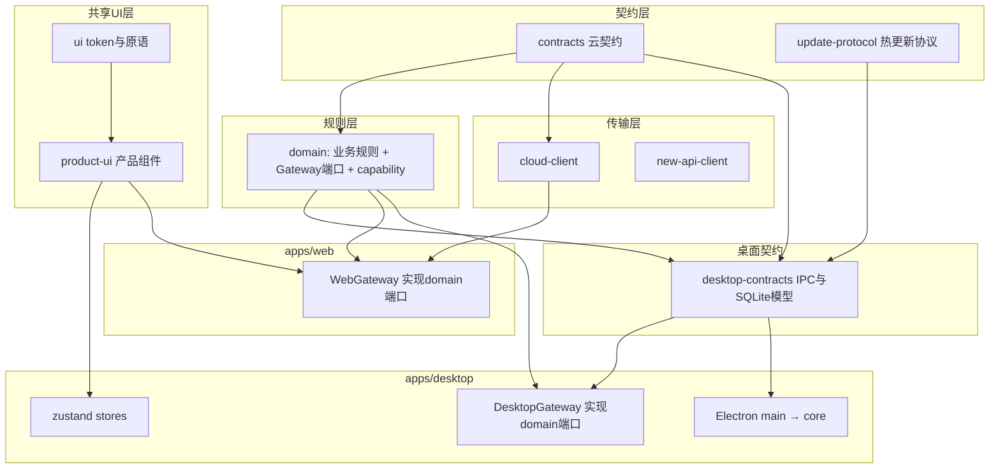

# Musefold v1.2.2 系统架构

> **状态**：v1.2.2 已实现架构基线（Phase 0、Phase 1a/1b、Phase 2 GW-01~09 及补卡、Phase 3 SHARE-01~06 均已落地）
>
> **日期**：2026-08-20
>
> **范围**：仓库目录结构、共享层分层、桌面数据访问抽象、TypeScript 工程组织
>
> **目的**：让双端一致体验建立在同一套代码上；降低维护成本、提高开发效率；不改变任何用户可见行为

## 0. 结论摘要

v1.2.2 把仓库从「桌面 App 占据根目录 + 一批外挂 workspace 包」重构为标准的双端 monorepo：

1. **桌面 App 迁入 `apps/desktop`**，与 `apps/web`、`apps/web-api`、`apps/generation-worker` 平级；根目录只留 workspace 配置与工具链。
2. **`shared/` 解散**（Phase 1a 已落地）：IPC 契约与 SQLite 行模型进 `packages/desktop-contracts`；平台无关逻辑归位 `packages/domain`；Node 绑定与桌面行模型逻辑归位 `packages/core` / 主进程。`@shared/types/*` 兼容别名已于 Phase 3 SHARE-06 删除，消费方改走 `@musefold/desktop-contracts/<mod>` 子路径。
3. **桌面补上数据访问抽象**：`packages/domain` 六端口已上提（GW-01），WebGateway 已显式继承同一组端口；桌面 `DesktopGateway` 与 `DesktopExtras` 覆盖共享业务面及 library/account/cloudSync/provider/aiConnection/workbench 桌面语义，工作台再以 `WorkbenchIO` 隔开 transport。system/pet/automation/designScheme/skillRuntime 等宿主能力统一经 `DesktopHostServices`。renderer 业务代码直接 import `lib/ipc` 已归零，裸 `window.api` 只剩 5 个低层入口。桌面已接入 `getProductCapabilities('desktop')`（GW-08）。
4. **双模型不强合，用 mapper 收口**：SQLite 行模型与云文档模型语义不同（时间、分页、乐观锁），转换集中在明确的 mapper 层；新功能一律以 `contracts` 形状为准。
5. **依赖规则从约定变成机器约束**：dependency-cruiser 把分层图变成 CI 门禁；package.json 补全真实依赖；TypeScript project references 统一 typecheck 入口。

技术栈本身不变：Electron、Fastify 5 + PostgreSQL 16 + Graphile Worker、Vite + React 18、npm workspaces + Turborepo。重估过程与不采用清单见[技术选型与决策](./V122-TECHNOLOGY-DECISIONS.md)。

## 1. 现状与问题定位

### 1.1 规模基线（2026-08-20 实测；Phase 1a 前）

下表为目录迁移前的规模快照。Phase 1a 已将 `src/`、`electron/` 迁入 `apps/desktop/`，并解散 `shared/`。

| 区域 | 生产代码 | 说明 |
|---|---|---|
| `src/`（桌面渲染） | 151 文件 / 约 3.0 万行 | feature-sliced，含 2,942 行的 `GenerationWorkbench.tsx` 与 2,080 行的工作台 store |
| `electron/`（主进程 + preload） | 98 文件 / 约 1.9 万行 | IPC handler、账号、豆包桥、系统集成 |
| `shared/` | 25 文件 / 约 4.6 千行 | IPC `Api` 面（1,081 行）+ SQLite 行模型 + 混装的运行时逻辑 |
| `packages/product-ui` | 64 文件 / 约 1.1 万行 | 双端共享产品组件，v1.1 最大成果 |
| `packages/core` | 54 文件 / 约 8.0 千行 | 桌面本地核：SQLite、Provider、同步引擎 |
| `packages/domain` | 5 文件 / 约 200 行 | 过薄；`PromptRepository` 端口零实现 |
| `apps/web/src` | 13 文件 / 约 5.7 千行 | 薄宿主，数据走 `WebGateway` |

### 1.2 五个结构性缺口

**缺口一：两套并行领域模型。** 同一批实体在桌面行模型（原 `shared/types/models.ts`，Phase 1a 起为 `packages/desktop-contracts`：`Prompt.contentNegative`、`createdAt: number`、无 version）与 `packages/contracts/src/prompt.ts`（`negative`、ISO 字符串、`version` 乐观锁）各有一份定义，工作台会话、账号、历史同理。`packages/core` 的 SQLite 行与 IPC 全部是前者。

**缺口二：桌面曾没有数据访问抽象。** Web 侧 `apps/web/src/runtime.ts` 的 `WebGateway` 已经把 fixture/HTTP 藏在接口后面；Phase 2 前桌面侧有 47 个渲染文件直接 import IPC、8 个文件裸用 `window.api`，18 个 zustand store 的 action 就是数据层。Phase 2 已完成收口：六端口、`DesktopGateway`、`DesktopExtras` 与 `DesktopHostServices` 分别承接共享业务、桌面数据语义和纯宿主能力；renderer 业务代码直接 import transport 已归零，裸 `window.api` 只剩 5 个低层桥接入口，见第 4 节。

**缺口三：桌面 App 曾占据仓库根目录。** Phase 1a 已将 `src/`、`electron/` 迁入 `apps/desktop/` 并解散 `shared/`；Phase 1b 已下移 App manifest 与 builder 配置，根 `package.json` 现为纯 workspace root。迁移前的后果是工程配置无法收敛：`tsconfig.node.json`、`tsconfig.web.json`、`electron.vite.config.ts`、`vitest.config.ts` 各维护一套不完全一致的别名；根 tsconfig 没有 references 到任何包；`typecheck` 拆成三条命令，其中 `typecheck:mcp` 需要 8 GiB 堆。后两项已由 Phase 0 收口；别名于 DIR-03 收敛为 `tooling/aliases.mjs` + tsconfig 守卫。

**缺口四：宿主编排层重复。** Web `App.tsx`（1,373 行）与桌面 pages+stores 是接同一批 product-ui 组件的两套平行编排；`packages/new-api-client` 与 `electron/account/api-client.ts` 是接口几乎同名的两份客户端；`titleFromPromptContent`、积分格式化等纯函数在 domain、桌面、Web 各有副本；`src/components/ui/` 里 dropdown/select/slider/lightbox 等约 1,000 行原语未完成向 `@musefold/ui` 的迁移。

**缺口五：依赖靠别名而非声明。** `core`、`cli`、`client`、`automation-server` 的 package.json 不声明 `better-sqlite3`、`@musefold/contracts` 等真实依赖，靠 vite/tsconfig 别名编译通过；`packages/mcp` 锁 zod v3 而其余包用 v4；包版本号存在 `0.1.0`、`0.5.0-dev`、`1.1.0-dev` 三套。

## 2. 目标目录结构

```text
apps/
  desktop/                     # ← 根目录 src/ + electron/ 迁入（Phase 1a 已落地）
    electron/
      main/                    # 主进程（原 electron/main 等；skill-scanner 归位于 main/skill-import/）
      preload/
    src/                       # 渲染进程（原根 src/）
    electron.vite.config.ts
    tsconfig.node.json         # 自根目录迁入，保留原名（无按名发现机制）
    tsconfig.web.json
    electron-builder.yml       # Electron 打包配置
    package.json               # Electron App manifest 与运行依赖
  web/                         # 不变
  web-api/                     # 不变
  generation-worker/           # 不变

packages/
  contracts/                   # 云契约（Zod）；新增实体的唯一规范形状
  desktop-contracts/           # ← shared/types 迁入：IPC Api 面 + SQLite 行模型 + 桌面枚举 + design-scheme / diagnostics / share
  domain/                      # 做厚：纯业务规则 + Gateway 端口 + contracts 侧 mapper + capability
  ui/                          # 设计 token 与原语（补齐迁移）
  product-ui/                  # 共享产品组件与交互 controller
  cloud-client/                # Cloud HTTP 客户端（双端共用）
  new-api-client/              # new-api 客户端（收敛为唯一一份）
  server-crypto/               # 服务端密封
  core/                        # 桌面本地核（SQLite/Provider/同步），声明真实依赖；定价行模型与落盘路径常量在此
  automation-server/           # 本地控制面，职责不变
  client/                      # 控制面客户端，职责不变
  cli/                         # CLI，职责不变
  mcp/                         # 本地 stdio MCP，职责不变

tooling/                       # 扁平布局（Phase 0 实测，未用子目录）
  tsconfig.base.json
  eslint.config.base.mjs
  dependency-cruiser.cjs
  dependency-cruiser-known-violations.json
  aliases.mjs                  # 运行时别名单点（DIR-03）

根目录：package.json（Phase 1b 起纯 workspace root）、turbo.json、锁文件、scripts/、docs/、infra/、website/、tests/
```

要点：

- `website/`、`services/`、`infra/`、`scripts/`、`tests/`（Python E2E）保持现位，不在本次范围。根 `shared/` 已于 Phase 1a 解散，不再存在。
- 根 `package.json` 已从「Electron App manifest 兼 workspace root」退化为纯 workspace root；electron-builder、`main` 字段、App 依赖全部位于 `apps/desktop`。详见[迁移计划](./V122-MIGRATION-PLAN.md)。
- `@shared/types/*` 别名曾在迁移期直映 `packages/desktop-contracts`（无 re-export 胶水，避免把 `better-sqlite3` 拉进渲染层）；其余 `@shared/<module>` 已在 DIR-02 改写为真实包名。兼容别名已于 Phase 3 SHARE-06 删除，消费方改走 `@musefold/desktop-contracts/<mod>` 子路径；ESLint `no-restricted-imports` 禁 `@shared`，depcruise 保留 `'^@shared'` 回流锁。

## 3. 分层与依赖规则

### 3.1 分层图



`domain → desktop-contracts` 与 type-only `update-protocol → desktop-contracts` 为 2026-08-20 执行期裁定：desktop-contracts 不再与 contracts 同属「零 workspace 依赖」的叶子契约层；依赖方向仍禁止 core / electron / renderer / apps（渲染安全）。详见 §3.2。

### 3.2 依赖规则（dependency-cruiser 强制）

```text
contracts          ← 不依赖任何 workspace 包（仅 zod）
desktop-contracts  ← zod + domain + contracts + type-only update-protocol（Channel）
                     depcruise `desktop-contracts-no-upward`（2026-08-20 裁定）：放行上述三包，禁止 core / electron / renderer / apps
                     理由：prompt-compiler 运行时调 domain 的 generation-prompt；AppResult 为 type-only；向下依赖、渲染安全
                     domain 仍禁止依赖 desktop-contracts（禁止反向）
domain             ← contracts；禁止 desktop-contracts、electron、fs、window.api
ui                 ← 不依赖任何 workspace 包
product-ui         ← ui；禁止 domain 实现细节、window.api、cloud-client、electron
cloud-client       ← contracts
core               ← contracts + desktop-contracts + better-sqlite3；禁止 electron
apps/desktop       ← 一切桌面侧包；渲染进程禁止 import 'electron'
apps/web           ← contracts/domain/ui/product-ui/cloud-client；禁止 desktop-contracts、core
apps/web-api       ← contracts/domain/new-api-client/server-crypto；禁止 desktop-contracts、core
禁止全局           ← 循环依赖；`better-sqlite3` 出现在 web/web-api；`window.api` 出现在 packages/*
```

`domain` 保持 cloud-pure（只依赖 contracts）是有意为之：桌面行模型 → 视图模型的 mapper 放在 `apps/desktop` 宿主侧（见第 5 节），避免 domain 被桌面语义污染，Web 与 web-api 也能继续安全消费 domain。

`scripts/check-shared-ui-boundaries.mjs` 中唯一 import 形规则（lucide-react 直连禁令）已于 Phase 3 SHARE-05 折入 ESLint `no-restricted-imports`（regex `^lucide-react(?:/|$)`，`packages/ui/src/icons.ts` 唯一豁免）；「禁私有 sidebar」核实为 CSS/JSX 断言而非 import 图，与 token / CSS / JSX 断言一并留 `check:ui-boundaries` 脚本。depcruise 19 条（SHARE-05 时）已于 GW-02 增至 20 条（`desktop-runtime-contracts-only-in-mappers`），0 豁免。

### 3.3 平台专属能力的归属

以 `packages/domain` 的 capability manifest 为唯一开关。GW-08（2026-08-20，ae9723e）已落地：桌面经单点 `apps/desktop/src/runtime/capabilities.ts` 消费 `getProductCapabilities('desktop')`；Sidebar / SettingsView / CommandPalette 按 flag 滤入口；工作台内部按钮不闸。当前 flag 全 true，可见入口不变：

- 设计方案、Skill runtime、豆包网页桥、BYOK Provider、备份导入导出、桌宠、朱点、命令面板 → 仅 `apps/desktop`。
- 本地控制面三件套（automation-server / client / cli）与本地 stdio MCP → 桌面生态，职责与 v0.4 一致，不参与本次重构。

## 4. 桌面 Gateway 与端口设计

Phase 2 已落地 domain 六端口（GW-01）、`DesktopGateway`（GW-02）、library 写路径样板（GW-03）、history/account stores（GW-04/05）、`DesktopExtras`（GW-07 + GW-06 workbench 无损面 + settings 补卡）、工作台/generation IO 收口（GW-06）、桌面 capabilities（GW-08）与全 renderer depcruise 门禁（GW-09）。WebGateway 显式端口绑定、settings aiConnection/provider 和宿主 IO 补卡均已收口。

### 4.1 端口定义（packages/domain）

GW-01（2026-08-20，b12bbd8）已把 Web `WebGateway` 现行接口面上提为 domain 六端口，签名照抄、不改名不合并。类型只引用 `@musefold/contracts` + domain：

```text
// packages/domain：六端口，方法名照抄 WebGateway
PromptGateway：      listPrompts / getPrompt / createPrompt / updatePrompt / deletePrompt / restorePrompt / usePrompt
WorkbenchGateway：   list/get/create/update/deleteWorkbenchSession
GenerationGateway：  createGeneration / getGeneration / streamGenerationEvents / cancelGeneration / retryGeneration / approveGeneration
HistoryGateway：     listGenerationHistory / deleteGeneration / restoreGeneration
AccountGateway：     getSession / login / logout / listConnections / updateConnection / revokeConnection
PlatformServices：   空接口（WebGateway 当时没有 toast/download/clipboard/openExternal；GW-08 落地的是 capabilities，未填此项）
// 未归组：readonly mode: "api" | "fixture"（宿主传输开关，非领域 IO）
```

`WebGateway` 已显式继承六个 domain 端口；`HttpWebGateway` 与 `DeferredFixtureWebGateway` 实现该聚合接口。`gateway-ports.typecheck.test.ts` 继续以 `satisfies`/赋值断言锁形状不漂移。

约束：

- 端口签名使用 **contracts 形状或共享视图模型**，不出现 `window.api` 类型、SQLite 行或本地路径。
- 进度/事件用回调或 `AsyncIterable` 表达，两端分别落到 IPC 事件与 SSE。桌面 `streamGenerationEvents` 保持 NotImplemented（见 4.2）；无 seq/终态的 `image.onProgress` 经 `DesktopExtras.onImageGenerationProgress` 保留宿主原生语义，不伪造成共享 SSE。
- library/account/cloudSync/provider/aiConnection 的桌面数据面，以及 workbench 的无损 session summary/document 与原生 progress **不进共享端口**，归 `DesktopExtras`（类型来自 `desktop-contracts`）。pet/automation/designScheme/skillRuntime/system 等纯宿主能力经 `DesktopHostServices`，不污染 domain 端口。workbench 保留 `runs`、计数、最近资源和无 seq progress，不经云 `WorkbenchSession` / SSE 有损转换。

### 4.2 两端实现

```text
apps/web/src/runtime.ts        WebGateway 显式 extends 六端口；Http / Fixture 两实现
apps/desktop/src/runtime/      DesktopGateway + DesktopExtras + DesktopHostServices；capabilities.ts 单点 getProductCapabilities('desktop')；字段转换只在 mappers/
```

GW-02 骨架：PromptGateway 全实现（有损字段逐条注释）。其余按 IPC 能直映的做，对不齐的抛 `DesktopGatewayNotImplementedError`。**`streamGenerationEvents` 裁定为 NotImplemented**（桌面 `image.onProgress` 无 seq/终态，硬适配会编造序号）。骨架未接线，行为零变化。

GW-03（2026-08-20，7790a35）以 library store 为写路径模式样板：

- **list 不走端口**：云 `PromptListQuery` 表达不了桌面 search + 多维 filters + sortDir。
- 走 gateway：update / delete / restore / copy 的 usePrompt；delete/restore 传合成 version 1。
- **create 仍走 `api.prompt.create`**：`NewPromptDocument` 无 `previewImagePath`，笺与工作台「存为提示词」经端口会丢封面（GW-07 第一刀已切到 extras）。
- 仍走 api：list / listDeleted / stats / togglePin / reorderPins / purge / searchHistory（GW-07 第一刀已切到 extras）。
- 新增 `applyPromptDocumentToRow`：update 回写保留封面路径。
- 注入：模块级 `setLibraryPromptGatewayForTests`，无 React context。

GW-07 第一刀（2026-08-20，fa45f74）：新增扁平 `DesktopExtras`（`packages/desktop-contracts/src/desktop-extras.ts`）。library list/listDeleted/stats/create/togglePin/reorderPins/purge/searchHistory 直通行模型，不经 PromptDocument；library store 剩余 api 调用已切到 extras。update/delete/restore/usePrompt 仍走 PromptGateway。

GW-07 第二刀（2026-08-20，83d9f71）：DesktopExtras 新增 account* 与 cloudSync* 扁平方法，直通 IPC，返回 AccountStatus / CloudSyncSummary，不经 AccountSession mapper。account/store.ts 去掉 lib/ipc；AccountSection 不再出现 window.api.cloudSync。

GW-07 补卡（2026-08-20）：provider store 已走 DesktopExtras；aiConnection 完整 namespace 进入 DesktopExtras，AI store 通过可注入 `AiConnectionIO` 使用。随后新增 `DesktopHostServices` 收口不属于共享端口的纯桌面壳能力，并以 `renderer-no-direct-ipc` 禁止 renderer 业务代码直接 import transport。

GW-06 + SHARE-04（2026-08-20）：工作台新增 `WorkbenchIO` 窄注入面，生产绑定 `DesktopGateway`，测试绑定 fake。会话 CRUD、生图提交/取消/重试全部经 gateway；无损 session list/document 和原生 progress 经 `DesktopExtras`。`store.ts` 拆出三个桌面 controller：

- `draftController.ts`：草稿约束、附件去重、参数偏好持久化；
- `sessionController.ts`：复用 product-ui session reducer，管理 list/open 请求竞态与后台会话缓存；
- `generationSyncController.ts`：运行登记、批量结果展开、transport error 与 retry progress 回填。

共享 session reducer 已上提；草稿的 Skill/Scheme/本地图片和 generation 的桌面结果/缓存语义留宿主，不把 `desktop-contracts` 泄漏进 `product-ui`。`streamGenerationEvents` 继续 NotImplemented，不扩 preload、不改拉模型。

消费规则（目标不变，library / account 写路径已按此走）：

- zustand store 与 React 组件通过宿主组装的 runtime 对象获取 IO；跨端业务面走 Gateway，桌面数据面走 DesktopExtras，纯宿主面走 DesktopHostServices。renderer 业务代码不再直连 `src/lib/ipc.ts`。
- 现有 47 处直连 IPC 与 8 处裸 `window.api` 按 feature 逐个收编（迁移顺序见迁移计划 Phase 2），迁完的 feature 目录由 depcruise 规则从 warn 提升为 error。
- 桌宠、窗口控件等纯桌面窗口壳可以保留直连，在规则中显式豁免并注明理由。

### 4.3 为什么不是把 store 搬进共享包

共享包禁 IPC（v1.1 边界规则），直接搬 store 等于把平台依赖搬进共享层。GW-06/SHARE-04 已按正确顺序完成：先立端口和 `WorkbenchIO`，再拆 controller。通用 session reducer 复用 `product-ui`；依赖 Skill/Scheme、本地附件、桌面结果行与原生 progress 的状态机留桌面。两端共享交互契约，不强行共享状态库或宿主特有语义。

## 5. 双模型策略：映射而非强合

SQLite 行模型与云文档模型的差异不是命名问题，是语义问题：epoch 与 ISO 时间、offset 与 cursor 分页、无版本与乐观锁、本地文件路径与签名 URL。强行统一实体等于一次数据层改造，收益不足以支撑 v1.2.2 承担该风险。因此：

1. **转换收口**。桌面行模型 ↔ 端口形状的 mapper 全部集中在 `apps/desktop/src/runtime/mappers/`（GW-02 已落地；depcruise `desktop-runtime-contracts-only-in-mappers` 禁止 runtime 组装层引用 contracts），禁止组件与 store 内散落临时映射；contracts 侧的通用换算（如 `applyPromptToGeneration`）继续放 domain。
2. **新功能以 contracts 为准**。任何新增实体或字段先进 `packages/contracts`，桌面侧如需本地持久化再在 `desktop-contracts` 建行模型并写 mapper；禁止再往 `desktop-contracts` 加与云语义重复但形状不同的新类型。
3. **实体统一列为 v1.3+ 候选**。前置条件：云同步（v1.1 M4）在真实多设备环境稳定运行、`prompts` 表具备版本列迁移方案。届时统一的方向是 SQLite 行模型向 `PromptDocument` 靠拢，而不是相反。

> **v1.3 接棒（2026-08-21）**：v1.3 ENT-01~04 已把**渲染层与 `DesktopExtras` 签名**统一到 contracts 文档形状，行模型退回存储细节（depcruise `renderer-row-models-banned` 强制，baseline 为 0）。仍未做的是数据层本身——SQLite schema 与 `prompts` 版本列迁移不在 v1.3 范围（ENT-B 明确排除），本节前置条件对那一步继续有效。

## 6. `shared/` 的去向

Phase 1a DIR-02（2026-08-20，fcd614f）已按 import 图执行完毕。下表为实际归位，相对原预估的差异见裁定栏。

| 原文件 | 实际去向 | 依据 / 裁定 |
|---|---|---|
| `types/*` 15 文件 | `packages/desktop-contracts/src/` | 桌面 IPC/持久化契约。Phase 1a 以 `@shared/types/*` 别名直映到包内（数百处 types import 零改动，无 re-export 胶水）；Phase 3 SHARE-06 已删除该别名，消费方改走 `@musefold/desktop-contracts/<mod>` |
| `design-scheme/{schema,prompt-compiler,agents}.ts` | `packages/desktop-contracts` | 方案是桌面独有能力 |
| `diagnostics.ts`、`share.ts` | `packages/desktop-contracts` | **订正预估**（原写 core / `apps/desktop`）：import 图核实为纯函数，无 Node import，`Buffer` 仅特性探测 |
| `export-format.ts`、`generation-prompt.ts`、`app-result.ts`、`errors.ts` | `packages/domain` | 平台无关业务规则 |
| `pricing.ts` | `packages/core` | **订正预估**（原写 domain）：类型面是桌面 SQLite 行模型即 desktop-contracts；domain 禁止依赖 desktop-contracts，故不能进 domain（2026-08-20 裁定） |
| `constants.ts` | 拆分：产品常量 + `MUSEFOLD_SKILL_*` 三常量 → `packages/domain/src/constants.ts`；落盘路径类（`DB_NAME`、目录名、`FTS_TOKENIZE`）→ `packages/core/src/constants.ts`；billing 消费方直连 `@musefold/contracts/billing.js` | 混装 |
| `skill-scanner.ts` | `apps/desktop/electron/main/skill-import/` | **订正预估**（原写 core / `apps/desktop`）：依赖 yaml 且仅主进程消费 |
| 全仓守卫 `brand-migration` / `namespace` 测试 | `tests/repo/` | 仓库级守卫，非包运行时 |

**desktop-contracts 依赖面（2026-08-20 裁定）**：zod + domain + contracts + type-only update-protocol（`Channel`）。depcruise 规则 `desktop-contracts-no-upward` 放行上述、禁止 core / electron / renderer / apps。理由：`prompt-compiler` 运行时调 domain 的 `generation-prompt`；`AppResult` 为 type-only；向下依赖、渲染安全。domain 仍禁止依赖 desktop-contracts。

`@shared/types/*` 兼容别名已于 Phase 3 SHARE-06（2026-08-20，0bd0a28）删除：180 个消费方改写为 `@musefold/desktop-contracts/<mod>` 子路径，ESLint `no-restricted-imports` 禁 `@shared`；其余 `@shared/<module>` 已在 DIR-02 改写为真实包名。

## 7. TypeScript 工程统一

1. `tooling/tsconfig.base.json` 为唯一 base（扁平布局，无 `tooling/tsconfig/` 子目录）；各 app/包持有 `composite: true` 的独立 tsconfig 并声明 `references`。
2. 根 `tsconfig.json` references 全图，`npm run typecheck` 收敛为一条 `tsc -b`（Turborepo 按包切分缓存）。`typecheck:mcp` 的 8 GiB 堆问题已随图切分消失并移除特殊入口。
3. 别名收敛（DIR-03，2026-08-20）：workspace 包一律包名 import（`exports` 直指 `src/`）；app 内部别名只保留 `@renderer`、`@electron` 两个（**事实修正**：原文写 `@main`，实际代码一直是 `@electron`，按代码订正），且只在对应 app 的 tsconfig 与构建配置中取用。运行时别名单点定义 `tooling/aliases.mjs`，electron.vite / vitest / vite.preview / build-cli 以 `pickAliases` 取名单。tsconfig paths 因 `extends` 整表覆盖不合并、且无法 import JS，保持声明在 `tooling/tsconfig.base.json`，由 `tests/repo/alias-consistency.test.ts`（3 条）双向比对锁漂移。
4. 包版本收敛为统一的 `0.0.0-internal`（不发布 npm），内部引用一律 `*`；App 版本单一事实源沿用 `V121-CI-07` 的结论。

## 8. 与 v1.2.1 CI/CD 的衔接

| v1.2.1 资产 | v1.2.2 的影响 | 同步动作 |
|---|---|---|
| 层级路径映射（`V121-CI-04`，单点定义） | `src/`、`electron/` 移动，`shared/` 消失 | Phase 1a 已完成：映射切至 `apps/desktop/**`；`desktop-contracts` 双列 content+shell；补卡将 `core` 列入 shell、`domain` 列入 service，桌面 tsconfig 按编译单元拆归 shell/content |
| Turborepo 任务图（按包定义） | 包位置变化 | 只改 `workspaces` glob，任务图不动 |
| `infra/v1.1/Dockerfile` | 根 manifest 不再携带 App 依赖 | 只复制 Web/Web API 并选择性安装对应 workspace；真实镜像构建通过，桌面源码与 Electron/better-sqlite3 依赖均不进入镜像 |
| renderer bundle 产物路径（`out/renderer`） | 变为 `apps/desktop/out/renderer` | 打包与热更新流水线从构建配置读取（v1.2.1 已预留） |
| `minShellVersion` 推导（`V121-HOT-06`） | `shared/types/ipc.ts` 迁至 `desktop-contracts` | 推导脚本按包名解析（v1.2.1 已预留） |
| 视觉门禁、桌面 E2E、`check`/`check:v1.1` | 语义不变 | 每个 Phase 的回归安全网 |

## 9. 明确不变的部分

- Web API v1 的 endpoint、错误码与 OpenAPI 契约。
- 桌面 SQLite schema、本地 Automation API v1、CLI/MCP 行为、Electron 密钥红线。
- `packages/ui` / `packages/product-ui` 的分工与「产品组件共享、页面由平台壳组合」的粒度（v1.1 D9）。
- v1.2.1 交付的三层发布模型、通道、热更新协议。

## 10. 相关文档

- [技术选型与决策](./V122-TECHNOLOGY-DECISIONS.md)
- [迁移计划](./V122-MIGRATION-PLAN.md)
- [v1.1 Web 架构](../v1.1/V11-WEB-ARCHITECTURE.md)（目标分层的最初来源，本文取代其第 5 节的目录规划）
- [v1.1 共享 UI 架构](../v1.1/V11-SHARED-UI-ARCHITECTURE.md)（边界规则继续有效，runtime 注入设计由本文第 4 节落实）
- [v1.2.1 CI/CD 架构](../v1.2.1/V121-CICD-ARCHITECTURE.md)
