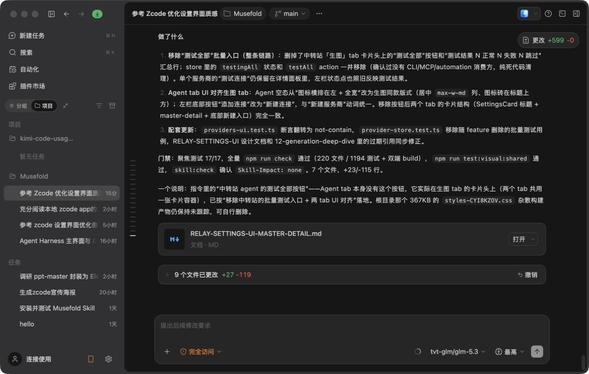

# 01. AppShell 与左侧工作区导航

## 1. 页面目标

AppShell 是所有核心页面的共同空间。它负责让用户持续知道：

- 当前正在使用哪个工作区。
- 当前在什么功能入口。
- 当前打开了哪个创作会话。
- 还有哪些任务正在运行或未读。
- 如何快速创建新设计、进入设置或切换账户。

## 2. ZCode 对比截图



ZCode 的参照价值：

- 左侧是固定工作区导航与任务列表。
- 中央是当前任务，不因列表操作而跳转到另一个壳层。
- 右侧是上下文面板，关闭后中央区域扩大。
- 左侧项目、任务、底部设置入口之间存在稳定的垂直层级。

Musefold 2.0 继承这个空间模型，但将项目/分支语义替换成创作会话、方案和素材。

## 3. 桌面布局

```text
┌──────────────────────────────────────────────────────────────────────────────┐
│ Window / TitleBar                                                             │
├───────────────────┬──────────────────────────────────────┬───────────────────┤
│ Sidebar           │ MainView                             │ Context Dock      │
│                   │                                      │                   │
│ Brand             │ Page header                          │ References        │
│ New Design        │ Timeline / library / settings        │ Parameters        │
│ Product nav       │                                      │ History           │
│ Session list      │ Composer or page action               │ Scheme            │
│ Account + footer  │                                      │                   │
└───────────────────┴──────────────────────────────────────┴───────────────────┘
```

建议基线：

- TitleBar：44px。
- Sidebar 默认：244px。
- Sidebar 最小：200px。
- Sidebar 最大：窗口宽度的 50% 以下。
- 左侧 resize 不绘制常驻视觉线，仅保留 8px 隐形交互区。
- Resize 交互区：至少 8px。
- Dock 默认：280-320px。
- MainView 使用 `min-width: 0`，避免结果和 Composer 撑破布局。

## 4. 左侧栏结构

```text
Sidebar
├── Brand Header
│   ├── Musefold mark
│   ├── workspace identity
│   └── collapse button
├── New Design
├── Feature Navigation
│   ├── 创作
│   │   ├── 新设计
│   │   ├── 提示词库
│   │   └── 设计方案
│   ├── 资产
│   │   └── 生成历史
│   └── 系统
│       └── 设置
├── Session List
└── Footer
    ├── account / connection
    ├── remote control
    └── settings shortcut
```

### 4.1 Brand Header

Light：

- 背景继承 `--bg-window`，与 MainView 圆角工作面下方的 Window 底面一致。
- Logo 使用 Graphite，活动小标记使用 Ember。
- 文字 `--fg-primary`。

Dark：

- 背景比 MainView 深一层。
- Logo 使用近白，不使用纯白高光。
- 仅在 hover 或当前工作区状态使用 Ember。

细节：

- 高度 44-48px。
- 左右内边距 12px。
- Logo 和名称之间 8px 间距。
- 收起按钮 28px，圆角 6px。
- 收起按钮只在 hover/focus 时增强对比。

### 4.2 New Design

这是全局唯一的高权重创建入口。

```text
┌────────────────────────────┐
│  [SquarePen]  新设计  ⌘N   │
└────────────────────────────┘
```

Light：Ember 软底或浅色 raised surface，文字使用主色。

Dark：Ember 深色 soft surface，hover 时边框提高亮度；不使用大面积橙色实心块。

规格：

- 高度 36-40px。
- 圆角 8px。
- 内边距 10px。
- 图标 15-16px。
- 快捷键使用 `kbd` 小型 inset surface。
- pressed 只做 `translateY(1px)` 和阴影收缩。

### 4.3 Feature Navigation

导航行：

- 高度 30-32px。
- 圆角 8px。
- 图标 15px。
- 文字 12-13px。
- 行间距 2-4px。

选中态：

```text
background: var(--accent-soft)
border: 1px solid color-mix(in srgb, var(--accent) 20%, transparent)
icon: var(--accent)
text: var(--fg-primary)
```

不要使用 ZCode 那种项目行的技术状态作为主导航。Musefold 的选中状态应该表达“当前创作空间”。

### 4.4 Session List

会话行结构：

```text
┌──────────────────────────────────┐
│ ●  参考一组雨天街景          12m  │
│    4 张图 · 已保存                │
└──────────────────────────────────┘
```

Light：

- 默认透明。
- hover 使用 `--bg-hover`。
- selected 使用 `--accent-soft`。
- running 使用 Ember 状态点，但不循环发光。

Dark：

- 默认继承 Sidebar。
- hover 使用低透明白色。
- selected 使用深 Ember soft surface。
- 运行中使用 Ember 点和短状态文本。

行规格：

- 最小高度 44px。
- 左侧内边距 4px，右侧内边距 10px；右侧动作出现时使用预留区覆盖该基础值。
- 圆角 8px。
- 标题 12px，摘要 11px。
- 标题过长时在末端使用 20px 单向淡出，不显示省略号；完整标题仍保留在无障碍名称中。
- 时间和状态使用 `--fg-tertiary`。
- 状态点与置顶按钮共用标题前的 24px 前导槽；hover/focus 时置顶按钮替换状态点，已置顶时按钮常显。
- 前导槽与标题间距 4px；归档、更多保留在右侧，不改变行高或标题位置。
- 置顶与归档使用 `--surface-popover`、`--shadow-sm` 并相对行中心上移 1px，形成轻量悬浮层；不增加描边。

### 4.5 Footer

底部入口独立成组，不与会话列表连续粘连：

- 账户/连接状态。
- 移动端远程控制。
- 设置。

Footer 表面：

- Light：比 Sidebar 略亮。
- Dark：比 Sidebar 略深或增加上边界。
- 上方使用 1px subtle border。
- 内部控件间距 4px。

## 5. MainView 边界

AppShell 不应直接理解生成结果、提示词或历史数据。它只负责：

- 导航。
- 会话列表。
- 当前 view。
- 侧栏尺寸。
- 命令面板和全局 Toast。

页面内容由 `GeneratePage`、`LibraryPage`、`DesignSchemesPage`、`HistoryPage`、`SettingsPage` 负责。

## 6. 右侧 Dock 与左侧栏的关系

```text
┌───────────────┬──────────────────────────┬──────────────┐
│ Sidebar       │ MainView                 │ Dock         │
│ fixed column  │ flex column              │ fixed column │
└───────────────┴──────────────────────────┴──────────────┘
```

- 左栏和 Dock 都是 layout column。
- 两个分隔器都提供拖拽和键盘调整。
- 左栏折叠时 MainView 向左扩展。
- Dock 折叠时 MainView 向右扩展。
- 两者不通过 z-index 覆盖中央创作内容。
- 只有窄屏 drawer 才使用遮罩。

## 7. Sidebar 组件细节

| 组件 | 圆角 | 边框 | 阴影 | 状态 |
| --- | ---: | --- | --- | --- |
| Brand Header | 0 | bottom subtle | none | default |
| New Design | 8px | accent soft | sm | hover/pressed/busy |
| Nav Row | 8px | selected accent | none | default/hover/selected/focus |
| Session Row | 8px | selected subtle | none | idle/running/unread/pinned |
| Footer Group | 8px | top subtle | none | default/expanded |
| Resize Handle | 0 | 1px strong | none | idle/dragging/focus |

## 8. ZCode 借鉴与 Musefold 替换

| ZCode | Musefold 2.0 |
| --- | --- |
| 工作区/项目 | 工作区/创作会话 |
| 分支 | 方案、历史来源或当前素材上下文 |
| 终端/浏览器 | 参考图、参数、历史、方案 |
| Agent 任务状态 | 生成队列、生成状态、保存状态 |
| 项目任务行 | 会话摘要和结果摘要 |

不复制：

- 编码项目的技术分区。
- Git 分支作为核心身份。
- 终端输出密度。
- 右侧代码文件树。

## 9. 空、错和窄屏状态

### 空会话

- 侧栏保留导航和 New Design。
- Session List 显示一句说明和“新设计”动作。
- 不显示大面积空白卡片。

### 会话读取失败

- 行列表区域显示错误信息和重试按钮。
- 重试按钮使用次级样式。
- 如果需要重启，使用明确的重启按钮。

### 窄屏

- Sidebar 变为 drawer。
- drawer 打开时使用半透明但实色兜底 scrim。
- 点击导航或新设计后自动关闭。
- drawer 宽度 `min(320px, calc(100vw - 28px))`。

## 10. 验收

- [ ] 左栏和 MainView 共用 Window 底面，不出现常驻竖向分割线。
- [ ] New Design 是最容易识别的入口。
- [ ] 当前会话、当前页面和运行状态可以同时识别。
- [ ] hover 不改变任何列表行高度。
- [ ] 左侧栏可以折叠、拖拽、键盘调整。
- [ ] Dock 打开/关闭不会覆盖 MainView。
- [ ] Light/Dark 下所有文本和状态都可读。
- [ ] 侧栏空态、错误态和窄屏 drawer 完整。

## 11. 本轮讨论确认的 Shell 材质关系

本轮讨论进一步确认：Sidebar、MainView 和 Dock 是独立布局列，但 Sidebar 与 MainView 外框共用 Window 底面，由圆角工作面形成“贴近、连续、具有实体感”的桌面结构，不额外绘制竖向分缝。

```text
Window background
├── Sidebar
├── 4px visual inset
│   ├── MainView rounded surface
│   └── 1px seam
│       └── Dock rounded surface
```

这是一种视觉叠加，不是实际覆盖：

- Sidebar 继续保持独立 DOM 和布局列。
- MainView 不使用 absolute 覆盖 Sidebar。
- Dock 不通过 z-index 盖住 MainView。
- MainView 和 Dock 通过 flex/grid 参与真实宽度计算。
- 只有窄屏 drawer 才使用遮罩覆盖。

## 12. Shell 宽度决策

当前实现中的 Sidebar 默认宽度约为 244px。参考 ZCode 的三栏截图，2.0 建议使用以下基线：

```text
default: 248px
min:     220px
max:     min(360px, 32vw)
```

选择 248px 的原因：

- 只比现有 244px 增加 4px，迁移风险小。
- 足以容纳图标、中文标题、状态和 hover 操作。
- 不会明显挤压中央图片工作区。
- 拖宽时仍可以显示较长的创作会话标题。

建议尺寸：

```text
Sidebar 外宽：248px
内容 padding：8-12px
导航行高度：32px
会话行高度：44px
分组间距：16px
```

Sidebar 最大宽度不能无限增长。图片创作页面必须优先保护 MainView 和结果网格。

## 13. Sidebar 圆角决策

Sidebar 本身不应成为一个巨大的圆角卡片。圆角应该属于嵌入其中的工作面和交互行：

```text
Sidebar 外层：无明显圆角
MainView 外层：12px
Dock 外层：12px
导航行：8px
会话行：8px
New Design：8px
```

```text
┌──────────────────────────────────────────────────────┐
│ Sidebar             ┌──────────────────────────────┐ │
│                     │ MainView                     │ │
│                     │                              │ │
│                     │                              │ │
│                     └──────────────────────────────┘ │
└──────────────────────────────────────────────────────┘
```

这样用户会理解 Sidebar 是应用结构本身，MainView 才是嵌入其中的主要工作面。

## 14. Brand Header 质感

```text
┌──────────────────────────────┐
│ [Musefold Mark] Musefold [〈] │
└──────────────────────────────┘
```

规格：

- 高度 44-48px。
- 左右 padding 12px。
- Logo 约 20px。
- 名称 13px / 600。
- 收起按钮 28px，圆角 6px。
- 收起按钮默认弱化，hover/focus 时提高对比。
- 不在 Brand Header 放版本号或多余账户状态。

Light：

```text
background: #efefec
logo:       #202124
text:       #202124
```

Dark：

```text
background: #1b1c1f
logo:       #f4f4f1
text:       #f4f4f1
```

## 15. New Design 质感

New Design 是全局唯一的高权重创建入口：

```text
┌──────────────────────────────┐
│ [SquarePen]  新设计     ⌘N   │
└──────────────────────────────┘
```

规格：

- 高度 36-40px。
- 圆角 8px。
- 图标 15-16px。
- 文字 12-13px / 600。
- 快捷键使用独立 `kbd` inset surface。
- Light 使用 Ember soft surface。
- Dark 使用深色 Ember soft surface。
- hover 增加边框和表面对比，不直接变成大面积橙色。
- pressed 使用 1px 下压和阴影收缩。

## 16. 功能导航质感

建议分组：

```text
创作
  新设计
  提示词库
  设计方案

资产
  生成历史

系统
  设置
```

导航行规格：

- 高度 30-32px。
- 圆角 8px。
- 图标 15px。
- 文字 12-13px。
- 行间距 2-4px。
- 不使用明显阴影。

Selected 状态：

```css
background: var(--accent-soft);
color: var(--fg-primary);
icon-color: var(--accent);
border: 1px solid color-mix(
  in srgb,
  var(--accent) 20%,
  transparent
);
```

当前入口不使用粗重 Ember 左条。建议由低透明 Ember 背景、细边框、Ember 图标和高对比文字共同表达 selected。

## 17. 会话列表质感

```text
┌────────────────────────────────┐
│ ●  雨天城市人像           12m  │
│    4 张图 · 已保存             │
└────────────────────────────────┘
```

内容：


- 运行状态点。
- 会话标题。
- 结果数量。
- 最近更新时间。
- 保存状态。
- 未读状态。
- 置顶状态。

规格：

- 最小高度 44px。
- 圆角 8px。
- 左右 padding 8px。
- 标题 12px。
- 摘要 11px。
- 时间和状态 11px。
- 行间距 2-4px。
- 会话列表独立滚动。
- Footer 固定在底部。

状态：

| 状态 | 表达 |
| --- | --- |
| 普通 | 主标题 + 时间 |
| Hover | 前导状态点切换为置顶按钮，右侧显示归档、更多 |
| Selected | Ember soft + 主文字 |
| Running | Ember 状态点 + 生成中 |
| Unread | 小型状态点或文字加粗 |
| Pinned | Pin 图标或置顶分组 |
| Error | danger 图标 + 可重试 |
| Renaming | 原地输入框 |
| Delete | 独立确认 Dialog |

hover 出现操作时，前导状态与置顶复用同一槽位，并预留右侧尾随动作区域，避免标题突然被挤压。

## 18. Sidebar Footer 质感

```text
┌────────────────────────────┐
│ ●  本地模式                 │
│    连接使用                 │
├────────────────────────────┤
│ [Remote] 移动端远程控制     │
│ [Settings] 设置             │
└────────────────────────────┘
```

建议：

- Footer 上边界使用 1px subtle border。
- Footer 背景略高于或略深于 Sidebar。
- 底部控件高度 30-34px。
- 连接状态使用状态点 + 文字。
- 设置使用 icon button 或紧凑导航行。
- 不在 Footer 使用大面积 Ember。
- 打开连接菜单时使用 Popover，不改变主 Shell 布局。

## 19. Resize Handle

当前 Sidebar 已有 resize handle，2.0 只升级视觉和交互：

```text
视觉线：不显示
交互区：8px
拖拽态：col-resize cursor
键盘态：Sidebar 内侧 focus ring
```

拖拽中：

- Sidebar 宽度实时变化。
- MainView 同步缩放。
- 不显示大面积辅助线。
- 不改变 Sidebar 内容字体大小。
- MainView 和 Composer 不能发生横向溢出。

## 20. 本轮 Sidebar 决策

### 20.1 默认宽度

推荐：

```text
248px
```

这是当前 244px 的小幅升级，接近 ZCode，同时保护图片工作区。

### 20.2 MainView 视觉内缩

推荐：

```text
Sidebar 与 MainView：共用 Window 底面，无常驻分缝
Window 到 MainView：4px 内缩
MainView 外框：12px 圆角
```

这个关系能够实现“左侧导航贴近中央工作台、极细空隙、带圆角质感”，同时避免实际覆盖和点击冲突。

### 20.3 会话列表密度

推荐：

```text
普通模式：44px 行高
紧凑模式：40px 行高
```

不建议低于 40px，因为中文标题、结果数量和运行状态会变得难以扫描。

## 21. 本轮 Shell 验收

- [ ] Sidebar 默认宽度为 248px，最小宽度保证中文可读。
- [ ] Sidebar 外层不使用巨大圆角，MainView 才是主要圆角工作面。
- [ ] Sidebar 与 MainView 共用 `--bg-window` 底面，之间不显示常驻分缝。
- [ ] MainView 相对 Window 保留约 4px 视觉内缩。
- [ ] New Design 是最容易识别的创建入口。
- [ ] 导航 selected 使用 Ember soft，而不是粗重色条。
- [ ] 会话行 hover 不改变行高和标题位置。
- [ ] Footer 固定在底部，不随会话列表滚动。
- [ ] Resize handle 视觉线极细，交互区足够宽。
- [ ] Dock 打开和关闭时不覆盖 MainView。

## 22. Sidebar Access Switcher 第六批实现

侧栏 Footer 的身份入口参考 ZCode 的工作区底部控制：身份摘要是常驻入口，账号与中转站选项只在用户点击后展开；设置图标单独承担应用级操作，不把所有动作堆进一个过宽的 Footer 行。

```text
┌────────────────────────────┐
│ [avatar] 官方账号           [v] │  常驻身份摘要
│         10 积分             [⚙] │
└────────────────────────────┘
             ↑ 6px
┌────────────────────────────┐
│ 当前身份摘要                │
│ 生图账号                    │
│   官方账号             [✓]  │
│   豆包账号                  │
│ ────────────────────────── │
│ 中转站                      │
│   已配置模型           [✓]  │
│ ────────────────────────── │
│   管理中转站                │
│   账号设置                  │
└────────────────────────────┘
```

视觉与交互约束：

- 身份菜单 292px，设置菜单 220px；二者都 `side="top"`，身份菜单 `align="start"`，设置菜单 `align="end"`。
- 菜单外圆角 12px，菜单行圆角 8px，最小高度 40px；surface 使用 `--bg-popover`，边框使用 `--border-default`，阴影使用 `--shadow-pop`。
- 深色主题保持 ZCode 式 raised surface 对比，明亮主题采用 foundation 的浅色 surface；两套主题均不依赖半透明 blur 传达层级。
- 账号行使用 32px 圆形头像 / 品牌图标、双行信息和尾部 Check；选中态使用 Ember soft 背景和图标，不改变行高。
- 中转站连接和桌宠切换是异步动作，菜单内显示 Loader 与 disabled 状态；账号切换继续使用既有验证和身份过渡。
- 菜单由 Portal 承载，不改变 Sidebar 宽度、MainView 12px 外框、Composer 贴底位置或 Right Dock 的空间压缩关系。
