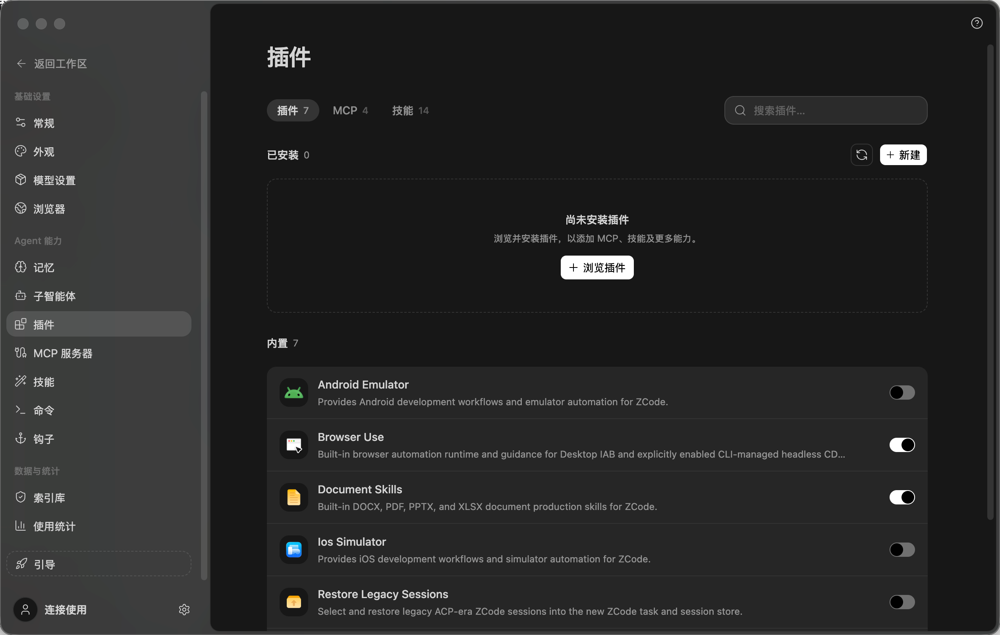

# 03. 提示词库

## 1. 页面定位

提示词库是 Musefold 的可复用创作资产库。它不是图片瀑布流，也不是普通设置列表，而是一个方便扫描、比较、编辑和送入制作的内容工作区。

核心动作：

- 搜索提示词。
- 读取提示词摘要。
- 查看关联图片和参数。
- 复制内容。
- 送入制作。
- 编辑和保存。
- 置顶、归档、删除。

## 2. ZCode 对比截图



该图为 2026-08-26 用户提供的 ZCode 插件页截图，作为本轮顶部控制区的直接对照基准。

可借鉴：

- 左侧保持固定的工作区导航。
- 中央页面是当前内容主面。
- 右侧详情可以作为独立 Inspector。
- 任务列表使用低干扰的平面行。
- 顶部控制区分成两行：第一行是范围标签与搜索，第二行是结果摘要与操作。
- 搜索框保持紧凑并靠右，不横跨整个内容面。
- 选中标签使用低对比填充，数量跟随标签文字，不做高饱和胶囊。

需要替换：

- ZCode 的项目/任务行换成提示词资产行。
- 任务时间换成更新时间、使用次数和来源。
- 代码摘要换成提示词摘要和关联图片。
- 右侧上下文换成 Prompt Inspector。

## 3. 页面结构

```text
┌──────────────────────────────────────────────────────────────┐
│ [全部 128] [笺匣 6]          [搜索提示词、标签、内容]       │
│ 提示词 128                         [刷新] [更多] [新建]    │
├──────────────────────────────────────────────────────────────┤
│ 置顶                                                     4   │
│ ┌──────────────────────────────────────────────────────────┐ │
│ │ thumb │ 标题 / 摘要 / 标签 / 使用次数             [使用] │ │
│ └──────────────────────────────────────────────────────────┘ │
│ 全部                                                    124 │
│ rows...                                                      │
└──────────────────────────────────────────────────────────────┘
```

大屏可使用双列列表，但每个条目仍然保持行结构；不能把列表改成纯卡片网格导致扫描效率下降。

## 4. Light / Dark 页面配色

| 区域 | Light | Dark |
| --- | --- | --- |
| 页面背景 | `--bg-work #fafaf8` | `--bg-work #1d1f22` |
| 搜索框 | `--bg-elevated #fff` | `--bg-elevated #25272a` |
| 列表行 | transparent / white | transparent / `#25272a` |
| Hover | `rgba(24,24,29,.06)` | `rgba(255,255,255,.065)` |
| Selected | Ember soft | Ember soft |
| 缩略图背景 | `--bg-inset` | `--bg-inset` |
| Primary action | Ember | Ember |
| Delete | danger 10% | danger 16% |

页面不使用大量白色卡片；列表通过行边界、缩略图和分区标题建立秩序。

## 5. 顶部控制区

组件：

- 第一行左侧：`全部 / 笺匣` 单选标签组。
- 第一行右侧：搜索框，桌面宽度 360-400px。
- 第二行左侧：当前结果名称与数量。
- 第二行右侧：刷新、更多、新建。
- 导入与回收站放入更多菜单，避免与主动作争夺注意力。

规格：

- 两行间距 20px，控制区与列表间距 26px。
- 范围标签高度 32px，圆角 8px，选中态为 `--bg-active` + 极轻内描边。
- 标签文字 11.5px / 500，选中后 600；数量 10.5px tabular figures。
- 刷新与更多为 34x34px outline icon button，圆角 8px。
- 新建高度 34px，圆角 8px；沿用黑白强主操作质感，暗色下自动反转。
- 页面标题继续由桌面 TitleBar 唯一承载，不在内容区重复。

## 6. Search Field

```text
┌──────────────────────────────────────┐
│ [Search] 搜索提示词、标签、内容      [×] │
└──────────────────────────────────────┘
```

Light：白色 elevated + `#dfdfdb` border。

Dark：`#25272a` + `#33353a` border。

规格：

- 高度 34-36px。
- 桌面宽度 360-400px，位于首行右侧；内容面变窄时最多占 44%。
- 圆角 8px。
- 左侧图标 14px。
- focus 使用 Ember ring 2px 外扩但不改变布局。
- 有输入时显示清空按钮。
- placeholder 使用 tertiary，不作为唯一字段标签。

搜索结果更新应保持列表滚动位置和选中项逻辑稳定。

## 7. Section Heading

```text
置顶                                      4
──────────────────────────────────────────
```

- 文字 13px / 600。
- 数量 11px / tabular。
- 底部 subtle border。
- 上下 section 间距 24px。
- 不做独立卡片，不增加背景块。

## 8. Prompt List Row

```text
┌─────────────────────────────────────────────────────────────┐
│ ┌────┐  雨天城市人像                               [使用]   │
│ │img │  低饱和、电影感、35mm、湿润街道...                   │
│ └────┘  人像 · 电影 · 18 次使用 · 2 小时前   [⋯]           │
└─────────────────────────────────────────────────────────────┘
```

规格：

- 最小高度 76px，紧凑模式 68px。
- 缩略图 56x56px，圆角 8px。
- 行圆角 8px。
- 左右 padding 8-10px。
- row gap 4px。
- 标题 12.5-13px / 600。
- 摘要 11-12px，最多两行。
- 元数据 11px。
- 右侧“使用”按钮 28-32px 高。

Light 行：hover 使用灰色 soft surface，selected 使用 Ember soft。

Dark 行：默认透明，hover 使用白色透明 surface，selected 增加 Ember 低透明边界。

hover 操作：

- 使用。
- 复制。
- 置顶/取消置顶。
- 编辑。
- 删除。
- 更多。

hover 不能导致标题或摘要横向跳动；右侧动作区需要预留宽度。

## 9. Prompt Detail Inspector

选中提示词后，详情可以作为右侧 Dock 或独立轻量详情页。优先采用右侧 Dock 以保持 ZCode 的连续工作模型。

```text
┌────────────────────────┐
│ Prompt Inspector       │
│ [image] 标题           │
├────────────────────────┤
│ 提示词                 │
│ 长文本...              │
├────────────────────────┤
│ 负面提示词             │
├────────────────────────┤
│ 参数 / 标签 / 来源     │
├────────────────────────┤
│ [送入制作] [编辑] [⋯]  │
└────────────────────────┘
```

Light：Dock 使用 elevated surface，内容分隔用 subtle border。

Dark：Dock 使用 sidebar/elevated 之间的深色 surface，输入或代码型文本使用 inset。

详情组件：

- 封面图或首张关联图。
- 标题、描述、更新时间。
- 正文文本区。
- 负面提示词区。
- 参数摘要。
- 标签。
- 来源与使用次数。
- 送入制作。
- 编辑。
- 复制。

文本区默认折叠长内容，展开按钮高度稳定。

## 10. Editor Form

编辑器使用受控草稿，不引入新的表单库。

字段组：

1. 标题和描述。
2. 正向提示词。
3. 负面提示词。
4. 参数和标签。
5. 封面/关联图片。

控件：

- 输入框 34-36px。
- 多行文本框最小高度 120px。
- 圆角 8px。
- label 12px / 600。
- hint 11px / tertiary。
- error 11px / danger，带恢复说明。

底部操作：

- 取消：ghost。
- 保存：Ember primary。
- 保存成功后显示短暂状态，不跳走页面。

## 11. Empty / Loading / Error

### Empty

```text
没有找到提示词
换一个搜索词，或创建第一条提示词
[新建提示词]
```

空状态放在内容列中央，不放一个巨大装饰卡片。

### Loading

- 使用 3-5 行 skeleton。
- 每行骨架尺寸接近真实行。
- 缩略图保持 56x56px。

### Error

- 保留搜索和页面头。
- 列表区域显示读取失败。
- 提供刷新。

## 12. Trash / Delete

删除是可恢复或不可恢复两种语义：

- 移入回收站：普通 danger secondary。
- 永久删除：danger primary + 确认 Dialog。

Dialog：

- 宽度 400px 左右。
- 圆角 16px。
- Light `--bg-popover`，Dark `--bg-popover`。
- 阴影 `shadow-dialog`。
- 取消在左/次级，确认在右/危险。

## 13. ZCode 借鉴与差异

借鉴：

- 左侧工作区持续可见。
- 中央列表是主内容。
- 详情可以使用右侧上下文面板。
- 搜索作为高频入口。

差异：

- 提示词行必须有图片或来源提示，不能像代码任务行一样只有文本。
- `使用` 是主动作，比“打开文件”更重要。
- 详情需要表达 prompt、参数、图片三种关系。
- 列表密度保持高，但图片必须有稳定存在感。

## 14. 验收

- [ ] 列表可扫描、可比较、可搜索。
- [ ] 送入制作在默认状态下可发现。
- [ ] 详情不会覆盖或破坏主列表。
- [ ] Light/Dark 选中态清晰。
- [ ] 缩略图、行高和 hover 操作不跳动。
- [ ] 长提示词、错误和空态均可处理。
- [ ] 删除和永久删除语义分开。
- [ ] 页面使用的圆角、边框和阴影来自 2.0 foundation。

## 15. 本轮讨论确认的页面定位

提示词库是 Musefold 的可复用创作资产库，不是图片瀑布流，也不是普通设置列表。

它需要同时满足：

- 快速扫描大量提示词。
- 比较标题、摘要、标签和使用频率。
- 查看关联图片和生成参数。
- 复制和编辑内容。
- 送入 Composer 继续创作。
- 置顶、归档、删除和恢复。

因此 2.0 继续列表优先，而不是改成纯图片网格。

## 16. 页面空间关系

```text
固定 Sidebar
       ↓
中央 Prompt Library
       ↓
可选 Prompt Inspector Dock
```

大屏：

```text
┌──────────────────┬──────────────────────────────┬──────────────┐
│ Sidebar          │ Prompt List                  │ Inspector    │
│                  │                              │              │
│                  │ search / sections / rows     │ prompt       │
│                  │                              │ image        │
└──────────────────┴──────────────────────────────┴──────────────┘
```

窄屏：

```text
Prompt List → Prompt Detail Page / Bottom Sheet
```

Inspector 默认不覆盖列表；只有在窄屏或明确打开详情时，才转换为 sheet 或独立页面。

## 17. Light / Dark 表面决策

| 区域 | Light | Dark |
| --- | --- | --- |
| 页面背景 | `#fafaf8` | `#1d1f22` |
| 搜索框 | `#ffffff` | `#25272a` |
| 普通列表行 | transparent/white | transparent/`#25272a` |
| Hover | `rgba(24,24,29,.06)` | `rgba(255,255,255,.065)` |
| Selected | Ember soft | Ember soft |
| 缩略图背景 | `#f0f0ed` | `#121315` |
| Inspector | `#efefec` | `#1b1c1f` |
| 主动作 | `#d6653f` | `#ef7a52` |
| 删除动作 | danger soft | danger soft |

页面不要堆叠大量纯白卡片。顺序应当是：

```text
页面背景
→ 分区标题
→ 平面列表行
→ 缩略图和状态
→ Inspector raised surface
```

## 18. Page Header 细节

```text
┌──────────────────────────────────────────────────────────────┐
│ [FileText] 提示词库  128 条       [搜索] [新建] [导入] [更多] │
└──────────────────────────────────────────────────────────────┘
```

规格：

- 页面标题 18px / 600。
- 数量 11px / tabular figures。
- Header 高度 48-56px。
- 页面内边距 24px。
- 新建提示词是唯一高权重动作。
- 导入使用 outline/subtle。
- 更多使用 28px icon button。
- 页面标题不放在大型标题卡中。

## 19. Search Field 细节

```text
┌──────────────────────────────────────┐
│ [Search] 搜索提示词、标签、内容      [×] │
└──────────────────────────────────────┘
```

规格：

- 高度 34-36px。
- 圆角 8px。
- 1px default border。
- Light 使用白色 raised surface。
- Dark 使用 `#25272a`。
- focus 使用 Ember ring，但不改变布局尺寸。
- 有输入时显示清空按钮。
- placeholder 使用 tertiary。
- 仍然提供可访问 label，不能让 placeholder 代替 label。

搜索结果变化时：

- 列表行不能突然改变高度。
- 当前选中项尽量保持。
- 清空搜索后恢复原有视图。
- 空结果提供清除搜索或新建提示词动作。

## 20. Prompt List Row 细节

```text
┌─────────────────────────────────────────────────────────────┐
│ ┌────┐  雨天城市人像                               [使用]   │
│ │img │  低饱和、电影感、35mm、湿润街道...                   │
│ └────┘  人像 · 电影 · 18 次使用 · 2 小时前   [⋯]           │
└─────────────────────────────────────────────────────────────┘
```

规格：

- 最小高度 76px。
- 紧凑模式 68-72px。
- 缩略图 56x56px。
- 缩略图圆角 8px。
- 行圆角 8px。
- 左右 padding 8-10px。
- 行间距 4px。
- 标题 12.5-13px / 600。
- 摘要 11-12px，最多两行。
- 元数据 11px。
- 右侧“使用”按钮高度 28-32px。

默认状态不使用明显阴影。高级感来自行间关系、缩略图承托面和 selected 边界。

### 20.1 Hover

显示：

- 使用。
- 复制。
- 置顶。
- 编辑。
- 删除。
- 更多。

右侧动作区必须预留宽度，避免标题突然被挤压。hover 不改变行高、缩略图尺寸和文本基线。

### 20.2 Selected

```css
background: var(--accent-soft);
border: 1px solid color-mix(
  in srgb,
  var(--accent) 24%,
  transparent
);
```

selected 不能只依靠文字颜色改变；需要同时使用表面和边界。

## 21. Prompt Inspector 细节

```text
┌────────────────────────┐
│ Prompt Inspector       │
│ [image] 标题           │
├────────────────────────┤
│ 提示词                 │
│ 长文本...              │
├────────────────────────┤
│ 负面提示词             │
├────────────────────────┤
│ 参数 / 标签 / 来源     │
├────────────────────────┤
│ [送入制作] [编辑] [⋯]  │
└────────────────────────┘
```

Light：

- Dock 使用 `#efefec` 或 elevated。
- 图片区域使用白色 media surface。
- 分区之间使用 subtle border。

Dark：

- Dock 使用 `#1b1c1f`。
- 文本区使用 `#121315` inset surface。
- 图片区域使用 `#2a2c30`。
- 不使用大黑影。

详情内容：

- 封面图或首张关联图。
- 标题。
- 描述。
- 更新时间。
- 正文提示词。
- 负面提示词。
- 生成参数。
- 标签。
- 来源。
- 使用次数。
- 送入制作。
- 编辑。
- 复制。

长提示词默认显示摘要，展开后显示完整内容。展开不能遮挡底部动作。

## 22. Prompt Editor 细节

编辑器分为五组：

```text
标题 / 描述
正向提示词
负面提示词
参数 / 标签
封面 / 关联图片
```

控件：

- 输入框 34-36px 高。
- 多行文本框最小 120px。
- 圆角 8px。
- label 12px / 600。
- hint 11px / tertiary。
- error 11px / danger。
- focus 使用 Ember ring。

底部操作：

```text
[取消]                              [保存]
```

- 取消使用 ghost。
- 保存使用 Ember primary。
- 保存中显示按钮内 spinner。
- 保存成功显示短暂状态，不自动离开详情。
- 草稿变化显示未保存状态。

## 23. 送入制作的主路径

“使用”是提示词库的主要动作，高于复制和编辑：

```text
提示词库
   ↓
打开制作工作台
   ↓
将提示词填入 Composer
   ↓
显示来源卡片
   ↓
等待用户明确点击生成
```

点击“使用”后不能直接生成。Composer 中需要显示：

```text
来源：提示词库 · 雨天城市人像
```

用户仍然可以修改提示词、添加参考图和调整参数。

## 24. Empty / Loading / Error

### Empty

```text
没有找到提示词
换一个搜索词，或创建第一条提示词

[新建提示词]
```

空状态位于内容列中央，不使用巨大装饰卡片。

### Loading

- 使用 3-5 行 skeleton。
- 每行保持真实行高。
- 缩略图保持 56x56px。
- 右侧操作区保留宽度。
- 不使用高度不断变化的 shimmer。

### Error

- 页面头和搜索框保持可用。
- 列表区域显示读取失败。
- 提供刷新。
- 长期错误不只使用 Toast。
- 错误状态不改变页面整体高度。

### Filter Empty

```text
没有符合条件的提示词
[清除筛选]
```

## 25. 删除与回收站

区分：

```text
移入回收站
永久删除
```

移入回收站：

- 使用 danger secondary。
- 支持恢复。

永久删除：

- 使用 danger primary。
- 必须 Dialog 确认。
- 明确说明不可恢复。
- 不通过普通行按钮直接执行。

Dialog：

- 宽度约 400px。
- 圆角 16px。
- Light 使用 `#fdfcf9`。
- Dark 使用 `#2b2d31`。
- 使用 `shadow-dialog`。
- 取消为次级按钮。
- 确认位于右侧。

## 26. 与 ZCode 的语义转换

```text
ZCode 项目/任务行   → Musefold 提示词资产行
任务时间            → 更新时间 / 使用次数
代码摘要            → 提示词摘要
查看文件            → 送入制作
终端上下文          → 生成参数和关联图片
任务详情            → Prompt Inspector
```

Musefold 比 ZCode 多一个必须保持的关系：

```text
提示词 + 参数 + 图片
```

这三者必须在详情中同时可见，不能只展示一段文本。

## 27. 本轮提示词库决策

### 27.1 列表缩略图

推荐：

```text
56x56px，8px 圆角
```

它足以提供图像识别，同时不会把提示词库变成图片画廊。

### 27.2 详情呈现

推荐：

```text
右侧 Inspector 为默认详情
独立详情页作为编辑或深度阅读状态
```

这样用户查看提示词后可以直接送入制作，不需要频繁离开列表。

### 27.3 主动作

推荐：

```text
使用 / 送入制作
```

该动作应同时出现在默认列表行和 Inspector 底部。

## 28. 本轮提示词库验收

- [ ] 页面保持列表优先，不退化为纯图片网格。
- [ ] 搜索框、分区标题和列表行有稳定的层级。
- [ ] 列表行同时表达标题、摘要、缩略图、标签和使用次数。
- [ ] hover 操作不改变行高和文本位置。
- [ ] Inspector 默认不覆盖列表。
- [ ] Inspector 能同时展示提示词、参数和关联图片。
- [ ] “使用”会填入 Composer，但不会直接生成。
- [ ] 编辑器有草稿、保存中、错误和未保存状态。
- [ ] 可恢复删除和永久删除语义明确分开。
- [ ] Light/Dark 使用统一的圆角、边框和阴影 foundation。

## 29. Phase C 菜单实现进度（2026-08-26）

提示词库顶部操作菜单与详情操作菜单已迁移到共享 Dropdown 原语，保持列表、Inspector 和顶部工具栏原有几何不变。

已落地：

- 顶部“更多”按钮使用“提示词库操作”可访问名称，菜单直接锚定按钮，不再以整个动作组右边缘做绝对定位。
- 详情“更多”按钮使用“提示词操作”可访问名称，菜单锚定三点按钮，不遮挡标题或“使用”主动作。
- Light 使用 `#fdfcf9` popover surface，Dark 使用 `#2b2d31`；统一 8px 外圆角、6px 行圆角、1px border 和 `shadow-pop`。
- 顶部菜单中的导入、回收站，以及详情菜单中的编辑、复制、置顶、分享、创建方案和移入回收站，全部进入同一个 Radix 菜单集合。
- 菜单打开后首项获得焦点；方向键、Home / End、Escape 和关闭后的焦点归还使用共享键盘模型。
- 删除前使用真实 separator；危险项只使用 danger text，不升级为整块大红按钮。
- Prompt 删除确认结构已接入 `DialogBody`，与 Header / Footer 保持稳定分区。

桌面验收：

```text
tests/e2e/test_42_prompt_overlays_v2_desktop.py
```

该门禁只使用 1440x900 桌面视口，覆盖顶部菜单和详情菜单的 Light / Dark 表面、圆角、阴影、首项焦点、Home / End 与 Escape 焦点归还。按当前开发约定，本批不执行手机端测试。
