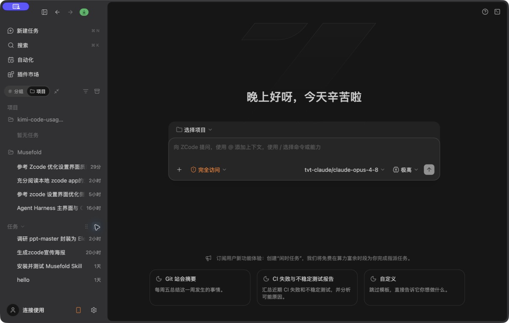

# 04. 设计方案

## 1. 页面定位

设计方案是 Musefold 把一次创作方法整理成可重复工作流的入口。它连接提示词、历史图像、变量、生成参数和运行结果。

方案不应该被设计成普通文件列表。它需要同时表达：

- 方案是什么。
- 来自哪里。
- 是否已经试运行。
- 能否完整复现。
- 需要哪些输入。
- 运行后产出了什么。

## 2. ZCode 对比截图



ZCode 的新建任务页面提供模板建议，值得借鉴的是“空页面也给出下一步动作”。Musefold 2.0 将其转换为方案创建入口：

- 从一个想法开始。
- 从历史内容创建。
- 从提示词创建。
- 从 GitHub/Skill 创建。
- 导入分享包。


方案运行时可以继承 ZCode 的三栏关系：左侧方案列表，中央方案运行工作台，右侧变量、来源和结果上下文。

## 3. 方案列表布局

```text
┌──────────────────────────────────────────────────────────────┐
│ 设计方案       [我的方案] [发现]                  [新建方案] │
│ [搜索方案、作者或仓库]                                      │
├──────────────────────────────────────────────────────────────┤
│ 我的方案                                              12    │
│ ┌────┐  雨天视觉方向             [完整还原] [使用]      │
│ │cover│  低饱和城市人像 · 需要 2 个输入                 │
│ └────┘  历史 · 4 次运行 · 2 小时前               [⋯]   │
└──────────────────────────────────────────────────────────────┘
```

大屏可以使用两列方案行，窄屏改为单列。

## 4. Light / Dark 页面配色

| 区域 | Light | Dark |
| --- | --- | --- |
| 页面背景 | `--bg-work #fafaf8` | `--bg-work #1d1f22` |
| 方案行 | transparent/elevated | transparent/`#25272a` |
| 方案封面占位 | `--accent-soft` | `--accent-soft` |
| 试运行状态 | warning soft | warning soft |
| 已验证状态 | success soft | success soft |
| 草稿状态 | Ember soft | Ember soft |
| 新建方案 | Ember primary | Ember primary |
| 创建菜单 | `--bg-popover #fdfcf9` | `--bg-popover #2b2d31` |

方案状态不能依赖颜色 alone；必须同时有文字标签或图标。

## 5. Page Header

组件：

- `设计方案` 标题。
- 我的方案/发现 segmented tabs。
- 搜索。
- 新建方案按钮。
- 刷新或更多。

规格：

- 页面标题 18px / 600。
- tabs 高度 30-32px，圆角 8px。
- 新建方案高度 34-38px，圆角 8px。
- 搜索框高度 34-36px，圆角 8px。

## 6. Create Menu

```text
┌────────────────────────────────┐
│ [Sparkles] 从一个想法开始       │
│ 描述可重复使用的创作方式         │
├────────────────────────────────┤
│ [GitBranch] 从 GitHub 添加       │
│ 识别 Skill 或提示词仓库           │
├────────────────────────────────┤
│ [History] 从历史内容创建         │
│ 选择图片、消息与提示词            │
├────────────────────────────────┤
│ [Wand] 从提示词创建              │
│ 整理固定规则和变量                │
├────────────────────────────────┤
│ [FileUp] 导入分享包              │
└────────────────────────────────┘
```

Light：popover 使用接近瓷白的实色表面。

Dark：popover 使用比页面抬高一层的深灰。

规格：

- 宽度 280-300px。
- 圆角 12px。
- 内边距 6px。
- 单项最小高度 48px。
- 图标 16px，标题 12px，描述 11px。
- hover 使用 soft surface，不使用整行 Ember。

## 7. Scheme Row

```text
┌──────────────────────────────────────────────────────────────┐
│ ┌──────┐  雨天视觉方向   [完整还原]                           │
│ │ cover│  低饱和城市人像                                     │
│ └──────┘  历史 · 4 次运行 · 输入：主体、色调         [删除][使用] │
└──────────────────────────────────────────────────────────────┘
```

规格：

- 最小高度 76px。
- 封面 56x56px，圆角 8px。
- 行圆角 8px。
- 右侧操作高度 28-32px。
- 删除默认隐藏，hover/focus 可见。
- 状态点只作为辅助，不单独表达状态。

状态标签：

- 草稿：`草稿`。
- 等待试运行：`待试运行`。
- 已有成功试运行：`可继续`。
- 正式方案：`已验证`。
- 完整度：`完整还原`、`有取舍`、`暂不支持`。

## 8. Scheme Detail

```text
┌──────────────────────────────────────────────────────────────┐
│ [←] 雨天视觉方向                         [试运行] [⋯]         │
├──────────────────┬───────────────────────────┬───────────────┤
│ 方案说明          │ 运行 Composer             │ 输入/来源 Dock │
│ 固定规则          │ 提示词/变量/参数          │ 历史图片       │
│ 输入变量          │ 生成结果                  │ 提示词引用     │
│ 运行记录          │                           │ 变量说明       │
└──────────────────┴───────────────────────────┴───────────────┘
```

小宽度时折叠为：

```text
详情 → 运行 → 结果
```

### 8.1 详情表面

方案说明、固定规则和变量使用平面 section，不嵌套多层卡片。

- section 圆角不单独增加。
- 输入变量行使用设置 row 语义。
- 运行记录使用列表。
- 方案封面可以使用 media surface。

### 8.2 运行 Composer

复用生成工作台 Composer，但增加：

- 必填变量。
- 来源图像选择。
- 固定规则只读显示。
- 方案版本或运行次数。

运行按钮为 Ember primary，保存草稿为 secondary。

## 9. 变量输入

每个变量行：

```text
主体描述                         [输入内容             ]
色调                             [选择                  ]
参考图                           [添加图片              ]
```

Light：输入使用 white/elevated。

Dark：输入使用 inset surface，focus 时 Ember ring。

规格：

- 行间距 12px。
- label 12px / 600。
- hint 11px / tertiary。
- required 用文字或小标记，不只用红色。
- 错误显示在字段下方，不改变相邻字段位置过多。

## 10. Runtime Album

运行结果相册用于比较同一方案的多次运行。

```text
运行 #04    2 小时前                         [打开历史]
┌────────┐ ┌────────┐ ┌────────┐
│ image  │ │ image  │ │ image  │
└────────┘ └────────┘ └────────┘
```

- 图片使用 1:1 或方案指定比例。
- 圆角 12-14px。
- hover 显示放大、保存、送入提示词库。
- 结果组之间使用 16px 间距。
- 运行失败的结果位保留比例并显示重试。

## 11. 删除与移除

草稿删除和正式方案移除要有不同文案：

- 删除草稿：删除方案和运行记录。
- 移除方案：从方案库移除，但历史图片仍保留。

Dialog 采用 16px 圆角、Dialog shadow、危险按钮右对齐。

## 12. ZCode 借鉴与差异

借鉴：

- 新建入口提供模板和下一步建议。
- 列表项 hover 承载低频动作。
- 中央运行区持续显示当前任务。
- 右侧显示当前上下文。

差异：

- ZCode 任务状态换成方案生命周期。
- ZCode 的项目文件改为方案输入、变量和运行相册。
- ZCode 的终端工具组改为生成过程和结果变体。
- 方案“可复现性”是核心信息，必须比普通描述更突出。

## 13. Empty / Loading / Error

### Empty Mine

```text
还没有设计方案
把一组成功的提示词和图片整理成可复用工作流
[新建方案]
```

### Empty Discover

显示搜索、刷新和导入入口，不显示无意义的空卡片。

### Loading

方案行骨架保持封面、标题和操作区宽度。

### Error

明确是列表读取失败、方案导入失败还是运行失败，并提供对应恢复动作。

## 14. 验收

- [ ] 我的方案和发现清晰分开。
- [ ] 新建菜单能覆盖五种来源。
- [ ] 方案行能同时表达封面、状态、来源和下一步动作。
- [ ] 方案详情能从说明切换到运行和结果。
- [ ] 变量和来源在 Light/Dark 下可读。
- [ ] 运行结果与历史之间有明确出口。
- [ ] 删除草稿、移除方案和保留历史语义不混淆。
- [ ] 与 ZCode 的空间结构相似，但没有编码专属术语。

## 15. 本轮讨论确认的方案定位

设计方案不是提示词收藏，也不是普通模板卡片。它是一套可以重复运行的创作方法：

```text
固定提示词规则
+ 输入变量
+ 参考图片或历史来源
+ 生成参数
+ 运行结果
```

页面同时解决两件事：

```text
如何管理方案
如何运行方案
```

因此方案页采用：

```text
Operate：方案列表、搜索、状态、来源
+
Work Surface：方案详情和运行 Composer
+
Theater Moment：首次创建和首次成功运行
```

## 16. 方案列表空间关系

```text
固定 Sidebar
       ↓
中央 Scheme Library
       ↓
方案详情 / 运行 Dock
```

```text
┌──────────────────┬──────────────────────────────┬──────────────┐
│ Sidebar          │ Scheme List                  │ Detail Dock  │
│                  │                              │              │
│                  │ search / tabs / scheme rows  │ variables    │
│                  │                              │ run records  │
└──────────────────┴──────────────────────────────┴──────────────┘
```

大屏使用三栏，窄屏按以下顺序切换：

```text
详情 → 运行 → 结果
```

方案详情默认不遮挡列表；只有窄屏或明确进入深度编辑时才变成独立页面或 bottom sheet。

## 17. Light / Dark 表面决策

| 区域 | Light | Dark |
| --- | --- | --- |
| 页面背景 | `#fafaf8` | `#1d1f22` |
| 方案行 | transparent/elevated | transparent/`#25272a` |
| 封面占位 | Ember soft | Ember soft |
| 草稿状态 | Ember soft | Ember soft |
| 待试运行 | warning soft | warning soft |
| 已验证 | success soft | success soft |
| 发现内容 | info/neutral soft | info/neutral soft |
| 新建方案 | Ember primary | Ember primary |
| 创建菜单 | `#fdfcf9` | `#2b2d31` |

状态标签不能只依靠颜色表达，需要同时使用文字、图标或边界。

## 18. Page Header 细节

```text
┌──────────────────────────────────────────────────────────────┐
│ [Blocks] 设计方案       [我的方案] [发现]      [新建方案] [⋯] │
└──────────────────────────────────────────────────────────────┘
```

规格：

- 标题 18px / 600。
- `我的方案 / 发现` 使用 segmented control。
- tabs 高度 30-32px。
- tabs 圆角 8px。
- 搜索框高度 34-36px。
- 新建方案高度 34-38px。
- 新建方案是唯一高权重 Ember 按钮。
- 刷新、更多使用 icon button 或 subtle button。

## 19. 新建方案菜单质感

```text
┌────────────────────────────────┐
│ [Sparkles] 从一个想法开始       │
│ 描述可重复使用的创作方式         │
├────────────────────────────────┤
│ [GitBranch] 从 GitHub 添加       │
│ 识别 Skill 或提示词仓库           │
├────────────────────────────────┤
│ [History] 从历史内容创建         │
│ 选择图片、消息与提示词            │
├────────────────────────────────┤
│ [Wand] 从提示词创建              │
│ 整理固定规则和变量                │
├────────────────────────────────┤
│ [FileUp] 导入分享包              │
└────────────────────────────────┘
```

规格：

- 宽度 280-300px。
- 圆角 12px。
- 内边距 6px。
- 单项最小高度 48px。
- 图标 16px。
- 标题 12px。
- 描述 11px。
- hover 使用 soft surface。
- 不使用整行 Ember。
- 菜单打开不改变 Shell 三栏宽度。

这是 ZCode“空页面提供下一步动作”的 Musefold 转译。

## 20. Scheme Row 细节

```text
┌──────────────────────────────────────────────────────────────┐
│ ┌──────┐  雨天视觉方向   [完整还原]                           │
│ │ cover│  低饱和城市人像                                     │
│ └──────┘  历史 · 4 次运行 · 输入：主体、色调       [删除][使用] │
└──────────────────────────────────────────────────────────────┘
```

规格：

- 最小高度 76px。
- 封面 56x56px。
- 封面圆角 8px。
- 行圆角 8px。
- 右侧动作高度 28-32px。
- 删除默认隐藏，hover/focus 显示。
- 状态点只作为辅助，不单独表达状态。

状态建议：

```text
草稿
待试运行
可继续
已验证
完整还原
有取舍
暂不支持
```

生命周期和能力标签需要分开。生命周期表达“现在处于哪个阶段”，能力标签表达“能做到什么程度”。

## 21. 方案详情三栏

```text
┌──────────────────────────────────────────────────────────────┐
│ [←] 雨天视觉方向                         [试运行] [⋯]         │
├──────────────────┬───────────────────────────┬───────────────┤
│ 方案说明          │ 运行 Composer             │ 输入/来源 Dock │
│ 固定规则          │ 提示词 / 变量 / 参数      │ 历史图片       │
│ 输入变量          │ 生成结果                  │ 提示词引用     │
│ 运行记录          │                           │ 变量说明       │
└──────────────────┴───────────────────────────┴───────────────┘
```

左侧方案说明：

- 方案标题。
- 描述。
- 固定提示词规则。
- 方案来源。
- 完整度状态。
- 版本或运行记录。

中央运行工作台：

- Composer。
- 变量填写。
- 参考图。
- 生成结果。
- 试运行和继续使用。

右侧输入/来源 Dock：

- 必填变量说明。
- 历史图片。
- 提示词引用。
- 当前运行参数。
- 上一次运行结果。

这部分直接继承 ZCode 的中央任务工作台 + 右侧上下文 Dock，但把编码上下文替换为创作上下文。

## 22. 方案变量细节

```text
主体描述                       [输入内容             ]
色调                           [选择                  ]
参考图                         [添加图片              ]
```

Light：

- 输入使用 white/elevated。
- focus 使用 Ember ring。
- hint 使用 tertiary。
- 错误使用 danger。

Dark：

- 输入使用 inset surface。
- focus 使用 Ember ring。
- 选择器使用 `#25272a`。
- 说明文本使用 `#a0a2a7`。

规格：

- 行间距 12px。
- label 12px / 600。
- hint 11px。
- required 使用文字或标识，不只用红色。
- 错误显示在字段下方。
- 字段错误不能让相邻字段出现严重跳动。

## 23. 方案运行 Composer

方案运行 Composer 复用生成工作台 Composer，但增加：

```text
当前方案名称
方案变量
固定规则只读摘要
来源图像
方案版本
运行次数
```

```text
┌──────────────────────────────────────────────────────────────┐
│ 方案：雨天视觉方向                         v1 · 第 4 次运行  │
├──────────────────────────────────────────────────────────────┤
│ 固定规则：低饱和、电影感、35mm                             │
│                                                               │
│ 主体描述                                                     │
│ [一个站在雨中的年轻人                                   ]   │
│                                                               │
│ [添加参考图] [1:1] [高质量]                         [试运行] │
└──────────────────────────────────────────────────────────────┘
```

运行按钮使用 Ember primary；保存草稿使用 secondary。

## 24. Runtime Album 细节

```text
运行 #04    2 小时前                         [打开历史]

┌────────┐ ┌────────┐ ┌────────┐
│ image  │ │ image  │ │ image  │
└────────┘ └────────┘ └────────┘
```

规格：

- 图片使用方案指定比例。
- 圆角 12-14px。
- Light 使用轻微 `shadow-sm`。
- Dark 使用媒体承托面。
- hover 显示放大、保存、送入提示词库。
- 运行失败的结果位保留比例。
- 失败项显示重试，不影响其他成功结果。
- 每组结果和运行编号保持稳定关系。

结果出口：

```text
打开生成历史
保存为提示词
送入新设计
再次运行
```

## 25. Theater Moment

方案最适合使用 Theater 的地方不是整个列表，而是：

- 首次创建方案。
- 首次成功试运行。
- 方案从草稿变为正式方案。
- 运行结果相册首次出现。

建议状态顺序：

```text
固定规则出现
→ 变量区域就位
→ 结果图显形
→ 状态变为已验证
```

动效只使用 `opacity`、`transform`、轻微 scale 和结果图的短暂就位。不使用持续漂浮、大面积光效、多卡片弹跳、颜色渐变或全屏滚动叙事。

## 26. 删除与移除

草稿删除：

```text
删除草稿「雨天视觉方向」？
草稿与运行记录会被移除，已生成图片仍保留。
```

正式方案移除：

```text
移除方案「雨天视觉方向」？
方案将从方案库移除，历史图片仍保留。
```

两个动作不能使用完全相同的文案。

Dialog：

- 宽度 400px。
- 圆角 16px。
- 使用 `shadow-dialog`。
- 取消为次级按钮。
- 危险确认位于右侧。
- 运行中删除需要 disabled 或二次确认。

## 27. 与 ZCode 的语义转换

```text
ZCode 新建任务模板   → Musefold 方案创建来源
ZCode 项目任务行     → Musefold 方案行
ZCode 当前任务       → Musefold 当前方案运行
ZCode Terminal       → Musefold 运行过程
ZCode Changes        → Musefold 结果变体/历史差异
ZCode 右侧面板       → Musefold 输入变量/来源/运行记录
```

核心差异：

```text
ZCode：完成一个任务
Musefold：复用一套创作方法
```

所以方案的可复现性和输入变量必须比普通标题和描述更突出。

## 28. 本轮方案决策

### 28.1 方案详情布局

推荐：

```text
左侧说明
+
中央运行 Composer
+
右侧输入/来源 Dock
```

理由是它和 ZCode 的三栏工作模式一致，同时适合方案运行。

### 28.2 方案封面尺寸

推荐：

```text
列表封面：56x56px
详情封面：160-220px
运行结果：使用实际画幅比例
```

列表重点仍然是扫描，详情才增加图像存在感。

### 28.3 方案状态层级

推荐：

```text
草稿 → 待试运行 → 可继续 → 已验证
```

`完整还原 / 有取舍 / 暂不支持` 作为第二层能力标签，不和生命周期状态混为一组。

## 29. 本轮方案验收

- [ ] 我的方案和发现清晰分开。
- [ ] 新建菜单覆盖五种来源。
- [ ] 方案行表达封面、状态、来源和下一步动作。
- [ ] 方案详情能从说明切换到运行和结果。
- [ ] 变量和来源在 Light/Dark 下可读。
- [ ] 运行结果与历史之间有明确出口。
- [ ] 删除草稿、移除方案和保留历史语义不混淆。
- [ ] 方案详情三栏不遮挡核心内容。
- [ ] Theater 只用于创建和成功运行等关键时刻。
- [ ] 与 ZCode 的空间结构相似，但没有编码专属术语。
