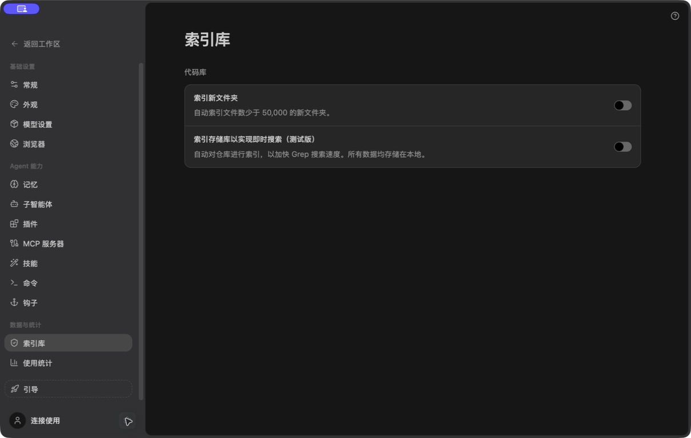
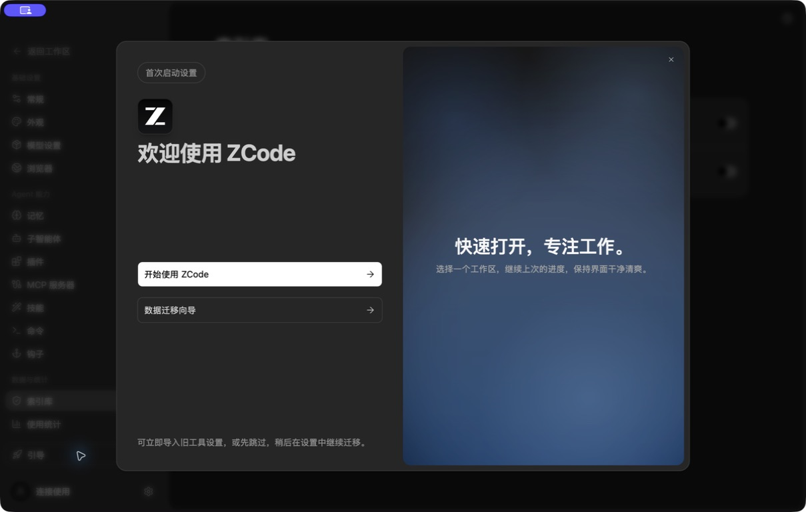
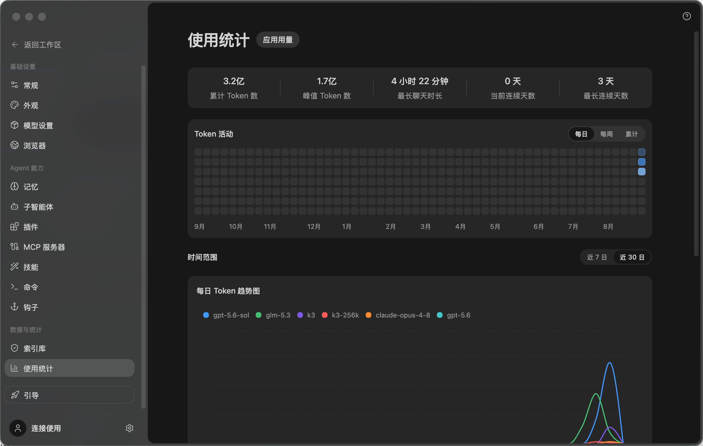
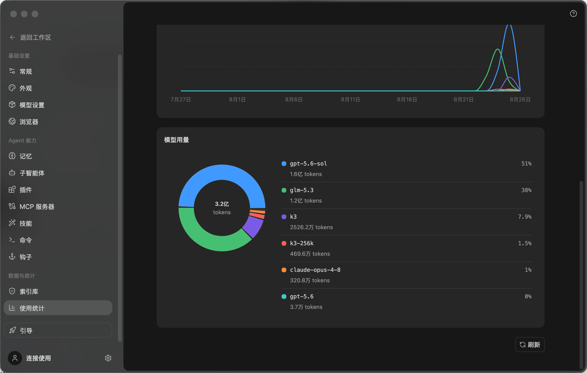

# 06. 设置、账户与接入

## 1. 页面定位

Musefold 当前设置已收敛为七个分区：

```text
账户与接入
├── 账号
└── 中转站

通用
├── 偏好
└── 开放能力

数据与应用
├── 使用统计
├── 数据与关于
└── 已归档聊天
```

2.0 不重新膨胀为十几个设置页面，而是在现有信息架构内提高扫描效率、连接状态可见性和组件质感。

## 2. ZCode 对比截图



ZCode 设置页的参照价值：

- 左侧设置分组稳定固定。
- 右侧内容是独立滚动列。
- 设置项采用标题、说明、右侧控件的 row 结构。
- 开关、按钮和危险动作都有固定的右对齐线。



ZCode 引导弹窗提供 modal、主次按钮和视觉预览的参照；Musefold 2.0 会把它转化为自己的图像创作引导。





使用统计借鉴 ZCode 的横向摘要带、全年活动热力图、安静的时间分段控件、宽趋势面板和“图表 + 明细列表”分布结构，但数据语义改为 Musefold 的生成渠道、模型与账号积分。

## 3. Settings Shell

```text
┌────────────────────┬─────────────────────────────────────────┐
│ 返回工作区          │ 页面标题                                │
│                     │ 页面说明                                │
│ 账户与接入          │                                         │
│   账号              │ Section                                 │
│   中转站            │ ┌─────────────────────────────────────┐ │
│ 通用                │ │ Settings Card                       │ │
│   偏好              │ │ label / hint            control      │ │
│   开放能力          │ └─────────────────────────────────────┘ │
│ 数据与应用          │                                         │
│   使用统计          │                                         │
│   数据与关于        │                                         │
│   已归档聊天        │                                         │
└────────────────────┴─────────────────────────────────────────┘
```

建议：

- Settings Sidebar：220-240px。
- 常规设置内容列最大宽度：800-880px；使用统计为 1120px。
- 内容区内边距：32px，窄屏 16px。
- 导航和内容分别滚动。
- 顶部返回工作区按钮保持固定。

## 4. Light / Dark 页面配色

| 区域 | Light | Dark |
| --- | --- | --- |
| Settings Sidebar | `--bg-sidebar #efefec` | `--bg-sidebar #1b1c1f` |
| Content | `--bg-work #fafaf8` | `--bg-work #1d1f22` |
| Card | `--bg-elevated #fff` | `--bg-elevated #25272a` |
| Input | `--bg-inset #f0f0ed` | `--bg-inset #121315` |
| Popover | `--bg-popover #fdfcf9` | `--bg-popover #2b2d31` |
| Selected nav | accent soft | accent soft |
| Connected | success | success |
| High privilege | warning | warning |
| Destructive | danger | danger |

设置页不使用 Ember 大面积背景；Ember 只用于 selected、focus、主保存动作和当前激活项。

## 5. Settings Navigation

导航项：

- 返回工作区。
- 账户与接入 / 账号。
- 账户与接入 / 中转站。
- 通用 / 偏好。
- 通用 / 开放能力。
- 数据与应用 / 使用统计。
- 数据与应用 / 数据与关于。
- 数据与应用 / 已归档聊天。

导航行规格：

- 高度 32px。
- 圆角 8px。
- 左右 padding 10px。
- 图标 15px。
- 分组标题 11px / 600 / tertiary。
- 当前项 `accent-soft + Ember icon + primary text`。
- hover 仅改变 surface，不移动文本。

## 6. 通用 Settings Section

```text
页面标题
页面说明

Section 标题                                 [页面动作]
──────────────────────────────────────────────────────────
┌──────────────────────────────────────────────────────────┐
│ Card header                                              │
│ Card description                                         │
├──────────────────────────────────────────────────────────┤
│ Label                              control               │
│ Hint                               control               │
├──────────────────────────────────────────────────────────┤
│ Label                              control               │
└──────────────────────────────────────────────────────────┘
```

Settings Card：

- Light：white elevated，1px default border，shadow-sm。
- Dark：`#25272a`，1px `#33353a`，shadow-sm-dark。
- 圆角 12px。
- header padding 16px。
- row padding 12px 16px。
- row 分隔线使用 subtle。
- card 之间 16-24px。

Settings Row：

- 左侧 `min-width: 0`。
- 右侧控件 `flex-shrink: 0`。
- label 13px / 600。
- hint 11-12px / tertiary。
- 长说明最多自然换行，不挤压控件。

## 7. 账号

页面目标：让用户清楚当前身份、图像来源、云同步和账户状态。

组件：

- 账户身份卡。
- 登录/注册状态。
- 积分/额度。
- 图像来源选择。
- 云同步状态。
- 登录、退出、切换账户。
- 兑换码或服务器信息。

身份卡：

- 圆角 12px。
- 头像/身份图标 40-48px。
- 主名称 14px / 600。
- 次信息 11px。
- 登录状态点使用 success/warning/danger + 文本。

按钮：

- 登录/注册：Ember primary。
- 管理账号：outline。
- 同步：subtle，运行中显示 spinner。
- 退出：ghost 或 danger secondary，按账户语义确认。

## 8. 中转站

中转站内部采用 master-detail，并保留两个 tab：

- 生图服务商。
- Agent AI 通道。

```text
┌──────────────────┬───────────────────────────────────────────┐
│ 服务商列表        │ BigModel                                  │
│ BigModel          │ [已连接]                                   │
│ 自定义服务商       │ 连接方式                                   │
│                   │ API Key 状态                              │
│                   │ 模型列表                                   │
│                   │ [测试连接] [保存]                         │
└──────────────────┴───────────────────────────────────────────┘
```

列表项：

- 高度 48-56px。
- 选中使用 accent soft。
- 连接状态点 + 文本。
- 更多菜单中放编辑、禁用、删除。

详情卡：

- 圆角 12px。
- 连接信息分成 section，不嵌套卡片。
- Key 只显示状态和尾部，不显示完整凭据。
- 测试连接按钮使用 outline。
- 保存按钮使用 Ember primary。
- 连接失败提供错误原因和恢复动作。

## 9. 偏好

包含：

- 默认画幅。
- 质量。
- 背景。
- 默认生成数量。
- 方案优先级。
- 主题。
- 深色/浅色。
- 动效。
- 密度。

### 9.1 主题选择

使用三项 segmented control：系统、浅色、深色。

- 高度 32px。
- 圆角 8px。
- 当前项有背景和 icon。
- 不使用三个大型预览卡片。

### 9.2 密度

密度只改变行高、间距和缩略图尺寸，不缩放字体：

- Comfortable：12px row padding。
- Compact：8px row padding。

### 9.3 动效

使用 switch 或 segmented control。启用减少动效后：

- 关闭结果入场动画。
- 关闭引导动效。
- 关闭朱点呼吸。
- 保留必要 loading 反馈。

## 10. 开放能力

包括：

- 本地控制面。
- Token。
- CLI。
- Skill。
- Cloud MCP。
- 自动化。
- Connected Apps。

按能力分组：

```text
本地能力
云端能力
外部授权
高权限操作
```

每行显示：

- 能力名称。
- 说明。
- 当前状态。
- 权限/范围。
- 开关或管理按钮。

高权限能力不能只显示普通 switch，需要显示权限影响和当前授权范围。

## 11. 数据与关于

页面 section：

- 导入/导出。
- 备份。
- 存储路径。
- 日志。
- 重置。
- 版本和更新。
- 文档、反馈、开源许可。
- 快捷键。

危险区单独 section：

- 背景色仅使用 danger 低透明度。
- 删除/重置按钮使用 danger。
- 文字明确说明是否可恢复。
- 永久操作必须 Dialog 确认。

## 12. 已归档聊天

列表行：

- 会话标题。
- 归档时间。
- 最后一张结果缩略图或会话图标。
- 恢复。
- 永久删除。

恢复使用次级按钮；永久删除使用 danger icon button + Dialog。

空态：

```text
没有已归档聊天
已归档的创作会话会出现在这里
```

## 13. Settings Controls

| 控件 | 圆角 | Light | Dark |
| --- | ---: | --- | --- |
| Switch | 9px | neutral track / Ember checked | dark track / Ember checked |
| Select | 8px | white + border | elevated + border |
| Stepper | 8px | inset group | inset group |
| Text Input | 8px | white/inset | inset |
| Primary Save | 8px | Ember | Ember |
| Danger Button | 8px | danger soft/solid | danger soft/solid |
| Segmented | 8px | inset selected | inset selected |

## 14. ZCode 借鉴与差异

借鉴：

- 设置左导航固定。
- 页面内容列独立滚动。
- Settings Row 的左右对齐。
- 开关、按钮、危险操作的语义区分。

差异：

- ZCode 设置面向 Agent、MCP、技能和浏览器。
- Musefold 设置还要承载账户、云同步、生图服务商、素材数据和本地存储。
- Musefold 的连接状态必须和生成结果、额度和数据安全关联。

## 15. 验收

- [ ] 七个设置分区保持清晰，不重新膨胀。
- [ ] Light/Dark 下设置卡片有细微但清晰的层级。
- [ ] Row 的右侧控件始终对齐。
- [ ] 中转站 master-detail 可扫描并可测试连接。
- [ ] 开放能力明确区分普通能力和高权限能力。
- [ ] 数据、重置、永久删除操作有危险保护。
- [ ] 归档聊天支持恢复和永久删除。
- [ ] 设置页与 ZCode 有相同的秩序感，但不复制 ZCode 的能力语义。

## 16. 本轮讨论确认的 Settings Shell

Musefold 2.0 设置保持七个任务分区，不重新膨胀为十几个页面：

```text
账户与接入
├── 账号
└── 中转站

通用
├── 偏好
└── 开放能力

数据与应用
├── 使用统计
├── 数据与关于
└── 已归档聊天
```

这与 ZCode 的设置双栏结构一致，但 Musefold 的设置重点是：

```text
身份
接入
生成
资产
同步
安全
```

## 17. Settings Shell 空间关系

```text
┌────────────────────┬─────────────────────────────────────────┐
│ 返回工作区          │ 页面标题                                │
│                     │ 页面说明                                │
│ 账户与接入          │                                         │
│   账号              │ Section                                 │
│   中转站            │ ┌─────────────────────────────────────┐ │
│ 通用                │ │ Settings Card                       │ │
│   偏好              │ │ label / hint            control      │ │
│   开放能力          │ └─────────────────────────────────────┘ │
│ 数据与应用          │                                         │
│   数据与关于        │                                         │
│   已归档聊天        │                                         │
└────────────────────┴─────────────────────────────────────────┘
```

尺寸：

```text
Settings Sidebar：220-240px
内容列最大宽度：800-880px
内容区内边距：32px
窄屏内容内边距：16px
```

导航和内容分别滚动；返回工作区按钮固定在导航顶部。

## 18. Settings Shell Light / Dark

| 区域 | Light | Dark |
| --- | --- | --- |
| Settings Sidebar | `#efefec` | `#1b1c1f` |
| Content | `#fafaf8` | `#1d1f22` |
| Card | `#ffffff` | `#25272a` |
| Input | `#f0f0ed` | `#121315` |
| Popover | `#fdfcf9` | `#2b2d31` |
| Selected nav | Ember soft | Ember soft |
| Connected | success | success |
| High privilege | warning | warning |
| Destructive | danger | danger |

设置页不使用 Ember 大面积背景。Ember 只用于 selected、focus、主保存动作和当前激活项。

## 19. 设置导航质感

导航行：

- 高度 32px。
- 圆角 8px。
- 左右 padding 10px。
- 图标 15px。
- 分组标题 11px / 600 / tertiary。
- 当前项使用 Ember soft。
- 当前 icon 使用 Ember。
- 不使用粗重左侧色条。
- hover 不改变文字和图标位置。

返回工作区：

- 高度 34-36px。
- 圆角 8px。
- 使用 ArrowLeft icon。
- 使用 subtle/ghost。
- 不使用 Ember primary，因为它不是设置页主任务。

## 20. Settings Card 与 Row

推荐层级：

```text
一个 section
  └── 一张 settings card
       └── 多个平面 settings row
```

Settings Card：

- 圆角 12px。
- 1px default border。
- Light 使用轻微 shadow-sm。
- Dark 使用低透明黑色阴影。
- Header padding 16px。
- Row padding 12px 16px。
- Row 之间使用 subtle border。
- Card 之间 16-24px。

Settings Row：

- 左侧 `min-width: 0`。
- 右侧控件 `flex-shrink: 0`。
- label 13px / 600。
- hint 11-12px / tertiary。
- 长说明自然换行，不挤压右侧控件。
- 控件状态变化不能改变右侧对齐线。

## 21. 账号页面质感

账号页的核心不是登录表单，而是账户身份、云同步和图像来源。

```text
┌──────────────────────────────────────────────────────────────┐
│ 账号                                                          │
│ 管理 Musefold 身份、云同步和额度                               │
├──────────────────────────────────────────────────────────────┤
│ Account Identity                                             │
│ [avatar] 用户名                       [已连接]                │
│         账号 / 服务器 / 同步状态                               │
├──────────────────────────────────────────────────────────────┤
│ 图像来源                                                      │
│ 本地服务商 / 云端 / 豆包等                                     │
├──────────────────────────────────────────────────────────────┤
│ 账户操作                                                      │
│ [管理账号] [同步] [退出]                                      │
└──────────────────────────────────────────────────────────────┘
```

身份卡：

- 圆角 12px。
- 头像/身份图标 40-48px。
- 主名称 14px / 600。
- 次信息 11px。
- 状态点 + 状态文字。
- Light 使用 white elevated。
- Dark 使用 `#25272a`。

状态：

```text
已登录
同步中
同步完成
同步失败
未登录
连接过期
```

颜色需要搭配文字和图标，不单独依赖状态点。

按钮：

- 登录/注册：Ember primary。
- 管理账号：outline。
- 同步：subtle，运行中 spinner。
- 退出：ghost 或 danger secondary。
- 账户切换：popover 或 Dialog。

## 22. 中转站 master-detail

中转站内部保留两个 tab：

```text
生图服务商
Agent AI 通道
```

```text
┌──────────────────┬───────────────────────────────────────────┐
│ 服务商列表        │ BigModel                                  │
│ BigModel          │ [已连接]                                   │
│ 自定义服务商       │ 连接方式                                   │
│                   │ API Key 状态                              │
│                   │ 模型列表                                   │
│                   │ [测试连接] [保存]                         │
└──────────────────┴───────────────────────────────────────────┘
```

左侧服务商列表：

- 行高 48-56px。
- 圆角 8px。
- selected 使用 Ember soft。
- 显示服务商图标或品牌标记。
- 显示连接状态点 + 文本。
- 更多菜单放编辑、禁用、删除。
- 无服务商时显示空状态和“添加服务商”。

右侧详情：

- 供应商名称。
- 连接状态。
- 连接方式。
- API Key 状态。
- 模型列表。
- 当前默认模型。
- 可用能力。
- 测试连接。
- 保存。
- 编辑或删除。

详情卡圆角 12px；连接信息使用 section 分隔，不嵌套大量小卡片。

API Key 只显示状态和尾部。任何视觉升级都不能改变密钥只能由主进程安全存储的约束。

## 23. 中转站连接状态

```text
未配置
已配置
连接中
已连接
连接失败
已禁用
```

每个状态同时使用：

```text
状态点 + 文案 + 语义图标
```

连接失败显示错误原因和恢复动作。测试连接按钮使用 outline，保存按钮使用 Ember primary。

## 24. 偏好页面

```text
默认画幅
质量
背景
默认生成数量
方案优先级
主题
深色/浅色
动效
界面密度
```

建议分组：

```text
生成默认值
方案行为
界面
体验
```

主题选择：

```text
[跟随系统] [浅色] [深色]
```

- segmented control。
- 高度 32px。
- 圆角 8px。
- 当前项使用 selected surface。
- 使用 Sun/Moon icon。
- 不使用三个大型主题预览卡。

密度只改变行高、间距、缩略图和会话行尺寸，不能缩放字体。

关闭动效后取消结果入场、引导动画和朱点呼吸，但保留必要 loading 和运行反馈。

## 25. 开放能力

包括：

- 本地控制面。
- Token。
- CLI。
- Skill。
- Cloud MCP。
- 自动化。
- Connected Apps。

重新分组：

```text
本地能力
云端能力
外部授权
高权限操作
```

每行显示能力名称、说明、当前状态、权限/范围和开关或管理按钮。

高权限能力不能只显示普通 switch，需要表达当前权限范围、连接对象、本地/云端属性、是否可撤销和是否正在使用。

## 26. 数据与关于

```text
数据
├── 导入
├── 导出
├── 备份
├── 存储路径
└── 日志

应用
├── 版本
├── 更新
├── 文档
├── 反馈
├── 开源许可
└── 快捷键

危险区
└── 重置 / 清除
```

普通数据操作使用平面 row：

```text
导出数据
导出提示词、历史和设置             [导出]
```

危险区独立使用 danger soft 背景，明确说明是否可恢复。永久操作必须使用确认 Dialog。

## 27. 已归档聊天

```text
┌──────────────────────────────────────────────────────────────┐
│ 已归档聊天                                                    │
│ 搜索                                                          │
├──────────────────────────────────────────────────────────────┤
│ 雨天城市人像       归档于 2 小时前                   [恢复]   │
│ 人像实验           归档于昨天                       [⋯]     │
└──────────────────────────────────────────────────────────────┘
```

恢复是普通次级按钮；永久删除是 danger 操作并进入确认流程。

空态：

```text
没有已归档聊天
已归档的创作会话会出现在这里
```

## 28. 使用统计

### 28.1 页面职责

使用统计是本地生成账本的聚合视图，回答三个问题：

1. 最近和累计生成了多少次，稳定性如何。
2. 用量分布在哪些账号、体验和自建渠道，以及哪些模型。
3. Musefold 账号渠道实际消耗了多少积分。

生成历史继续负责记录级检索和复用，不再承载累计成本 Dialog。使用统计不提供历史删除、图片预览或重试操作。

### 28.2 数据口径

| 数据 | 纳入渠道 | 规则 |
| --- | --- | --- |
| 尝试、成功、失败、取消 | 全部渠道 | 每条本地历史记录计一次 |
| 活跃天数 | 全部渠道 | 当日至少有一次成功生成 |
| 活动热力图 | 全部渠道 | 按成功生成次数着色 |
| 趋势、模型分布 | 全部渠道 | 只统计成功生成 |
| 渠道成功率 | 每个渠道 | 成功次数 / 尝试次数 |
| 账号积分消耗 | 仅 `account` | 只汇总成功记录的实际积分 |
| 当前积分 | 登录账号 | 使用账号余额，不从历史反推 |

渠道分组：

- `account`：所有 Musefold 账号托管 Provider 聚合为“账号渠道”。
- `doubao`：豆包体验聚合为“体验渠道”。
- `provider`：每个用户自建 Provider 独立展示。
- 豆包和自建 Provider 的 `cost` 即使存在，也不得转换或汇总为账号积分。
- 生成时把渠道类型与名称写入历史快照；Provider 删除或账号登出后仍可解释新记录。
- 旧记录无法可靠识别账号归属时回退为自建 Provider，不猜测积分。

### 28.3 桌面布局

```text
使用统计                                             [刷新]
汇总各生成渠道的用量与稳定性

┌──────────────────────────────────────────────────────────────┐
│ 累计生成 │ 成功率 │ 活跃天数 │ 账号积分消耗 │ 当前积分       │
└──────────────────────────────────────────────────────────────┘

┌──────────────────────────────────────────────────────────────┐
│ 生成活动                                              [每日] │
│ 9月  10月 ... 8月                                           │
│ ▪▪▪▪▪▪▪▪▪▪▪▪▪▪▪▪▪▪▪▪▪▪▪▪▪▪▪▪▪▪▪▪▪▪▪▪▪▪▪▪▪▪▪▪▪▪▪▪▪▪▪ │
│ ▪▪▪▪▪▪▪▪▪▪▪▪▪▪▪▪▪▪▪▪▪▪▪▪▪▪▪▪▪▪▪▪▪▪▪▪▪▪▪▪▪▪▪▪▪▪▪▪▪▪▪ │
└──────────────────────────────────────────────────────────────┘

时间范围                              [近7日][近30日][近90日][累计]

┌──────────────────────────────────────────────────────────────┐
│ 生成趋势  ●账号  ●豆包  ●Provider                           │
│ ───────────────── multi-channel line chart ───────────────── │
└──────────────────────────────────────────────────────────────┘

┌──────────────────────────────────────────────────────────────┐
│ 模型用量                                                     │
│      donut             model / count / percentage             │
└──────────────────────────────────────────────────────────────┘

┌──────────────────────────────────────────────────────────────┐
│ 渠道统计                                                     │
│ channel     success     rate     failed/cancelled     points  │
└──────────────────────────────────────────────────────────────┘
```

### 28.4 组件规格

| 组件 | 规格 |
| --- | --- |
| 内容列 | 最大 1120px，继承设置内容区 32px gutter |
| 摘要带 | 5 等分，最小高 108px，1px 分隔线，8px 圆角 |
| 摘要数值 | 20px / 650 / tabular，标签 12px，注释 10px |
| 数据面板 | 1px subtle border，8px 圆角，`shadow-sm` |
| 面板标题区 | 最小高 64px，padding `16px 18px 12px` |
| 活动热力格 | 53 列 x 7 行，共 371 格；15px，gap 3px，圆角 3px |
| 时间分段 | 外框 8px，内选项 6px，高 28px |
| 趋势图 | viewBox `760 x 220`，折线 2.25px，最多 6 个渠道 |
| 模型环图 | 220px，环宽 18px，最多 6 段，余项合并“其他” |
| 渠道行 | 最小高 70px，渠道名 + 四组定宽指标 |
| 刷新 | 34px icon button，loading 保持原几何尺寸 |

不使用大号营销数字、渐变背景、发光图表、卡片套卡片或单指标浮动卡。摘要带和数据面板是完整工具表面，内部通过分隔线组织。

### 28.5 Light / Dark 配色

| 元素 | Light | Dark |
| --- | --- | --- |
| 页面 | `--bg-work #fafaf8` | `--bg-work #1d1f22` |
| 摘要/面板 | `--bg-elevated #fff` | `--bg-elevated #25272a` |
| 面板边界 | `--border-subtle` | `--border-subtle` |
| 未活动热力格 | primary 7% + inset | primary 7% + inset |
| 活动热力格 | Blue 28/48/72/100% | Blue 28/48/72/100% |
| 账号积分 | Ember accent | Ember accent |
| 图表 1-6 | `#4b97eb`, `#45bd78`, `#7b5ce0`, `#ef6468`, `#f08a3e`, `#45b9bc` | 同色，落在实色面板上 |

图表颜色只用于数据系列，不扩散为页面主题。所有系列同时提供名称、数值或位置，不把颜色作为唯一信息。

### 28.6 交互与状态

- 默认时间范围为近 30 日；7/30 日按天，90 日按周，累计按月。
- 切换时间范围只刷新趋势、模型和渠道明细，累计摘要与 53 周热力图保持稳定。
- 刷新同时更新累计、活动、当前范围和账号余额。
- hover 热力格显示日期与成功次数；不改变格子尺寸。
- 无数据时保留面板几何，并分别显示趋势、模型、渠道空态。
- 查询失败在页面标题之后显示 inline error，不用 Toast 代替长期错误。
- 非账号渠道积分列固定显示“不计积分”，不能显示 `0 积分` 造成已计费的误解。
- 渠道名称来自生成时快照；缺失时回退到当前 Provider 名称或 Provider id。

### 28.7 实现映射

```text
SettingsView / usage
  → UsageStatisticsSection
  → useHistoryStatsQuery (累计 / 53 周 / 当前范围)
  → desktopGateway.historyStats
  → IPC HISTORY_STATS
  → SQLite history + providers + params 渠道快照
```

对应源码：

- `apps/desktop/src/features/settings/components/UsageStatisticsSection.tsx`
- `apps/desktop/src/features/settings/UsageStatisticsCharts.tsx`
- `apps/desktop/src/styles/usage-statistics.css`
- `apps/desktop/electron/main/ipc/history-stats.ts`
- `apps/desktop/electron/main/ipc/history.ts`
- `packages/core/src/services/generation.ts`

### 28.8 验收

- [ ] 历史页不再显示累计成本看板入口。
- [ ] 七个设置分区中“使用统计”位于“数据与应用”首位。
- [ ] 摘要、热力图、趋势、模型和渠道五部分完整显示。
- [ ] 账号积分只汇总账号渠道，豆包和自建 Provider 不参与。
- [ ] 多个自建 Provider 分别展示用量与成功率。
- [ ] Light/Dark 均保持 8px 面板、细边界和低对比阴影。
- [ ] 1440x900 无页面横向溢出，图表和文本不重叠。

## 29. Settings Controls 统一质感

| 控件 | 圆角 | Light | Dark |
| --- | ---: | --- | --- |
| Switch | 9px | neutral track / Ember checked | dark track / Ember checked |
| Select | 8px | white + border | elevated + border |
| Stepper | 8px | inset group | inset group |
| Text Input | 8px | white/inset | inset |
| Primary Save | 8px | Ember | Ember |
| Danger Button | 8px | danger soft/solid | danger soft/solid |
| Segmented | 8px | inset selected | inset selected |

统一规则：

- 右侧控件固定对齐。
- 长说明自然换行。
- 行高不因为开关状态变化。
- disabled 保留控件几何尺寸。
- focus 不造成布局跳动。
- 异步操作完整覆盖 loading、success、error。

## 30. 与 ZCode 的语义转换

```text
ZCode 设置导航        → Musefold 设置导航
ZCode 模型设置        → Musefold 服务商/中转站
ZCode 浏览器/插件能力 → Musefold 开放能力
ZCode Agent 配置      → Musefold 生成默认值与方案行为
ZCode 索引库          → Musefold 数据、提示词和历史存储
ZCode 账户/使用统计   → Musefold 账号积分与多渠道生成统计
```

空间结构可以相似，但 Musefold 设置必须围绕身份、接入、生成、资产、同步和安全。

## 31. 本轮设置决策

### 31.1 设置卡片密度

推荐：

```text
一张 Card 包含多个平面 Row
```

避免每个设置项都成为浮动卡片，防止卡片套卡片。

### 31.2 中转站布局

推荐：

```text
左侧服务商列表
+
右侧连接详情
```

不要继续使用长单列表单。服务商越多，master-detail 越能保持可扫描性。

### 31.3 设置页右侧结构

推荐：

```text
设置页不显示普通 Context Dock
中转站内部使用自己的 master-detail
```

设置页面的详情属于页面内部结构，不和制作工作台的上下文 Dock 混用。

## 32. 本轮设置验收

- [ ] 七个设置分区保持清晰。
- [ ] 使用统计能区分账号、豆包和多个自建 Provider，且积分只统计账号渠道。
- [ ] Light/Dark 下设置卡片有细微但清晰的层级。
- [ ] Settings Row 的右侧控件始终对齐。
- [ ] 中转站使用 master-detail 并支持测试连接。
- [ ] 连接状态同时包含颜色、图标和文字。
- [ ] 开放能力区分本地、云端和高权限能力。
- [ ] 数据、重置、永久删除操作有危险保护。
- [ ] 归档聊天支持恢复和永久删除。
- [ ] 设置页不额外引入普通右侧 Context Dock。
- [ ] 设置页与 ZCode 有相同秩序感，但不复制 ZCode 能力语义。
