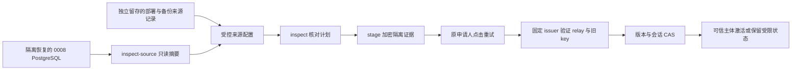

# v2.5 可信备份证据恢复运维流程

> 2026-09-08，SP-P1 的受控备份恢复切片。命令与代码已落地，本机完整联测和合流结果见[开发记录](./V25-DEVELOPMENT-LOG.md)；本文不是生产恢复已经执行的证明。
>
> 约束与验收依据：[费用边界 §10.9](./V25-SPEND-BOUNDARIES.md)、[后续任务卡](./V25-MIGRATION-GOALS.md)、[测试手册](./V25-MIGRATION-TESTING.md)。

## 1. 用途与权限

该工具用于：旧主体仍存在、当前恢复申请尚未完成，而 live 历史证据缺失时，从可独立审定来源的历史备份核对身份。运维只读取来源、生成计划和暂存加密证据；原申请人在现有账号恢复页点击「重试」后，服务端才重新验证并按事务 CAS 决定能否激活。



CLI 不提供激活账号、指定 payer、批准花费、恢复 BA/OAuth 会话、覆盖生产库或执行 worker 的选项。它不自动还原数据库 dump；源库须预先恢复到隔离 PG，且不启动应用或 worker。受限用户始终可继续使用既有重试、原设备验证和明确独立空间路径。

工具可以核对配置、固定查询结果、字节摘要和版本的一致性；历史来源审定是独立的运维事实输入。新 JSON 中的一句声明、备份自报 issuer、未验证 JWT payload、当前 `NEW_API_BASE_URL`、相同用户名/数字 ID 或单独 checksum 均不能替代该事实。

## 2. 首版支持范围与准备

| 要求 | 实际限制 |
|---|---|
| 源库 | 已隔离恢复的 Musefold PG 0008，迁移末项 hash 必须匹配仓库 0008；有新候选恢复表则拒绝，不能给较新库伪装旧 journal |
| 来源与目标 | profile 固定两端集群 `system_identifier`、库名、数据谱系和 principal；源/目标须分离，谱系与 principal 必须一致；禁止跨主体或跨 issuer 合并 |
| 发行者 | 历史 issuer 必须由独立部署记录确定，并与本次申请固定 issuer 一致；绝不向新的候选 URL 试探旧 secret |
| 完整证据 | 固定 SQL 提取该主体全部 relay 和 credential；relay 1–16 条，credential 恰好一条 `new-api/v1`，完整 key 和 token ID 可核对；超限、损坏或不支持的集合保留受限 |
| 独立性 | 备份快照早于经独立记录确定的最早候选/修复时点；所有相关行的创建/更新时间须与快照一致。无法排除失败候选自证时不能 stage |
| 文件 | profile、审定记录和 plan 使用绝对路径、受控普通文件；最终路径不是符号链接，归运行 UID 或 root 所有，组/其他用户不能写。profile 和记录有读取大小上限 |
| 连接 | 源连接只用于固定只读事务；运维身份需具备读取指定表、迁移 journal 和 `pg_control_system()` 的权限。目标身份只用于本工具的核对、行锁及暂存事务，不把这些权限授给用户前端 |
| 时间和秘密 | 请求有效期沿用 30 分钟；源/目标连接和 SQL 有 5 秒限界。旧解密密钥与当前服务端加密密钥仅由受控进程环境注入，不写入 profile、命令参数、计划或审计正文 |

如备份没有可独立核对的部署/来源记录，工具不能制造历史证明；保持受限或由用户选择独立空间。该流程不对全部历史生成记录补写 payer，也不把历史费用升级成真实账单。

## 3. 受控配置

唯一格式源：[backup-source.ts](../../apps/api/src/modules/account/backup-source.ts) 的 `backupSourceProfileSchema`。以下为需要填写的结构示意，尖括号内容必须取自实际受控记录，不能原样用于恢复：

```json
{
  "version": 1,
  "id": "legacy-0008-review-001",
  "apiIssuer": "https://musefold.example.invalid",
  "upstreamIssuer": "https://new-api.example.invalid",
  "targetDatabase": { "systemIdentifier": "<目标集群标识>", "name": "musefold" },
  "sourceDatabase": { "systemIdentifier": "<隔离源集群标识>", "name": "musefold_restore_0008" },
  "sourceDatabaseUrlEnv": "MUSEFOLD_RECOVERY_SOURCE_DATABASE_URL",
  "archiveKeyEnv": "MUSEFOLD_RECOVERY_ARCHIVE_KEY",
  "sourcePrincipalId": "<原主体 ID>",
  "targetPrincipalId": "<同一主体 ID>",
  "sourceLineage": "<已审定的数据谱系>",
  "targetLineage": "<同一数据谱系>",
  "capturedAt": "<可信备份时间，UTC ISO>",
  "independentBefore": "<最早候选或修复时间，UTC ISO>",
  "attestation": {
    "recordPath": "/srv/musefold-recovery/review-record.txt",
    "sha256": "<独立记录的 SHA-256>",
    "reference": "<备份与部署记录编号>",
    "reviewedBy": "<审定责任人或运维身份>",
    "decision": "complete-independent-legacy-evidence"
  }
}
```

首次只读获取摘要时可暂不填写 `expectedEvidenceSha256`。将 `inspect-source` 输出与独立记录核对后，才在受控 profile 增加该字段；`inspect` 和 `stage` 都强制匹配它，不会自行接受变化后的来源。

环境变量由部署的秘密管理方式注入：

- `MUSEFOLD_RECOVERY_TARGET_DATABASE_URL`：当前目标数据库的运维连接。
- `MUSEFOLD_RECOVERY_CURRENT_KEY`：与当前 API 的凭据加密配置一致。
- profile 的 `sourceDatabaseUrlEnv`：隔离源数据库连接；名称必须以 `MUSEFOLD_RECOVERY_` 开头。
- profile 的 `archiveKeyEnv`：历史备份密文对应的解密密钥；名称同样受限。

不要打印环境变量、连接字符串或解密后的证据。`inspect-source` 不需要目标连接、加密密钥或上游网络；它不创建身份信任。

同一目标部署的多个 API 进程还须保持一致的 `BETTER_AUTH_SECRET`：已有 JWKS 私钥依赖该认证配置，不随恢复申请清理；凭据的 `MUSEFOLD_RECOVERY_CURRENT_KEY` 是另一用途的配置。不能通过删除 JWKS 或临时更换认证密钥来完成恢复。密钥轮换须按其独立兼容流程验证；本工具不负责轮换。

## 4. 实际命令顺序

从仓库根执行。路径和申请 ID 是示例位置，应换为本次受控材料；命令中不携带 secret。

1. 查看固定接口：

   ```bash
   pnpm --filter @musefold/api exec tsx src/ops/account-recovery-evidence.ts --help
   ```

2. 对已隔离的来源获取摘要，输出只有源身份、主体、格式、条数、摘要和“仅指纹”说明：

   ```bash
   pnpm --filter @musefold/api exec tsx src/ops/account-recovery-evidence.ts inspect-source --profile /srv/musefold-recovery/profile.json
   ```

3. 完成独立来源核对并补齐 `expectedEvidenceSha256`，然后将指定 pending 申请的计划保存为受控文件：

   ```bash
   umask 077
   pnpm --filter @musefold/api exec tsx src/ops/account-recovery-evidence.ts inspect --profile /srv/musefold-recovery/profile.json --request-id REQUEST_ID > /srv/musefold-recovery/plan.json
   shasum -a 256 /srv/musefold-recovery/plan.json
   ```

   计划包含申请/主体/来源 ID、申请和身份版本、来源/profile 摘要、relay 数与截止时间；不含 bearer、JWT、refresh、key 或密文。核对这个具体计划后再暂存。

4. 使用上一步**计划文件本身**的 SHA-256 暂存；工具重读并核对来源/profile/计划，事务内检查申请仍 pending、会话仍为对应 `recovery_only`、版本未变化：

   ```bash
   pnpm --filter @musefold/api exec tsx src/ops/account-recovery-evidence.ts stage --profile /srv/musefold-recovery/profile.json --plan /srv/musefold-recovery/plan.json --plan-sha256 PLAN_FILE_SHA256
   ```

   返回暂存 ID、`staged`、`alreadyStaged`。重复提交同一来源计划幂等；它不返回激活结果。失败只输出静态脱敏错误；不能因为错误后没有 token 就推断上游或其他系统已回滚。

5. 原申请人在账号恢复页点击「重试」。API 在固定 issuer 核验全部旧 relay，必要时以 PG 租约独占 refresh，再 fresh `getSelf` 比对 owner；用候选授权获取旧 token 的实际 key，与备份解密 key 精确比较。备份中的 session ID 不是持有旧会话的证明。

6. 按用户得到的真实结果处理：激活成功只改变合法主体/本次会话；证据冲突、缺失、暂时失败或来源不明仍按原因保持受限。过期重新登录产生新申请；原 plan/申请不可移植过去，须重新核对。

## 5. 并发、清理与回退

- 所有 HTTP 验证在 PG 事务外；最终事务重新核对 live 身份/凭据/证据集、申请版本、候选会话和备份 lease/revision。换号、登出、到期、独立空间或新版本先提交，旧验证不能迟到覆盖。
- 上游 refresh 可能已轮换，而本地进程在保存前退出。这种跨系统间隙不承诺回滚；不能再把旧 refresh 必然可用当作事实，仍须重新认证/核对。
- 成功消费备份，或经原设备/独立空间路径完成申请后，在对应事务清除暂存密文和 lease，保留非秘密来源审计。到期立即失去使用资格。
- 现有 worker `maintenance/cleanup` 的每小时周期另外清除到期申请候选密文和过期/已完成申请下的暂存密文。每次 cleanup 执行最多处理每类 1,000 行；锁忙时跳过、积压留后续执行，不是所有 worker 每自然小时的全局限额。该物理清理不代替 API 的即时失效检查。
- 这不是整库恢复工具。失败不覆盖旧表，不回放旧 OAuth grant，不改历史执行/费用。源库、受控 profile/plan 和非秘密审定记录按运维保留策略处置，不能把其中未核实的内容自动同步给新主体。

## 6. 验收与证据

联测须使用独立源/目标 PG、按 owner 隔离的本地 HTTP fixture 和真实 CLI 子进程；不能只测试内部 helper。至少验证零网络/零激活的 inspect/stage、完整正例、错误 issuer/谱系/摘要、缺损/超限/冲突/候选自证拒绝、refresh/登出/到期/重复操作与版本竞争、秘密出参检查、实际迁移/replay。

02:33检查点完整API为162项，其中备份32项；后来补齐两条保存间隙SIGKILL，最终完整API **164 passed，0 failed/skipped/unhandled，退出0**，其中备份33项；profile就地15项。真实CLI在隔离PG同一集群的source/target两库执行，target 0009→0010与第二次replay退出0，旧行保留、15列断言通过；不称实际dump恢复。报告 `.results/v25/2026-09-08-development/b12-backup/validation-summary.json` 保留首次错误与修复，不从清理测试推导备份恢复成功。

周期清理专项 **8 passed、0 failed/skipped**：实际 PG/Graphile 接线、并发与写锁、有效证据保留、1,001条积压分批和单侧满批；完整worker集成55项通过。新源码已取得check35/35、E2E242 passed/7 skipped及source扫描通过；统一摘要 `tests/v25/.results/b12-followup/validation-summary.json`，源清单与失败历史见开发记录。后续真正刷新保存间隙SIGKILL测试另记，不能由并发/登出或live relay测试推导备份专属进程退出已覆盖。

最终增量已分别验证live与backup实际保存间隙SIGKILL：backup自然等待120秒lease后保持受限，用户明确建立独立空间，旧prompt归属不变、候选和暂存密文清理；既有JWKS ID保留。最后check35/35、source扫描通过，摘要 `tests/v25/.results/b12-p1-final/validation-summary.json`。这次只改三个API测试/fixture，E2E/worker按生产字节未变关联原证据，未重复运行；真实历史来源审定和实际生产恢复仍未执行。
